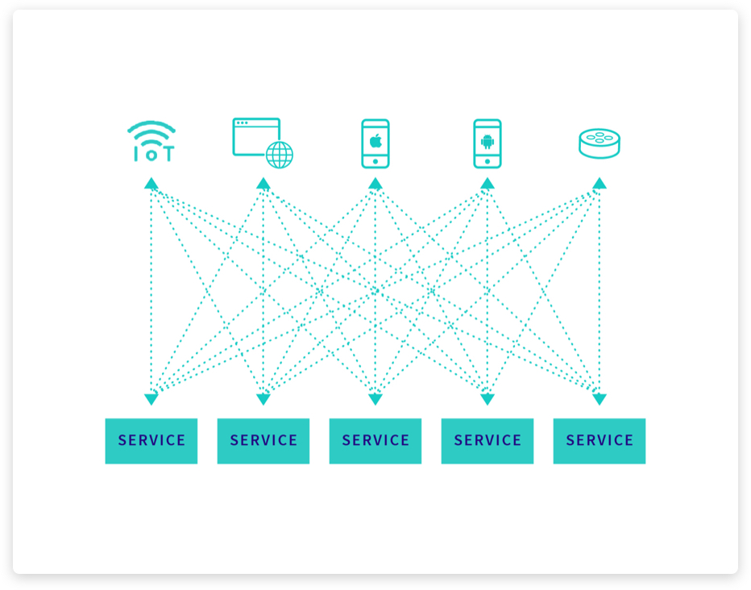
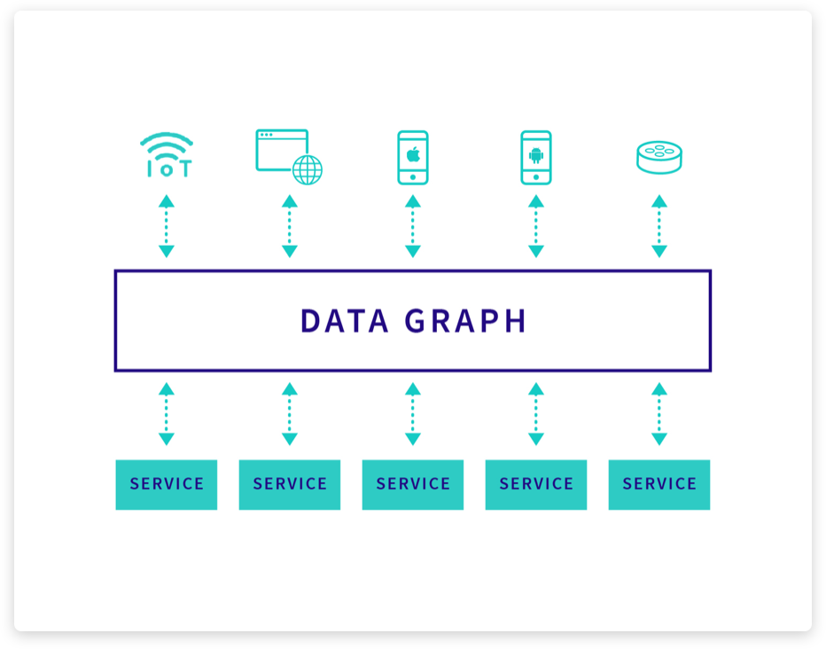

# Apollo

> - 여러 유연하지 않은 API들을 다기능의 단일 쿼리 시스템으로 대체하세요.
> - 프론트엔드와 백엔드 개발을 분리하세요.
> - 고품질의 앱을 더 많은 플랫폼으로 빠르게 옮기세요.

> "Apollo는 웹, ios, Android 모두에서 우리 고객의 경험을 극대화할 것이다." - Adam Neary, Tech Lead @Airbnb

아폴로는 GraphQL 플랫폼입니다. 또한 GraphQL을 잘 사용할 수 있는 완전한 솔루션을 제공한다고 하는 군요.

## 왜 GraphQL이 중요할까요?

오늘날 사용자들은 자신이 가진 모든 기기에서 사용할 수 있는 고품질의 개인화된 경험을 원합니다. 또한 계속 증가하는 데이터 서비스를 기반으로 앱을 제작해야합니다. 이러한 개발 복잡성을 어떻게 관리할 수 있을까요?

REST는 더이상 모던 애플리케이션에 적합하지 않습니다. 절차적 API기술인 REST의 point-to-point 속성은 서비스 및 클라이언트 작성자가 사전에 각 유스케이스를 조정하도록 합니다. 앱의 새 화면을 추가해야할 때라든지 프론트 엔드 팀이 백엔드 팀에서 새 엔드 포인트를 요청해야하는 경우 개발 속도는 굉장히 늦어집니다. 두 팀은 서로 독립적으로 빠르게 움직여야합니다.

### 아키텍처의 중심에 있는 데이터 그래프

GraphQL은 유연한 쿼리 언어를 도입하여 앱과 서비스를 분리합니다. 앱 개발자는 각 화면에 대한 맞춤 API 대신 필요한 데이터를 설명하고 서비스 개발자는 무엇을 제공할 수 있는지를 설명하고 GraphQL은 자동으로 이 두 데이터를 일치시킵니다. 팀은 데이터를 사용하는 방법에 대한 새로운 레벨의 가시성 및 제어 기능을 통해 더 많은 플랫폼에서 더 빠르게 출하합니다.

### GraphQL의 이점

더이상 endpoint가 아닌 최고 품질의 앱 제작

- 더 빠른 출하(Shipping Faster): 앱에서 새 화면의 데이터를 가져올때 많은 양의 코드를 작성하거나 새로운 고정 API 엔드 포인트에 의존하지 마세요.
- 더 나은 앱(Better Apps): 그 날 이용할 수 있는 API가 아닌 최상의 데이터 및 서비스로 기능을 구축하세요. GraphQL은 모든 앱에 맞춤된 설정을 할 수 있도록 도와줍니다.
- 플랫폼 간 패리티(Parity Across Platforms): 모든 채널에서 앱의 일관성을 유지하세요. 플램폼 간에 공통적인 데이터 관련 기능을 공유된 GraphQL 계층으로 이동시키세요.
- 강력한 API 파트너(Powerful Partner APIs): 공동 고객에게 고품질의 환경을 제공하면서 그에 맞춘 고객 변경없이 API에 새로운 파트너를 추가하세요.
- 데이터의 가시성(Visibility Into Your Data): 개발 팀에게 그들이 제공할 수 있는 서비스가 무엇인지를 실시간으로 정확하게 보여주도록 하세요.
- 양성 대조군(Positive Control): 데이터에 대한 모든 액세스를 보호하고 분석하여 어떻게 사용되었는지 확인하는 단일 제어 지점을 확보하세요.
