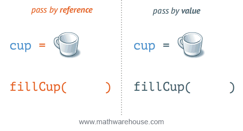

# 자료형, 참조, 불변성

Array의 메소드들은 새로운 배열을 반환하는 것도 있지만 기존의 배열에 추가하거나 제거하는 수정을 일으키는 것도 있다.  
반면에 String의 메소드들은 원본의 변형없이 새로운 문자열을 반환한다. 

매니저님께 질문드리니 '그것은 문자열같은 원시값은 불변이기 때문입니다.'라는 답을 들었다. 원시값, 불변... 처음 듣는게 아니라서 금방 이해했지만 까맣게 잊고 있던거에 충격을 먹어서 다시 정리하기로 했다. 

## 1. 원시 타입(Primitive type) vs 참조 타입(Reference type)

자바스크립트에는(ES2015) 7가지의 타입(자료형, Data type)이 존재한다.

+ 원시 타입, 기본 자료형(Primitive data type)
  - Boolean
  - Null
  - Undefined
  - Number
  - String
  - Symbol(ES2015 추가)
+ 참조 타입(Reference type), 객체형(Obejct type)
  - Object (원시 타입을 제외한 배열, 함수, 정규식 등)

원시 타입과 참조 타입 사이에는 몇 가지 유의할 만한 차이점이 있다.

### 1.1. 원시 타입, 기본 자료형

+ 원시 타입은 **변경 불가능한 값**이다.
+ **pass-by-value**(복사되어 전달됨)이다.
+ 메모리의 스택 영역(Stack Segment)에 고정된 메모리 영역을 점유하고 저장된다.

> **pass-by-value vs pass-by-reference**  
원시 타입의 값은 값(value)으로 전달된다. 즉, 복사되어 전달된다.  
반면에 참조 타입은 객체의 모든 연산이 실제값이 아닌 참조값으로 처리된다

  
<cite>이미지 출처 : [Passing by Value vs. by Reference Visual Explanation](https://blog.penjee.com/passing-by-value-vs-by-reference-java-graphical/)</cite>

### 1.2. 참조 타입, 객체형

+ 객체는 데이터와 그 데이터에 관련된 동작(절차, 방법, 기능)을 모두 포함할 수 있는 개념적 존재
  - 프로퍼티(property): 이름과 값을 가지는 데이터를 의미
  - 메소드(method): 동작을 의미
+ **pass-by-reference**(이다.
+ 메모리의 힙 영역(Heap Segement)에 저장된다.

#### 1.2.1. 참조(reference)

- 객체가 컴퓨터 메모리 상에서 어디에 저장되어있는지를 가리키는 값  
(자바스크립트에서는 우리가 참조를 직접 읽거나 조작할 수 없다.)
- 객체라고 생각하고 다루어왔던 값은 실제로는 **객체에 대한 참조**이다.

```js
const obj = {prop: 1}; // 변수 obj에 객체에 대한 참조가 저장
obj.prop; // obj를 통해 역참조된 객체의 속성을 읽어온다.
```
변수 obj에는 객체에 대한 참조가 저장되었다.  
객체의 속성에 접근하면,  
자바스크립트 엔진은 참조를 통해 메모리에 저장되어 있는 객체에 접근해서 해당 객체의 속성을 읽는다.(**역참조(dereference)**)

#### 1.2.2. 함수 호출

함수 호출 시 인수가 복사되어 매개변수에 대입된다.  
객체를 인수로 넘긴다면 실제로 복사되는 것은 객체 자체가 아니라 **참조**이다.  
참조를 이용해 원본 객체의 내욜을 변경할 수 있다.  
(원본과 복사된 참조는 같은 객체를 가리키고 있다.)

```js
const obj = {};

function addProp(o) {
  o.prop = 1;
}

addProp(obj); // 객체 자체(변수 `obj`)가 아니라 객체의 참조가 매개변수 `o`에 복사된다.

console.log(obj.prop); // 1
```

## 2. 동적 타이핑(Dynamic typing)

자바스크립트는 느슨한 타입(loosely typed) 언어, 혹은 동적(dynamic) 언어이다.
- 변수의 타입을 미리 선언할 필요가 없다.(값이 할당되는 과정에서 자동으로 자료형이 결정된다.)
- 같은 변수에 여러 타입의 값을 넣을 수 있다.

```js
var foo = 42;      // Number
var foo = 'bar';   // String
var foo = true;    // Boolean
```

※ C나 Java같은 C-family 언어는 변수 선언 시 사전에 저장할 값의 종류를 지정해야한다.(Type annotation), 이런 언어는 정적 타이핑(Static Typing) 언어라 한다.

## 3. 불변 vs 가변

### 3.1. 자바스크립트의 원시 값은 불변(immutable)이다.

원시 타입의 특징  

문자열을 변형하는 메소드가 기존의 문자열의 내용을 바꾸는 것이 아닌 새 문자열을 반환하는 것은 다음과 같은 이유 때문이다.

+ 원시 타입의 값 자체의 내용을 변경할 수 있는 방법은 없다.(**불변성(immutability)**)  
+ 변수에 저장된 원시타입의 값을 바꾸는 방법은 **변수에 다른 값을 대입**하는 방법밖에 없다.  
이는 메모리 영역에서의 변경이 불가능하고, 재할당은 가능하다는 의미이다.

다른 원시 타입 메소드 역시 마찬가지이다.  

```js
let str = 'hello';
str = 'world'; // 다른 값을 대입한다.
console.log(str); // 'world'

function func(s) {
  s = 'javascript'; // str에 영향을 미치지 않는다.
  str = 'immutable'; // str에 새 값이 대입되었다.
}
func(str);
console.log(str); // 'immutable'
```

### 3.2.자바스크립트의 객체는 가변(mutable)이다.

객체 자체의 내용을 변경할 수 있는 방법은 많다.  

`array.push()`같은 메소드는 직접 대상 배열을 변경한다. 또, 속성 접근자를 이용해 객체의 속성에 접근하여 속성 값을 변경하거나 새 속성을 추가하거나 혹은 `delete` 연산자를 통해 속성을 삭제할 수도 있다.

객체의 가변성 때문에 프로그래밍이 어려워지기도 한다.  
변경되지 말아야할 객체가 있다면 주의해서 코드를 작성해야 한다.  
그러나 객체가 정말로 변경되지 않았는지 확인하는 일은 쉽지않다.

---

Immutable.js가 React생태계에서 널리 사용된다니 이 글은 나중에 관련해서 추가 정리할 것 같다. 아직 이해하기 힘들기 때문에...

글로 풀어 정리하는 것은 쉽지 않은 것 같다. 메모리 스택이나, 힙같은 개념적인 부분은 아직도 이해가 잘 안된다. 지금은 그냥 그렇구나 어떤 메모리를 저장하는 영역이구나 정도로 생각하고 있다.  
관련글을 읽었을때 이해하기로는 스택이라는 영역에 원시값들이 고정된 영역을 차지하게 되고 객체같이 변경될 수 있는 값은(동적으로 할당되는?) 힙이라는 영역에 저장한다는 것인데 이것도 깊게 이해한 것은 아니라서 나중에 다시 읽어봐야할 것 같다.

pass-by-value랑 pass-by-reference 관련해서 애니메이션 이미지를 찾았는데 덕분에 자꾸 헷갈렸던 부분이 이해가 되었다. 

부끄럽게도 원시 타입, 참조타입 이라고 하면 자꾸 배열은 어디에 들어가는 녀석인가 쭉 헷갈려했던 것 같다. 이번 강의에서 계속 배열은 내부적으로 특별하게 취급되는 객체의 일종이다라는 설명을 듣고나니 이제는 확실하게 배열은 객체라는 걸 알겠다.

그리고 원시 타입이 객체처럼 쓰이는 것 때문에도 헷갈렸었다. 결국 모든 값이 객체인거 아냐?라고 생각했었는데 래퍼 객체라고 해서 원시 값은 객체가 아니지만 그 값을 객체처럼 (일시적으로)동작하게 래핑하는 객체(String, Number, Boolean, Symbol 객체)가 있다는 개념이 잡혀서 자바스크립트 자료형을 구분할 수 있게되었다.

---

# 관련 글

+ [hellojavascript - 값 더 알아보기](https://helloworldjavascript.net/pages/220-value-in-depth.html)
+ [mdn - 자바스크립트의 자료형](https://developer.mozilla.org/ko/docs/Web/JavaScript/Data_structures)
+ [mdn - Primitive](https://developer.mozilla.org/ko/docs/Glossary/Primitive)
+ [poiemaweb - 자료형과 변수](http://poiemaweb.com/js-data-type-variable)
+ [poiemaweb - 객체와 변경불가성(Immutability)](http://poiemaweb.com/js-immutability)
+ [javascript tutor](http://pythontutor.com/javascript.html#mode=edit): 자바스크립트 코드 실행을 시각화해주는 멋진 사이트
+ [메모리 특강](http://hacks.mozilla.or.kr/2017/11/a-crash-course-in-memory-management/)
+ [자바스크립트는 어떻게 작동하는가:메모리 관리 + 4가지ㅣ 흔한 메모리 누수 대처법](https://goo.gl/cfUVmr)
+ [자바스크립트의 동작원리: 엔진, 런타임, 호출 스택](https://joshua1988.github.io/web-development/translation/javascript/how-js-works-inside-engine/)
+ [변수와 스코프, 메모리](https://nolboo.kim/blog/2014/04/01/javascript-for-web-developer-4/)