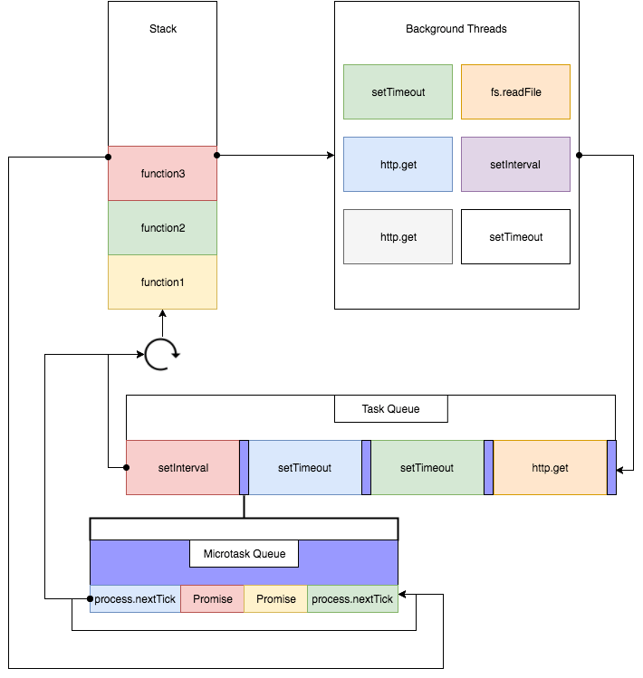
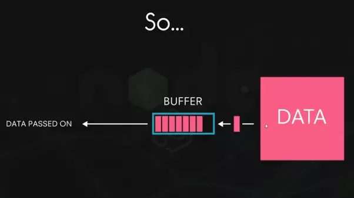

# 노드 기능

## 1. REPL

- **Read**: 읽고
- **Eval**: 해석하고
- **Print**: 결과물을 반환하고
- **Loop**: 종료될 때까지 반복

### 1.1. 노드 REPL 사용

```sh
$ node
> const str = "Helllo world, hello node";
undefined
> console.log(str)
Helllo world, hello node
undefined
```

### 1.2. 노드 REPL 종료 방법 2 가지

- `.exit`입력
- `Ctrl` + `C` 두번 입력

## 2. JS 파일 실행

콘솔에서 `node [자바스크립트 파일 경로]`로 파일 실행  
(확장자(.js)는 생략해도 된다.)

```js
// helloNode.js
console.log("Hello Node!!!");
```

```sh
$ node helloNode
Hello Node!!!
```

## 3. 모듈

코드의 재사용, 파일 하나가 모듈 하나가 된다. 파일별로 코드를 모듈화할 수 있다.

```js
// var.js
const odd = "홀수";
const even = "짝수";

module.exports = {
  odd,
  even
};
```

`require`는 모듈을 요청하는 노드에서 기본적으로 제공하는 내장객체이다.  
`module.exports`는 정의한 모듈을 export 하고 `require` 을 통해 사용할 수 있도록 한다. `module.exports`에는 객체뿐만 아니라 함수, 변수를 대입해도 된다.

```js
// func.js
// 아래는 ES2015+의 분해대입
const { odd, even } = require("./var");

function checkOddOrEven(num) {
  if (num % 2) {
    return odd;
  }
  return even;
}
module.exports = checkOddOrEven;
```

모듈로부터 값을 불러올 때 변수 이름을 다르게 지정할 수 있다.

```js
// index.js
const { odd, even } = require("./var");
// checkOddOrEven를 checkNumber라는 이름으로 사용한다.
const checkNumber = require("./func");

function checkStringOddOrEven(str) {
  if (str.length % 2) {
    return odd;
  }
  return even;
}

console.log(checkNumber(10));
console.log(checkStringOddOrEven("hello"));
```

### ES2015 모듈([ECMAScript Modules](https://nodejs.org/api/esm.html))

자바스크립트 자체 모듈 시스템 문법이 생겼다.

```js
import { odd, even } from "./var";

function checkOddOrEven(num) {
  // ...
}

export default checkOddOrEven;
```

노드에서도 9 버전부터 ES2015 의 모듈시스템을 사용할 수 있으나  
파일 확장자를 mjs 로 지정해야 하며, 실행시 `node --experimental-modules [파일명]`처럼 특별한 옵션을 붙여줘야한다.

```sh
node --experimental-modules my-app.mjs
```

## 4. 노드 내장 객체

노드에서 브라우저의 `window` 객체와 비슷하게 기본적인 내장 객체와 내장 모듈을 제공한다.

### 4.1. global

브라우저의 `window`와 같은 노드의 전역 객체  
모든 파일에서 접근할 수 있으면, `global`의 메서드를 사용시 `global`을 생략할 수 있다.

```js
// const { odd, even } = global.require("./var");
const { odd, even } = require("./var");

// global.console.log(odd);
console.log(odd);
```

노드 버전에 따라 콘솔 내용이 다를 수 있다.

```sh
$ node
> global
{ console: [Getter],
  global: [Circular],
  process: { ... },
  Buffer: { [Function: Buffer] ... },
  clearImmediate: [Function],
  clearInterval: [Function],
  clearTimeout: [Function],
  setImmediate: { [Function: setImmediate] [Symbol(util.promisify.custom)]: [Function] },
  setInterval: [Function],
  setTimeout: { [Function: setTimeout] [Symbol(util.promisify.custom)]: [Function] },
  module: { ... },
  require: { [Function: require] ... }
```

전역객체라는 점을 이용해 간단한 데이터를 파일간 공유할 때 사용하기도 한다.  
그러나 프로그램의 규모가 커질 수록 어떤 파일에서 `global`객체에 값을 대입했는지 찾기 힘들어 유지보수가 어려워지므로  
다른 파일의 값을 모듈 형식으로 만들어 명시적으로 값을 불러와 사용하는 것이 좋다.

### 4.1. console

브라우저의 `console`과 거의 비슷하다.  
보통 디버깅을 위해 사용. 대표적으로 `console.log` 메서드가 있음

- `console.time(레이블)`: `console.timeEnd(레이블)`과 대응되어 같은 레이블을 가진 time 과 timeEnd 사이의 시간을 측정한다.
- `console.log(내용 [, 내용] )`: 평범한 로그를 콘솔에 표시, 쉼표로 여러 내용을 동시에 표시할 수 있다.
- `console.error(에러 내용)`: 에러를 콘솔에 표시
- `console.dir(객체, 옵션)`: 객체를 콘솔에 표시할 때 사용.
  - 표시할 객체
  - 옵션:
    - color - 콘솔에 색 추가
    - depth - 객체 안 몇 단계까지 보여줄 지 결정(기본값 2)
- `console.trace(레이블)`: 에러가 어디에서 발생했는지 추적할 수 있게 함. 보통은 에러 발생 시 에러 위치를 알려주므로 자주 사용하지는 않는다.

### 4.2. 타이머

타이머 함수: 아이디를 반환한다.

- `setTimeout(콜백 함수, 밀리초)`: 주어진 밀리초 이후 콜백 함수 실행
- `setInterval(콜백 함수, 밀리초)`: 주어진 밀리초마다 콜백 함수 반복 실행
- `setImmediate(콜백 함수)`: 콜백 함수 즉시 실행

※ 밀리초: 1000 분의 1 초

타이머 취소

- `clearTimeout(아이디)`: `setTimeout` 취소
- `clearInterval(아이디)`: `setInterval` 취소
- `clearImmediate(아이디)`: `setImmediate` 취소

※ `setImmediate()`과 `setTimeout(콜백, 0)`에 담긴 콜백 함수는 이벤트 루프를 거친 뒤 즉시 실행된다. 파일 시스템 접근, 네트워킹 같은 I/O 작업의 콜백 함수 안에서 타이머를 호출하는 것과 같은 특수한 경우 `setImmediate()`이 보다 먼저 실행되지만 항상 그런 것은 아니므로 혼동되지 않게, `setTimeout(콜백, 0)`은 사용하지 않는 것이 좋다.

### 4.3. `__filename`, `__dirname`

`__filename`, `__dirname` 키워드는 경로에 대한 정보를 제공한다.  
현재 파일의 경로나 파일명을 알아야할 때 사용

```js
// filename.js
console.log(__filename); // 현재 파일 명
console.log(__dirname); // 현재 파일 경로
```

```
$ node filename.js
C:\Users\chiabi\Documents\study\TIL\NodeJS\hello\03_global\filename.js
C:\Users\chiabi\Documents\study\TIL\NodeJS\hello\03_global
```

경로가 문자열로 반환되기도 하고, `/`, `\`같은 경로 구분자 문제도 있어 보통은 이를 해결하는 `path`모듈과 함께 사용한다.

### 4.4. module, exports

`module` 객체의 `module.exports` 로 한번에 대입하는 대신 각각의 변수를 `exports` 객체에 넣는 방법으로 모듈을 만들 수 있다.  
`module.exports` 와 `exports` 가 같은 객체를 참조하므로 동일하게 동작한다.  
(`module.exports === exports` -> true)

```js
// var.js
exports.odd = "홀수입니다.";
exports.even = "짝수입니다.";
```

`exports`가 `module.exports`를 참조하므로 `exports`에는 반드시 객체처럼 속성명과 속성값을 대입해야 한다.  
`exports`에 다른 값을 대입하면 객체의 참조 관계가 끊겨 더 이상 모듈로 기능하지 않는다. 또한, 한 모듈에 `exports`객체와 `module.exports`를 동시에 사용하지 않는 것이 좋다.

### 4.5. process

현재 실행되고 있는 노드 프로세스에 대한 정보를 담고 있다.

```sh
$ node
> process.version
# 설치된 노드 버전
'v8.11.1'

> process.arch
# 프로세서 아키텍처 정보
'x64'

> process.platform
# 운영체제 플랫폼 정보
'win32'

> process.pid
# 현재 프로세스의 아이디
21548

> process.uptime()
# 프로세스가 시작된 후 흐른 시간(단위-초)
36.19

> process.execPath
# 노드 경로
'C:\\Program Files\\nodejs\\node.exe'

> process.cwd()
# 현재 프로세스가 실행되는 위치
'C:\\Users\\chiabi\\Documents\\study\\TIL\\NodeJS\\hello\\03_global'

> process.cpuUsage()
# 현재 cpu 사용량
{ user: 140000, system: 62000 }
```

### 4.5. [process.env](https://nodejs.org/api/process.html#process_process_env)

사용자 환경(시스템의 환경 변수 정보)을 포함하는 객체를 반환한다.

서비스의 중요한 키를 저장하는 공간으로도 사용된다.  
서버, 데이터베이스의 비밀번호와 각종 API 키를 유출될 수 있는 코드에 직접 입력하는 대신 `process.env` 속성으로 대체하는 것이 좋다.

모든 운영체제에 다음과 같이 동일하게 사용하기 위해 [dotenv](https://github.com/motdotla/dotenv)를 사용한다.

```js
const secretId = process.env.SECRET_ID;
const secretCode = process.env.SECRET_CODE;
```

### 4.6. [process.nextTick(callback)](https://nodejs.org/api/process.html#process_process_nexttick_callback_args)

이벤트 루프가 다른 콜백 함수들보다 `nextTick`의 콜백 함수를 우선으로 처리하도록 한다.  
`setImmediate`나 `setTimeout`보다 먼저 실행된다.

resolve 된 `Promise`도 `nextTick`처럼 다른 콜백들보다 우선시 되므로, `process.nextTick`과 `Promise`를 마이크로 태스크(microtask)라고 따로 구분지어 부른다.

단, 마이크로태스크를 재귀 호출할 경우, 이벤트 루프틑 다른 콜백함수보다 마이크로태스크를 우선하여 처리하기 때문에 콜백함수들이 실행되지 않을 수 있다.

  
<sub>(이미지 출처: https://blog.risingstack.com/node-js-at-scale-understanding-node-js-event-loop//)<sub>

### 4.7. [process.exit([code])](https://nodejs.org/api/process.html#process_process_exit_code)

실행 중인 노드 프로세스를 종료한다.  
서버에서 사용하면 서버가 멈추기 때문에 서버에서는 거의 사용하지 않고, 서버 외의 독립적인 프로그램에서 수동으로 노드를 멈추게 할 때 사용한다.

인자로 코드 번호를 줄 수 있다.

- 없거나 0: 정상 종료
- 1: 비정상 종료

## 5. 노드 내장 모듈

노드에서 제공하는 모듈을 사용하면 다음과 같은 기능들을 사용할 수 있다.

- 운영체제 정보에 접근
- 클라이언트가 요청한 주소에 대한 정보 가져오기

※ 노드 모듈은 버전마다 차이가 있다.

### 5.1. os

노드는 os 모듈에 정보가 담겨 있어 운영체제의 정보를 가져올 수 있다.  
주로 컴퓨터 내부 자원에 빈번하게 접근하는 경우 사용된다.  
일반적인 웹 서비스를 제작할 때는 사용 빈도가 높지 않지만 운영체제 별로 다른 서비스를 제공하고 싶을때 유용하다.

- 운영체제 정보
  - `os.arch()` : `process.arch`와 동일, 프로세서 아키텍처 정보
  - `os.platform()` : `process.platform`과 동일, 운영체제 플랫폼 정보
  - `os.type()` : 운영제체 종류
  - `os.uptime()` : 운영체제 부팅 이후 흐른 시간(초)
  - `os.hostname()` : 컴퓨터 이름
  - `os.release()` : 운영체제 버전
- 경로 정보
  - `os.homedir()` : 홈 디렉터리 경로
  - `os.tmpdir()` : 임시 파일 저장 경로
- cpu 정보
  - `os.cpus()` : 컴퓨터의 코어 정보
  - `os.cpus().length`로 코어의 개수를 알 수 있다. 단, 노드는 싱글 스레드라 코어가 몇 개이든 대부분의 경우 코어 하나밖에 사용하지 않는다.
- 메모리(RAM) 정보
  - `os.freemem()` : 사용 가능한 메모리(RAM)
  - `os.totalmem()` : 전체 메모리 용량
- 에러와 신호에 대한 정보
  - `os.constants`: 에러 발생 시 `EADDRINUSE`나 `ECONNRESET`같은 에러 코드를 함께 보여주는데, 이러한 코드들이 `os.constants`객체 안에 들어있다.

```sh
> console.dir(os.constants);
{ UV_UDP_REUSEADDR: 4,
  errno:
   { E2BIG: 7,
     EACCES: 13,
     EADDRINUSE: 100,
     # ...중략
     WSA_E_CANCELLED: 10111,
     WSAEREFUSED: 10112 },
  signals:
   { SIGHUP: 1,
     SIGINT: 2,
     # ...중략
     SIGBREAK: 21,
     SIGWINCH: 28 } }
```

### 5.2. path 🌟

폴더와 파일 경로를 쉽게 조작하도록 도와주는 모듈.  
운영체제별로 경로 구분자가 다르기 때문에 필요한 모듈이다.  
파일 경로에서 파일명이나 확장자만 따로 떼어주는 기능도 구현되어있다.

- Windows: `\` 로 구분 - `C:\Users\chiabi\Documents`
- POSIX: `/`로 구분 `/home/chiabi`

※ POSIX: 유닉스 기반 운영체제들(maxOS, 리눅스)

- `path.sep`: 경로의 구분자. Windows(`\`), POSIX(`/`)
- `path.delimiter`: 환경변수의 구분자. `process.env.PATH`를 입력하면 여러 개의 경로가 이 구분자로 구분되어 있다. Windows(`;`), POSIX(`:`)
- `path.dirname(path)`: 파일이 위치한 폴더 경로
- `path.extname(path)`: 파일 확장자
- `path.basename(path[, ext])`: 파일의 이름(확장자 포함), 파일 이름만 표시하고 싶을 때 두번째 인자에 확장자를 넣어주면 됨
- `path.parse(path)`: 파일 경로를 `root`, `dir`, `base`, `ext`, `name`으로 분리해서 객체를 반환
- `path.format(pathObject)`: `path.parse()`한 객체를 파일 경로로 합친다.
- `path.normalize(path)`: `\`나 `/` 혼용/여러번 사용 시 정상적인 경로로 변환
- `path.isAbsolute(path)`: 파일 경로가 절대경로인지 상대경로인지 `true`, `false`반환
- `path.relative(from, to)`: 경로를 두 개 넣으면 첫번째 경로에서 두번째 경로로 가는 방법을 알려줌
- `path.join([...paths])`: 여러 인자를 넣으면 하나의 경로로 합침. 상대경로(`..`)와 현 위치(`.`)도 알아서 처리
- `path.resolve([...paths])`: `path.join`과 비슷하지만 동작 방식이 다르다. `/`를 만나면 절대경로로 인식해서 앞의 경로를 무시한다.(`path.join`은 상대 경로로 처리한다.)

```js
path.join("/a", "/b", "c");
// '\\a\\b\\c'
path.resolve("/a", "/b", "c");
// 'C:\\b\\c'
```

※ 기본적으로 Windows 경로는 `\`하나만 사용해 표시한다. 단, 자바스크립트 문자열에서는 `\`가 특수문자이기 때문에 `\\`를 붙여(이스케이프) 경로를 표시해야한다. (Ex, `C:\\Users`)

- 절대경로: 루트폴더(Windows - `C:\` | POSIX - `/`)나 노드 프로세스가 실행되는 위치 기준
- 상대경로: 현재 파일 기준

※ [path.posix](https://nodejs.org/api/path.html#path_path_posix), [path.win32](https://nodejs.org/api/path.html#path_path_win32)
Windows 에서 POSIX 스타일 path 를 사용할 때나 그 반대의 경우

- Windows: `path.posix.sep`, `path.posix.join()`
- POSIX: `path.win32.sep`, `path.win32.join()`

### 5.3. url

인터넷 주소를 쉽게 조작하도록 도와주는 모듈

url 처리 방법 2 가지

- The WHATWG URL API - WHATWG 방식의 url(node 버전 7)

  ```js
  const url = require("url");

  const URL = url.URL;
  const myURL = new URL("https://github.com/chiabi");
  console.log(myURL);
  ```

  `urername`, `password`, `origin`, `searchParams` 는 WHATWG 에만 있다.

  ```sh
  URL {
    href: 'https://github.com/chiabi',
    origin: 'https://github.com',
    protocol: 'https:',
    username: '',
    password: '',
    host: 'github.com',
    hostname: 'github.com',
    port: '',
    pathname: '/chiabi',
    search: '',
    searchParams: URLSearchParams {},
    hash: '' }
  ```

  [WHATWG URL standard](https://url.spec.whatwg.org/)

- Legacy URL API

  ```js
  const url = require("url");

  const parsedUrl = url.parse("https://github.com/chiabi");
  console.log(parsedUrl);
  ```

  ```sh
  Url {
    protocol: 'https:',
    slashes: true,
    auth: null,
    host: 'github.com',
    port: null,
    hostname: 'github.com',
    hash: null,
    search: null,
    query: null,
    pathname: '/chiabi',
    path: '/chiabi',
    href: 'https://github.com/chiabi' }
  ```

#### 5.3.1. 기존 노드 방식

기존 노드 방식에서는 다음 두 메서드를 주로 사용한다.

- `url.parse()`: 주소를 분해
  - `username`, `password`: `auth`
  - `searchParmas`: `query`
- `url.format()`: 분해된 주소를 다시 조립. 2 가지 방식의 url 모두 사용할 수 있다.

※ WHATWG 방식은 주소가 `host` 없이 `pathname` 부분만 오는 경우 이 주소를 처리할 수 없음 (Ex. `/book/bookList.aspx`);

#### 5.3.2. WHATWG 방식

WHATWG 방식은 `search` 부분을 `searchParams` 라는 특수한 객체로 반환할 수 있어 유용하다.

`search` 부분은 보통 주소를 통해 데이터를 전달할 때 사용한다.  
물음표(?)로 시작하고, 그 뒤 **키=값** 형식으로 데이터를 전달한다.  
여러 키는 `&`로 구분한다.

```sh
http://www.gilbut.co.kr/?page=3&limit=10&category=nodejs
                        └───────────search 부분─────────┘
```

```js
const { URL } = require("url");

const myURL = new URL(
  "http://www.gilbut.co.kr/?page=3&limit=10&category=nodejs&category=javascript"
);
console.log(myURL.searchParams);
```

```sh
URLSearchParams {
  'page' => '3',
  'limit' => '10',
  'category' => 'nodejs',
  'ategory' => 'javascript' }
```

- `getAll(key)`: 키에 해당하는 모든 값을 가져옴
- `get(key)`: 키에 해당하는 첫번 째 값만 가져옴
- `has(key)`: 해당 키가 있는지 없는지 검사
- `keys()`: `searchParams`의 모든 키를 iterator 객체로 가져옴
- `values()`: `searchParams`의 모든 값을 iterator 객체로 가져옴
- `append(key, value)`: 해당 키를 추가. 같은 키의 값이 있다면 유지하고 하나 더 추가
- `set(key, value)`: `append` 와 비슷하지만 같은 키의 값들을 모두 지우고 새로 추가
- `delete(key)`: 해당 키 제거
- `toString()`: 조작한 `searchParams` 객체를 다시 문자열화, 이 문자열을 `search`에 대입하면 주소 객체에 반영된다.

### 5.4. querystring

기존 노드의 `url` 을 사용할 때 `search` 부분을 사용하기 쉽게 객체로 만드는 모듈

- `querystring.parse(str[, sep[, eq[, options]]])`: url 의 query 부분을 자바스크립트 객체로 분해
  - `str`: The URL query string to parse
- `querystring.stringify(obj[, sep[, eq[, options]]])`: 분해된 query 객체를 문자열로 다시 조립

### 5.5. crypto

다양한 방식의 암호화를 도와주는 모듈

#### 5.5.1. 단방향 암호화

복호화할 수 없는 암호화 방식(원래 문자열로 되돌릴 수 없음)  
비밀번호는 보통 단방향 암호화 알고리즘을 사용해 암호화한다.

주로 해시 기법 사용  
※ 해시기법: 어떤 문자열을 고정된 길이의 다른 문자열로 바꾸는 방법  
※ [SHA(Secure Hash Algorithm, 안전한 해시 알고리즘)](https://ko.wikipedia.org/wiki/SHA)

```
[SHA256 해시 생성]
abcdefg
=> C1D5FCA36C2B83E30A9834DBCF3597CD253AA2695358AB027F2612B4D5A81601
```

```js
const crypto = require("crypto");
crypto
  .createHash("sha512")
  .update("비밀번호")
  .digest("hex");
```

- `crypto.createHash(algorithm[, options])`: 사용할 해시 알고리즘을 넣는다.
  - `md5`(취약), `sha1`(취약), `sha256`, `sha512`
  - 현재는 sha512 정도로 충분하지만 취약해지면 더 강화된 알고리즘으로 바꿔야한다.
- `hash.update(data[, inputEncoding])`: 변환할 문자열을 넣는다.
- `hash.digest([encoding])`: 인코딩할 알고리즘을 넣으면, 결과물로 변환된 문자열을 반환한다.
  - `base64`(가장 짧아 애용), `hex`, `latin`

#### pbkdf2

※ [해시충돌](https://ko.wikipedia.org/wiki/%ED%95%B4%EC%8B%9C_%EC%B6%A9%EB%8F%8C)  
해시 함수가 서로 다른 두 개의 입력값에 대해 동일한 출력값을 내는 상황

현재는 주로 **pbkdf2**, **bcrypt**, **scrypt** 라는 알고리즘으로 비밀번호를 암호화한다.

- [참고: Naver d2 - 안전한 패스워드 저장](https://d2.naver.com/helloworld/318732)

pbkdf2 는 노드에서 지원한다. 기존 문자열에 `salt`라고 불리는 문자열을 붙인 후 해시 알고리즘을 반복해서 적용하는 것

**salt**: 다이제스트를 생성할 때 추가되는 바이트 단위의 임의의 문자열

```js
// pbkdf2
const crypto = require("crypto");

crypto.randomBytes(64, (err, buf) => {
  // randomBytes() : 64 바이트 길이의 문자열을 만들어 salt에 저장
  const salt = buf.toString("base64");
  console.log("salt: ", salt);
  // pbkdf2(암호화할 비빌먼호, salt, 반복횟수, 출력 바이트, 해시 알고리즘)
  crypto.pbkdf2("비밀번호", salt, 100000, 64, "sha512", (err, key) => {
    console.log("password: ", key.toString("base64"));
  });
});
```

sha512 로 변환될 결과값으 10 만 번 반복 후 다시 변환 과정을 10 만 번 반복  
간단하지만 bcrypt, scrypt 보다는 취약하다.

#### 5.5.2. 양방향 암호화

crypto 모듈은 양방향 대칭형 암호화, 양방향 비대칭형 암호화, HMAC 등의 다양한 암호화를 제공한다.

- [참고: 대칭형/비대칭형 암호 알고리즘](https://sungjk.github.io/2016/09/30/Security.html)

#### 5.5.2.1. 양방향 대칭형 암호화

암호화할 때 사용한 키(열쇠, 패스워드)를 사용해 암호화된 문자열을 복호화할 수 있다.  
웹에서는 클라이언트에 키를 보내야 하는데 클라이언트에서 어떤 일이 벌어질 지 알 수 없으니 잘 사용하지 않는다고 한다.

```js
const crypto = require("crypto");

const cipher = crypto.createCipher("aes-256-cbc", "열쇠");
let result = cipher.update("암호화할 문장", "utf8", "base64");
result += cipher.final("base64");
console.log("암호화: ", result);
// 암호화:  ooogp/vac4l26/ezEglCluFn9vjfixVtCUCaqiaMr28=

const decipher = crypto.createDecipher("aes-256-cbc", "열쇠");
let result2 = decipher.update(result, "base64", "utf8");
result2 += decipher.final("utf8");
console.log("복호화: ", result2);
// 복호화:  암호화할 문장
```

- `crypto.createCipher(algorithm, password[, options])`: 암호화 알고리즘과 키(비밀번호)를 넣어준다. 사용 가능한 알고리즘 목록은 `crypto.getCiphers()`를 통해 조회할 수 있다.
- `cipher.update(data[, inputEncoding][, outputEncoding])`: 암호화할 대상, 대상의 인코딩, 출력 결과물의 인코딩을 인자로 받는다.  
  보통 문자열은 utf8 인코딩, 암호는 base64 를 사용한다.
- `cipher.final([outputEncoding])`: 출력 결과물의 인코딩을 넣어주면 암호화가 완료된다.
- `crypto.createDecipher(algorithm, password[, options])`: 복호화할 때 사용. 암호화할 때 사용한 알고리즘과 키(비밀번호)를 그대로 넣어줘야 한다.
- `decipher.update(data[, inputEncoding][, outputEncoding])`: 암호화돈 문장, 그 문장의 인코딩, 복호화할 인코딩을 인자로 받는다.
- `decipher.final([outputEncoding])`: 복호화 결과물의 인코딩을 넣어주면 복호화된 결과물을 반환한다.

※ [`crypto.createCipher`](https://nodejs.org/api/crypto.html#crypto_crypto_createcipher_algorithm_password_options)와, [`crypto.createDecipher`](https://nodejs.org/api/crypto.html#crypto_crypto_createdecipher_algorithm_password_options)는 v10.0.0 이후로 Deprecated 되었다.

> Stability: 0 - Deprecated: Use [`crypto.createCipheriv()`](https://nodejs.org/api/crypto.html#crypto_crypto_createcipheriv_algorithm_key_iv_options) instead.  
> Stability: 0 - Deprecated: Use [`crypto.createDecipheriv()`](https://nodejs.org/api/crypto.html#crypto_crypto_createdecipheriv_algorithm_key_iv_options) instead..

#### `openssl list -cipher-algorithms`

알고리즘은 OpenSSL 에 의존하며, 예로 `aes192`등이 있다. 최근 OpenSSL 릴리스에서는 `openssl list -cipher-algorithms` (OpenSSL 의 이전 버전 - `openssl list-cipher-algorithms`)에 사용 가능한 암호 알고리즘이 표시된다.

```sh
$ openssl list -cipher-algorithms
# older version은 아래 것
$ openssl list-cipher-algorithms
AES-128-CBC
AES-128-CBC-HMAC-SHA1
AES-128-CBC-HMAC-SHA256
# ...중략
SEED-CFB
SEED-ECB
SEED-OFB
```

### 5.6. util

각종 편의 기능을 모아둔 모듈, 계속 API 가 추가되고 있다.  
(deprecated 되는 경우도 있다.)

- `util.deprecate(fn, msg[, code])`: 함수가 deprecated 처리되었음을 알림.
  - 첫번째 인자로 넣은 함수 사용시
  - 두번째 인자로 넣은 경고 메시지 출력
  - 함수가 조만간 사라지거나 변경될 예정일 때 알리는 용으로 유용
- `util.promisify(original)`: 콜백 패턴을 프로미스 패턴으로 바꿔준다. 바꿀 함수를 인자로 제공한다.
  - `asnyc/await`패턴도 사용할 수 있다.
  - `util.callbackify`: 프로미스를 콜백으로 바꾼다.(자주 사용되지는 않는다.)

## 6. 파일 시스템 접근

### 6.1. fs(File Sysytem) 모듈

파일 시스템에 접근(조작)하는 모듈  
파일 생성/삭제/읽기/쓰기, 폴더 생성/삭제가 가능하다.  
(웹 브라우저에서는 자바스크립트를 사용할 때 파일 다운로드와 파일 시스템 접근이 금지되어 있다.)

- `fs.readFile(path[, options], callback)`: 비동기적으로 파일의 모든 내용을 읽는다. 결과물로 Buffer 라는 형식으로 문자열이 출력된다. 문자열화 하려면 `toString()`을 이용한다.

  - path: 읽을 파일 경로를 지정
  - callback: 콜백 함수의 매개변수로 에러(err) 또는 데이터(data)를 받는다.
  - readme.txt

  ```txt
  README
  ```

  ```js
  const fs = require("fs");
  fs.readFile("./readme.txt", (err, data) => {
    if (err) {
      throw err;
    }
    console.log(data); // <Buffer 52 45 41 44 4d 45>

    console.log(data.toString()); // README
  });
  ```

- `fs.writeFile(file, data[, options], callback)`: 비동기적으로 데이터를 파일에 쓴다. 파일이 이미 있다면 대체한다.
  - data: 문자열 또는 버퍼일 수 있다.
  - 다음은 `writeme.txt`파일을 생성하고 파일에 `WRITEME`라는 문자열을 입력한 뒤 파일을 읽어 결과를 출력한다.
  ```js
  const fs = require("fs");
  fs.writeFile("./writeme.txt", "WRITEME", err => {
    if (err) {
      throw err;
    }
    fs.readFile("./writeme.txt", (err, data) => {
      if (err) {
        throw err;
      }
      console.log(data.toString()); // WRITEME
    });
  });
  ```

### 6.2. 동기 메서드 / 비동기 메서드

노드는 대부분의 메서드를 비동기 방식으로 처리하지만, 몇몇 메서드는 동기 방식으로 사용할 수 있다.

비동기 메서드를 사용하면 메인스레드는 백그라운드에 요청을 위임하고 다음 작업으로 넘어간다.  
백그라운드는 이러한 요청을 얼마든지 받을 수 있고, 나중에 각각의 요청 처리가 완료되면 메인스레드에 알림을 준다.
메인 스레드는 알림을 받으면 등록된 콜백함수를 실행한다.

- 동기/비동기: 함수가 바로 return 되는지 여부
- 블로킹/논블로킹: 백그라운드 작업 완료 여부

노드에서는 동기-블로킹/비동기-논블로킹 방식이 대부분이다.

- 동기-블로킹: 백그라운드 작업 완료 여부를 계속 확인한다. 호출한 함수가 바로 return 되지 않고 백그라운드 작업이 끝나야 return 된다.
- 비동기-논블로킹:백그라운드 작업 완료 여부는 신경 쓰지 않고 호출한 함수가 바로 return 되어 다음 작업으로 넘어간다. 나중에 백그라운드가 작업이 완료되어 알림을 주면 그 때 콜백함수를 처리한다.

#### 6.2.1. 동기 메서드

동기 메서드들은 이름 위에 `Sync`가 붙어있다.

- `fs.readFileSync(path[, options])`: `fs.readFile()`과 같이 파일을 읽는 작업을 동기적으로 처리한다. 콜백 함수 대신 직접 `return` 값을 받아온다.

  -

  ```js
  console.log("시작");
  let data = fs.readFileSync("./readme2.txt");
  console.log("1번", data.toString());

  data = fs.readFileSync("./readme2.txt");
  console.log("2 번", data.toString());
  console.log("끝");
  ```

- `fs.writeFileSync(file, data[, options])`

이러한 동기 메서드들은 요청이 수백 개 이상 들어오면 이전 작업이 완료될 때까지 다음 작업이 대기하고 있어야 하므로 성능상 비효율 적이며, 사용해야 하는 경우도 극히 드물다. 비동기 방식으로 하되 순서를 유지하고 싶다면, 콜백에 다음 비동기 작업을 넣으면 된다.(콜백지옥) 또는 이러한 콜백 지옥을 `Promise`나 `async/await`로 해결할 수 있다.

### 6.3. 버퍼 / 스트림

파일을 읽거나 쓰는 두가지 방식

- 버퍼를 이용하는 방식: `readFile()` - 전체 파일을 모두 버퍼에 저장하여 읽는 메서드
- 스트림을 이용하는 방식: `createReadStream()` - 부분으로 나눠 읽는 메서드

#### 6.3.1. 버퍼

파일을 읽을 때 **메모리에 파일 크기만큼 공간을 마련해두며, 파일 데이터를 메모리에 저장한 뒤** 사용자가 조작할 수 있도록 해준다.  
메모리에 저장된 데이터가 버퍼이다. 노드에서 `Buffer` 클래스를 통해 버퍼를 직접 다룰 수 있다.

  
<sub>(이미지 출처: https://www.youtube.com/watch?v=GlybFFMXXmQ)</sub>

`Buffer`객체가 제공하는 메서드

- `Buffer.from(string[, encoding])`: 문자열을 버퍼로 바꾼다.
- `buf.length`: `length` 속성은 버퍼의 크기를 알려준다.(바이트 단위)
- `buf.toString([encoding[, start[, end]]])`: 버퍼를 다시 문자열로 바꿀 수 있다.
  - 변환할 인코딩을 인자로 받는다.(base64, hex)
- `Buffer.concat(list[, totalLength])`: 배열 안에 든 버퍼들을 하나로 합친다.
- `Buffer.alloc(size[, fill[, encoding]])`: 빈 버퍼를 생성한다. 바이트를 인자로 지정해주면 해당 크기의 버퍼가 생성된다.

※ [Buffer.from](https://nodejs.org/api/buffer.html#buffer_class_method_buffer_from_string_encoding)

#### 6.3.2. 스트림

버퍼의 크기를 작게 만들어 여러번에 나눠서 보내는 방식  
버퍼 1MB 를 만든 후 100MB 파일을 백 번에 걸쳐 보내는 식.(메모리 1MB 로 100MB 파일 전송)  
파일을 읽는 스트림 메서드로 `createReadStream`을 사용

  
<sub>(이미지 출처: https://www.youtube.com/watch?v=GlybFFMXXmQ)</sub>

- `fs.createReadStream(path[, options])`

  - path: 읽을 파일 경로
  - options: 옵션 객체
    - `highWaterMark` 옵션은 버퍼의 크기(byte 단위)를 정할 수 있는 옵션, 기본값은 64KB 이다.
  - readme3.txt -> `저는 조금씩 나눠서 전달됩니다. 나눠진 조각을 chunk라고 부릅니다.`

  ```js
  const fs = require("fs");

  // 읽기 스트림을 만든다.
  // createReadStream()은 내부적으로 data와 end 이벤트를 호출한다.
  const readStream = fs.createReadStream("./readme3.txt", {
    highWaterMark: 16
  });
  const data = [];

  // 이벤트 리스너를 붙여 사용한다. (data, end, error 이벤트)
  // 내부적으로 data이벤트를 emit하고 있다.
  readStream.on("data", chunk => {
    data.push(chunk);
    console.log("data: ", chunk, chunk.length);
  });

  // 완료될 경우 end 이벤트를 emit하고 있다.
  readStream.on("end", () => {
    console.log("end: ", Buffer.concat(data).toString());
  });

  readStream.on("error", err => {
    console.log("error: ", err);
  });
  ```

- `fs.createWriteStream(path[, options])`

  - path: 출력 파일명
  - options: 옵션 객체
  - `writable.write(chunk[, encoding][, callback])`: 넣을 데이터를 쓴다. 여러번 호출할 수 있다.
  - `writable.end([chunk][, encoding][, callback])`: 종료를 알린다.(`finish`이벤트가 발생)

  ```js
  const fs = require("fs");

  const writeStream = fs.createWriteStream("./writeme2.txt");
  writeStream.on("finish", () => {
    console.log("파일 쓰기 완료");
  });

  writeStream.write("이 글을 쓴다. \n");
  writeStream.write("한 번 더 쓴다.");
  writeStream.end();
  ```

#### pipe

파이핑 - 스트림끼리 연결  
엑체가 흐르는 관(pipe)처럼 데이터가 흐른다고 해서 지어진 이름

- `readable.pipe(destination[, options])`

#### gzip

노드에는 파일을 압축하는 zlib 이라는 모듈을 제공하며, zlib 의 `createGzip()`이라는 메서드가 스트림을 지원해 `readStream`, `writeStream`중간에서 파이핑할 수 있다.

gzip 압축을 거친 후 파일로 쓰여진다.

```js
const zlib = require("zlib");
const fs = require("fs");

const readStream = fs.createReadStream("./readme4.txt");
const zlibStream = zlib.createGzip();
const writeStream = fs.createWriteStream("./readme4.txt.gz");
readStream.pipe(zlibStream).pipe(writeStream);
```

### 6.4. 기타 fs 메서드

- `fs.access(path[, mode], callback)`: 폴더나 파일에 접근할 수 있는 지 여부 체크.
  - 두번째 인자로 상수들을 넣는다. (`fs.constants.F_OK`(파일 존재 여부) | `fs_constants.R_OK`(읽기 권한 여부) | `fs.constants.W_OK`(쓰기 권한 여부))
  - 파일/폴더나 권한이 없으면 에러가 발생. (파일/폴더 없을 때 에러코드 - `ENOENT`)
- `fs.mkdir(path[, mode], callback)`: 폴더를 생성하는 메서드, 이미 폴더가 있으면 에러가 발생한다.(access 선행 필요)
- `fs.open(path, flags[, mode], callback)`: 파일의 아이디(fd 변수)를 가져오는 메서드, 파일이 없으면 파일을 생성한 뒤 그 아이디를 가져옴
  - 가져온 아이디(`fd`)는 `fs.read()`, `fs.write()`로 읽거나 쓸 수 있다.
  - [`flags`](https://nodejs.org/dist/latest-v10.x/docs/api/fs.html#fs_file_system_flags)에 어떤 동작을 할 것인지 설정할 수 있다. `w`(쓰기), `r`(읽기), `a`(기존 파일에 추가)
- `fs.rename(oldPath, newPath, callback)`: 파일 이름을 바꾸는 메서드. 반드시 같은 폴더를 지정할 필요가 없어서 잘라내기 같은 기능이 가능하다.
- `fs.readdir(path[, options], callback)`: 폴더 안의 내용물을 확인할 수 있다. 내부 파일/폴더 명의 배열을 반환
- `fs.unlink(path, callback)`: 파일을 지운다. 파일이 없다면 에러가 발생한다.
- `fs.rmdir(path, callback)`: 폴더를 지운다. 폴더 안에 파일이 있다면 에러가 발생하므로 먼저 내부 파일을 모두 지워야한다.
- `fs.copyFile(src, dest[, flags], callback)`: 파일을 복사한다. (v8.5 이전에는 `createReadStream`, `createWriteStream`을 pipe 해서 구현했었다.)

※ fs 프로미스  
노드 10 버전에 fs 모듈을 프로미스 형식으로 사용하는 방법이 추가되었으나, 아직 실험적인 기능이다.

```js
// fs모듈로부터 promise 객체를 불러와 사용한다.
const fsPromise = require("fs").promises;
```

## 7. 이벤트

직접 이벤트를 만들어 호출하고 삭제할 수 있다.

- `emmiter.on(eventName, listener)`: 이벤트 이름과 이벤트 발생 시 콜백을 연결한다.(이벤트 리스닝)
  - 이벤트 하나에 이벤트 여러 개를 달아줄 수 있다.
- `emitter.addListener(eventName, listener)`: `on`과 같은 기능
- `emitter.emit(eventName[, ...args])`: 이벤트를 호출하는 메서드. 이벤트 이름을 인자로 넣으면 미리 등록해둔 이벤트 콜백일 실행된다.
- `emitter.once(eventName, listener)`: 한 번만 실행되는 이벤트(호출을 여러번 해도 콜백은 한 번만 실행 됨)
- `emitter.removeAllListeners([eventName])`: 이벤트에 연결된 모든 이벤트 리스너를 제거
- `emitter.removeListener(eventName, listener)`: 이벤트에 연결된 리스너를 하나씩 제거
- `emitter.off(eventName, listener)`: (v10.0.0 추가), `removeListener`와 같은 기능
- `emitter.listenerCount(eventName)`: 현재 리스너가 몇 개 연결되어 있는지 확인한다.

## 8. 예외 처리

예외란 보통 처리하지 못한 에러를 말하며(에디터와 문법 검사 툴을 통해 배포용에는 문법 에러를 미리 제거하기 때문에 문법상의 오류를 의미하지 않는다.), 실행 중인 노드 프로세스를 멈춘다. 노드는 스레드가 하나이기 때문에 에러로 인해 스레드가 멈추면 전체 서버가 멈춘다는 걸 의미한다.

이러한 예기치 못한 에러를 에러 로그로 기록하면서 작업은 계속 진행되도록 처리해줘야 한다.

### 8.1. `try catch`

`try catch`문을 이용한다.

```js
setInterval(() => {
  console.log("시작");
  try {
    // 에러를 강제로 내보자
    throw new Error("서버를 고장낸다");
  } catch (err) {
    console.log(err);
  }
}, 1000);
```

```sh
시작
Error: 서버를 고장낸다
    at Timeout.setInterval [as _onTimeout] (C:\Users\chiabi\Documents\study\TIL\NodeJS\hello\07_error\error1.js:5:11)
    at ontimeout (timers.js:482:11)
    at tryOnTimeout (timers.js:317:5)
    at Timer.listOnTimeout (timers.js:277:5)
# 계속 반복

# 에러가 발생하지만 try catch로 잡히고
# setInterval는 계속 실행된다.
```

※ `throw`를 하면 노드 프로세스가 멈추기 때문에, `throw`를 사용하는 경우에는 **반드시 `try catch`문으로 `throw`한 에러**를 잡아야 한다.

### 8.2. 노드 자체에서 잡아주는 에러

노드 내장 모듈의 에러는 실행 중인 프로세스를 멈추지 않으므로, 에러 로그를 기록해두고 나중에 원인을 찾아 수정하면 된다.

```js
const fs = require("fs");

setInterval(() => {
  // `fs.unlink(path, callback(err => ()))`: 파일을 지운다.
  fs.unlink("./abcdefg.js", err => {
    if (err) {
      console.error(err);
    }
  });
}, 1000);
```

```sh
{ Error: ENOENT: no such file or directory, unlink 'C:\Users\chiabi\Documents\study\TIL\NodeJS\hello\07_error\abcdefg.js'
  errno: -4058,
  code: 'ENOENT',
  syscall: 'unlink',
  path: 'C:\\Users\\chiabi\\Documents\\study\\TIL\\NodeJS\\hello\\07_error\\abcdefg.js' }
# 계속 반복
```

### 8.3. 예측 불가능한 에러 처리

`process` 객체에 `uncaughtException` 이벤트 리스너를 달아준다.  
처리하지 못한 에러가 발생했을 때 이벤트 리스너가 실행되고 프로세스가 유지된다.

```js
process.on("uncaughtException", err => {
  console.error("예기치 못한 에러", err);
});

setInterval(() => {
  throw new Error("서버를 고장내자!");
}, 1000);

setTimeout(() => {
  console.log("실행된다.");
}, 2000);
```

```sh
예기치 못한 에러 Error: 서버를 고장내자!
    at Timeout.setInterval [as _onTimeout] (C:\Users\chiabi\Documents\study\TIL\NodeJS\hello\07_error\error3.js:6:9)
    at ontimeout (timers.js:482:11)
    at tryOnTimeout (timers.js:317:5)
    at Timer.listOnTimeout (timers.js:277:5)
실행된다.
```

※ `uncaughtException` 이벤트 리스너로 모든 에러를 처리할 수 있을 것 같아 보이지만, `uncaughtException` 이벤트 발생 후 다음 동작이 제대로 동작하는지 보장하지 않기 때문에, 노드 공식 문서에서는 `uncaughtException` 이벤트를 최후의 수단으로 사용하라고 말한다.  
단순히 에러 내용을 기록하는 정도로 사용하고 `process.exit()`로 프로세스를 종료하고 운영 중인 서버에서는 프로세스 종료 후 재시작하는 방법을 사용하는 것이 좋다.

- [`uncaughtException` - "Using `'uncaughtException'` correctly" 를 참고하자](https://nodejs.org/api/process.html#process_event_uncaughtexception)

> Note that 'uncaughtException' is a crude mechanism for exception handling intended to be used only as a last resort. The event should not be used as an equivalent to On Error Resume Next.

