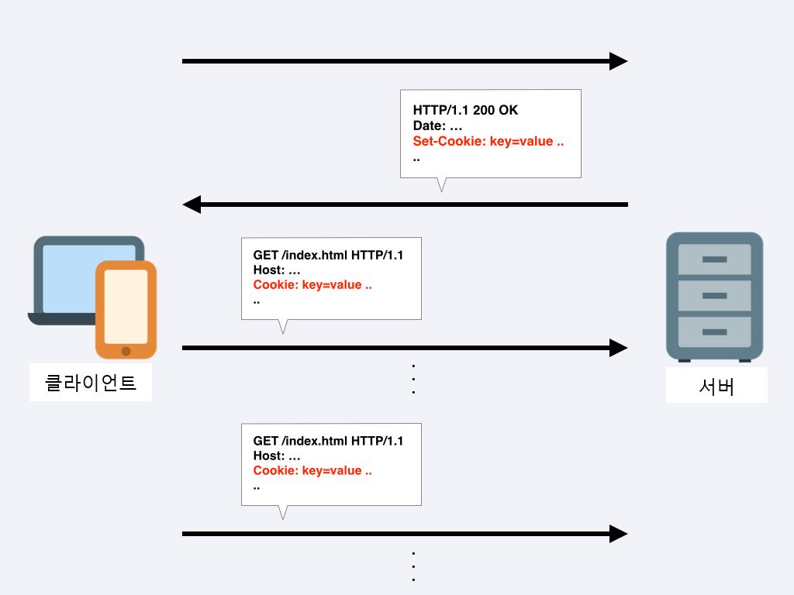

# http 모듈로 웹 서버 만들기

## 1. 요청과 응답

서버에는 요청을 받는 부분과 응답을 보내는 부분이 있어야 한다.  
클라이언트로부터 요청이 들어왔을 때 어떤 작업을 수행할지 이벤트 리스너를 미리 등록해두어야 한다.

### 1.1 [HTTP 모듈](https://nodejs.org/api/http.html#http_http)

http 서버가 있어야 웹 브라우저의 요청을 처리할 수 있다.  
Node.js 의 HTTP 인터페이스는 전통적으로 사용하기 어려운 프로토콜의 많은 기능을 지원하도록 설계되었다.

인터페이스는 전체 요청이나 응답을 절대 버퍼링하지 않도록 주의해야한다. 사용자는 데이터를 스트리밍할 수 있다.(the user is able to stream data)

- `http.createServer([options][, requestlistener])`: 인자로 요청에 대한 콜백함수를 넣을 수 있다.
  - Returns: `<http.Server>`

```js
// HTTP 서버와 클라이언트를 사용한다.
const http = require('http');

// 요청이 들어올 때마다 콜백 함수가 실행된다.
// req, request: 요청에 대한 정보들을 담고 있다.
// res, response: 응답에 대한 정보들을 담고 있다.
http
  .createServer((req, res) => {
    // 어떻게 응답할지 적는 곳
  })
  .listen(8080, () => {
    // 8080번 포트에서 서버에서 요청이 오기를 대기한다.
  });
```

- `server.listen()`: 연결을 수신하는 HTTP 서버를 시작한다. 이 메서드는 `net.Server` 의 [`server.listen()`](https://nodejs.org/api/net.html#net_server_listen_port_host_backlog_callback)과 동일하다.

#### `net.Server`: TCP, IPC 서버를 만드는 데 사용된다.

- `server.listen()`: 이 함수는 비동기이다. 서버가 수신 대기하기 시작하면 `listening`이벤트가 발생한다. 마지막 매개 변수 콜백이 `listening` 이벤트에 대한 리스너로 추가된다.
- `server.listen([port[, host[, backlog]]][, callback])`: 클라이언트에게 공개할 포트 번호와 포트 연결 완료 후 실행 될 콜백 함수를 넣는다.

```js
const http = require('http');

const server = http.createServer((req, res) => {
  res.write('<h1>Hello Node!</h1>');
  res.end('<p>Hello Server!</p>');
});

server.listen(8080);
// listen 메서드에 콜백함수를 넣는 대신,
// 서버에 listening 이벤트 리스너를 붙인다.
server.on('listening', () => {
  console.log('8080번 포트에서 서버 대기 중입니다.');
});

// error 이벤트 리스너
server.on('error', () => {
  console.log(error);
});
```

- `response.write(chunk[, encoding][, callback])`: 여러번 호출 해 데이터를 여러 개 보내도 된다.
  - `chunk(<string> | <Buffer>)`: 클라이언트로 보낼 데이터 (응답 본문(response body))
- `response.end([data][, encoding][, callback])`: 응답을 종료하는 메서드, 모든 응답 헤더와 본문이 전송되었음을 서버에 알린다. 인자가 있을 경우 그 데이터도 클라이언트에 보내고 응답이 종료된다.(data 가 있으면 `response.write(data, encoding)`를 호출 한 다음 `response.end(callback)`를 호출한 것과 같다.)

### 1.2 localhost 와 포트

#### [localhost](https://ko.wikipedia.org/wiki/Localhost)

현재 컴퓨터 내부 주소. 외부에서 접근할 수 없다. 서버 개발 시 테스트용으로 많이 사용된다.  
`127.0.0.1`을 주소로 사용해도 같다. 이러한 숫자 주소를 IP 라고 함

#### [포트(port)](<https://ko.wikipedia.org/wiki/%ED%8F%AC%ED%8A%B8_(%EC%BB%B4%ED%93%A8%ED%84%B0_%EB%84%A4%ED%8A%B8%EC%9B%8C%ED%82%B9)>)

서버 내에서 프로세스를 구분하는 번호.  
서버는 HTTP 요청을 대기하고, 데이터베이스와 통신하고, FTP 요청을 처리하는 등 많은 일을 한다. 이에 **서버는 프로세스에 포트를 다르게 할당해 들어오는 요청을 구분한다.**  
IP 주소 뒤에 콜론(:)과 함께 붙여 사용한다.

```
21   - FTP
23   - Telnet
80   - HTTP
443  - HTTPS
3306 - MYSQL
```

`https://www.naver.com/` 같은 사이트들은 포트번호를 따로 표시하지 않음, http 의 경우 80 번, https 의 경우 443 번 포트 번호를 생략할 수 있다. `https://www.naver.com:443`으로 요청해도 사이트에 접속된다.

## 2. 쿠키와 세션

### 2.1. 쿠키

클라이언트가 누구인지 기억하기 위해 서버는 요청에 대한 **응답을 할 때 쿠키라는 것을 같이 보내준다.** 서버로부터 쿠키가 오면 웹 브라우저는 쿠키를 저장해두었다가 요청할 때마다 쿠키를 같이 보낸다. 서버는 요청에 들어있는 쿠키를 읽어 사용자가 누구인지 파악한다.

- [쿠키(cookie)](https://ko.wikipedia.org/wiki/HTTP_%EC%BF%A0%ED%82%A4): 만료 기한이 있는 "키-값"의 저장소. 4kb 의 용량 제한이 있으며 매 서버 요청마다 서버로 쿠키가 같이 전송된다.

```
Cookie: PHPSESSID=298zf09hf012fh2; csrftoken=u32t4o3tb3gg43; _gat=1;
```

브라우저는 쿠키가 있다면 자동으로 같이 보내준다.  
**서버에서 브라우저로 쿠키를 보낼 때만 코드를 작성해서 처리하면 된다.**  
쿠키를 통해 악성 코드를 설치하거나, 바이러스를 옮길 수 없지만 브라우징 행동을 추적하거나 웹 계정의 접근 권한을 획득하는 등 개인정보가 유출 될 수 있으므로 쿠키를 주기적으로 지우는 것이 좋다.

쿠키는 요청과 응답 헤더(header)에 저장된다.

```js
const http = require('http');

// 쿠키는 "<cookie-name>=<cookie-value>;<cookie-name>=<cookie-value>"
// 형태의 문자열 형식으로 오는데 이를 객체로 바꿔주는 함수
const parseCookies = (cookie = '') =>
  cookie
    .split(';')
    // ["<cookie-name>=<cookie-value>", "<cookie-name>=<cookie-value>"]
    .map(v => v.split('='))
    // [["<cookie-name>","<cookie-value>"], ["<cookie-name>","<cookie-value>"]]
    .map(([k, ...vs]) => [k, vs.join('=')])
    // 혹시 value가 여러 개라면
    /* [["<cookie-name>","<cookie-value>=<cookie-value>"], 
        ["<cookie-name>","<cookie-value>"]]
    */
    .reduce((acc, [k, v]) => {
      acc[k.trim()] = decodeURIComponent(v);
      return acc;
    }, {});
/* {
 *   "<cookie-name>": "<cookie-value>=<cookie-value>"
 *   "<cookie-name>": "<cookie-value>"
 * }
 */

http
  .createServer((req, res) => {
    // req객체에 담긴 쿠키를 분석
    // req.headers.cookie에 쿠키가 들어있다. (req.headers는 요청의 헤더)
    const cookies = parseCookies(req.headers.cookie);
    console.log(req.url, cookies);

    // `res.writeHead`로 응답의 헤더에 쿠키를 기록한다.
    res.writeHead(200, { 'Set-Cookie': 'mycookie=test' });
    res.end('Hello Cookie');
  })
  .listen(8082, () => {
    console.log('8082번 포트에서 서버 대기 중입니다.');
  });
```

```sh
8082번 포트에서 서버 대기 중입니다.
# http://localhost:8082/ local접속 후
/ {}
/robots.txt {mycookie: 'test' }
/favicon.ico {mycookie: 'test' }
```

- [`response.writeHead(statusCode[, statusMessage][, headers])`](https://nodejs.org/api/http.html#http_response_writehead_statuscode_statusmessage_headers): 요청에 대해 응답 헤더를 보낸다. 이 메소드는 메시지에서 한번만 호출되어야 하며, `response.end()`가 호출되기 전에 호출되어야 한다.
- [`decodeURIComponent(encodedURI)`](https://developer.mozilla.org/ko/docs/Web/JavaScript/Reference/Global_Objects/decodeURIComponent): 암호화된 URI 컴포넌트에서 각각의 이스케이프 시퀀스(확장 문자열)를 자신을 나타내는 문자로 바꾼다.(복호화)
- [`request.url`](https://nodejs.org/api/http.html#http_message_url): 주소의 path 와 search 부분을 알려준다.
- `Set-Cookie`: Set-Cookie HTTP 응답 헤더는 서버로부터 사용자 에이전트로 전송된다. 간단한 쿠키는 다음과 같이 설정할 수 잇다.

```
Set-Cookie: <cookie-name>=<cookie-value>
```

```
Response Headers

  Set-Cookie: mycookie=test
```

```
Request Headers

  Cookie: _ga=GAX.XXXX.XXXXXX; mycookie=test
  Host: localhost:8082
```

  
<sub>(이미지 출처: https://qiita.com/mogulla3/items/189c99c87a0fc827520e)<sub>

### 2.1.1. [HTTP 상태 코드](https://developer.mozilla.org/ko/docs/Web/HTTP/Status)

- 2XX: 성공
  - 200 OK: 성공
  - 201 Created: 작성됨
- 3XX: 리다이렉션(다른 페이지로 이동)
  - 301 Moved Permanently: 영구 이동
  - 302 Found: 임시 이동
- 4XX: 요청 오류(요청 자체에 오류)
  - 401 Unauthorized: 권한 없음
  - 403 Forbidden: 금지됨
  - 404 Not Found: 찾을 수 없음
- 5XX: 서버 오류(요청은 제대로 왔으나 서버에 오류가 발생), 클라이언트로 `res.writeHead`로 직접 보내는 경우는 없고, 서버가 알아서 5XX 대 코드를 보낸다.
  - 500 Internal Server Error: 내부 서버 오류
  - 502 Bad Gateway: 불량 게이트웨이
  - 503 Service Unavailable: 서비스를 사용할 수 없음

### 2.1.2. 헤더와 본문

  
<sub>(이미지 출처: https://www.quora.com/What-does-an-HTTP-request-looks-like)<sub>

요청과 응답은 모두 헤더와 본문을 가지고 있다.

- 헤더: 요청 또는 응답에 대한 정보를 가지고 있다.
- 본문: 서버와 클라이언트 간 주고받을 실제 데이터를 담아두는 공간

#### [HTTP headers](https://developer.mozilla.org/ko/docs/Web/HTTP/Headers)

- General header: 요청, 응답 모두의 공통된 헤더, 본문에 전송 된 데이터와 관련이 없음
- Request header: 요청의 헤더(가져올 리소스 또는 클라이언트에 대한 자세한 정보를 포함)
- Response header: 응답의 헤더(응답에 대한 추가 정보, 예를 들어 위치 또는 서버의 이름 및 버전 등의 정보)
- Entity header: 콘텐츠 길이나 MIME 타입과 같이 엔티티 본문에 대한 더 많은 정보를 포함

#### [Set-Cookie](https://developer.mozilla.org/ko/docs/Web/HTTP/Headers/Set-Cookie)

쿠키는 설정할 때 Expires(만료 시간), HttpOnly, Path 같은 옵션을 넣을 수 있다.  
옵션 간 구분은 세미콜론(;)으로 한다.

- `<cookie-name>=<cookie-value>`: 기본적인 쿠키 값
- `Expires=<date>`: 만료 기한. 이 기한이 지나면 쿠키가 제거된다. 기본값은 클라이언트가 종료될 때까지
  - `Max-Age`가 설정되어있을 경우 무시된다.
- `Max-Age=<non-zero-digit(초)>`: `Expires`와 비슷하지만 날짜 대신 초를 입력할 수 있다. 해당 초가 지나면 쿠키가 제거된다.
- `Domain=<domain-value>`: 쿠키가 전송될 도메인을 특정한다. 기본값은 현재 도메인
- `Path=<path-value>`: 쿠키가 전송될 URL 을 특정할 수 있다.
  - 기본값 '/': 모든 URL 에서 쿠키를 전송할 수 있다.
- `Secure`: HTTPS 일 경우에만 쿠키가 전송
- `HttpOnly`: 설정 시 자바스크립트에서 쿠키에 접근할 수 없음. 쿠키 조작을 방지하기 위해 설정 권장

---

- [MDN - Cookie](https://developer.mozilla.org/ko/docs/Web/HTTP/Headers/Cookie)
- [MDN - HTTP 쿠키](https://developer.mozilla.org/ko/docs/Web/HTTP/Cookies)
- [zeroCho - 로컬스토리지, 세션스토리지](https://www.zerocho.com/category/HTML/post/5918515b1ed39f00182d3048)
