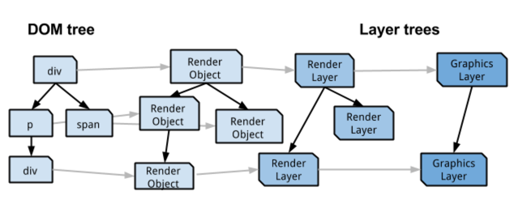

# 브라우저 GPU 가속이 동작하는 방식과 애니메이션 퍼포먼스 튜닝 방법

## GPU 가속, 하드웨어 가속

[하드웨어 가속](https://ko.wikipedia.org/wiki/%ED%95%98%EB%93%9C%EC%9B%A8%EC%96%B4_%EA%B0%80%EC%86%8D)은(GPU 가속이라고도 한다) 어플리케이션의 연산집약적인 부분(그래픽 연산 같은)을 GPU를 통해 수행하고 나머지 코드를 CPU에서 처리하는 식으로 함께 사용하여 CPU의 처리량을 줄이면서 어플리케이션의 속도를 빠르게 할 수 있는 하드웨어의 사용을 말한다.

## CPU? GPU?


- CPU는 직렬 처리에 최적화 된 몇 개의 코어(싱글 코어라면 하나)로 구성되어있다.
- GPU는 병렬 처리를 효율적으로 처리하기 위해 설계된 수 천개의 더 작은 코어로 구성되어 있다.

초기의 웹 브라우저는 웹 페이지 콘텐츠를 렌더링하기 위해 CPU에 전적으로 의존했는데...  
GPU를 사용하여 웹 페이지의 내용을 합성하면 속도가 크게 빨라질 수 있다.

## 페이지를 렌더링하는 방법

(※ Blink 렌더 엔진을 참고했으므로 다른 렌더 엔진과 방식이 다를 수 있으며 레이어 모델은 브라우저의 구현을 위한 모델이지 표준 지침이 있는 것은 아님)



- HTML소스가 로딩되고 파싱되면 웹 페이지의 콘텐츠들은 DOM 트리로 불리는 노드 객체 트리로 저장된다.
- 시각적으로 화면에 표현되는 DOM 트리의 각 노드는 렌더 트리라고 하는 병렬 트리를 구성하는 RenderObject에 대응한다.
- 각 RenderObject는 조상 RenderObject를 통해 직간접적으로 RenderLayer와 연결된다.
- 동일한 좌표 공간(에를 들어 동일한 css 변환의 영향을 받는) RenderObjects는 일반적으로 동일한 RenderLayer에 속한다.
- RenderLayer 중 실제로 그려질 노드는 GraphicsLayer를 생성한다.

이 GraphicsLayer들이 텍스쳐(일종의 비트맵 이미지)로써 GPU에 업로드되어 합성된 다음 화면에 출력된다.

## RenderLayer가 생성되는 조건

겹치는 콘텐츠, 반투명 요소 등을 올바르게 표시 할 수 있도록 페이지의 요소가 올바른 순서로 합성되도록 존재한다.

- 페이지의 루트 객체
- 명시적인 css position property(relative, absolute 또는 transform)
- 투명한(transparent) 요소
- 오버플로, alpha 마스트 또는 reflection
- css filter
- 3D(WebGL) 컨텐스트 또는 가속화된 2D 컨텍스트를 가진 `<canvas>` 요소
- `<vidoe>` 요소

## GraphicsLayer가 생성되는 조건

하드웨어 가속 처리를 위한 물리적인 레이어

- 3D, perspective transform CSS properties
- 비디오 디코딩 가속을 사용하는 `<video>` 요소
- 3D 컨텍스트 또는 가속화 된 2D 컨텍스트가있는 `<canvas>` 요소
- (예를 들어 Flash)와 같이 포함된 플러그인
- 투명도(Opacity)의 CSS 애니메이션이나 애니메이션되는 변환(Transform)을 사용하는 엘리먼트
- 가속되는 CSS 필터를 가진 엘리먼트
- 합성 레이어(Compositing layer)를 자손으로 가지는 엘리먼트 (즉, 스스로의 레이어를 가지는 자식 엘리먼트를 가진 엘리먼트)
- 형제(Sibling)가 합성 레이어와 낮은 z-index를 가지는 엘리먼트 (즉, 합성 레이어의 상단에 렌더링되는 엘리먼트)

## 가속 대상 확인하기

- 크롬 개발자 도구
  - Rendering 탭에서 Layer borders 체크
  - Layer 탭에서 페이지에 구성된 레이어를 확인할 수 있다.
- 사파리 개발자 도구
  - 마찬가지로 Layer 탭에서 페이지에 구성된 레이어를 확인할 수 있다.

## 모든 animation에 GPU가속이 발생하지는 않는다.

- [css triggers](https://csstriggers.com/)

layout이 발생하는 animation은 GPU로 그리지 않는다.

> - 레이아웃: 화면에서 얼마의 공간을 차지하고 어디에 배치되는지 계산한다. 웹의 레이아웃 모델은 한 요소가 다른 요소에 영향을 줄 수 있다.
> - 페인트: 픽셀을 채우는 프로세스로 시각적 부분을 그리는 작업이다.

다음은 layout을 발생시키는 left 요소를 이용한 애니메이션으로 GPU 가속이 발생하지 않는다.

```html
<style>
.a {
  position: absolute;
  left: 0;
  width: 90px;
  height: 90px;
  transition: left 1s;
}
.animate .a {
  left: 100px;
}
<style>
</head>
<body>
  <div class="a"></div>
  <button onclick="document.body.classList.toggle('animate')">Play</button>
</body>
```

다음은 GPU 가속이 발생한다.

```html
<style>
.a {
  position: absolute;
  left: 0;
  width: 90px;
  height: 90px;
  transition: transform 1s;
}
.animate .a {
  left: 100px;
  transform: translateX(100px);
}
<style>
</head>
<body>
  <div class="a"></div>
  <button onclick="document.body.classList.toggle('animate')">Play</button>
</body>
```

## GPU 가속 핵

(레이어(GraphicsLayer)를 만드는 방법)

- 3D transform
  - `transform: translateZ(0);`
  - `transform: translate3d(0, 0, 0);`
- `will-chage`: 요소에 예상되는 변화의 종류에 관한 힌트를 브라우저에 제공해 실제 요소가 변화되기 전에 미리 브라우저가 적절하게 최적화할 수 있게 한다.

```css
.a {
  will-chage: transform;
}
```

※ [CSS will-change 프로퍼티에 관해 알아둬야 할 것](https://dev.opera.com/articles/ko/css-will-change-property/)

## GPU 가속시 주의할 점

- 무분별한 GPU 가속은 되려 성능을 저하시킬 수 있다.
  - CPU와 GPU가 서로 다른 메모리를 사용하므로 정보를 동기화해야 하는데 이때 드는 시간
  - 암묵적 컴포지팅에 의해 의도치 않게 생겨난 큰 레이어, 중복 레이어를 모두 계산하면서 발생하는 성능 저하, 메모리 소모
- 암묵적 컴포지팅
  - [(번역) CSS GPU 애니메이션 제대로 하기](https://wit.nts-corp.com/2017/08/31/4861)
  - [프론트엔드 개발자를 위한 Layer Model](https://www.slideshare.net/Sn0wLe0pard/layer-model)

## 성능 향상을 위한 방법

### 불필요한 페인트를 피한다.

> - [Avoiding Unnecessary Paints](https://www.html5rocks.com/ko/tutorials/speed/unnecessary-paints/)
> - [Avoiding Unnecessary Paints: Animated GIF Edition](https://www.html5rocks.com/ko/tutorials/speed/animated-gifs/)

- 스크롤이 일어나는 동안 페인팅 작업이 작아야 사용자가 멈칫거리는 현상을 보지 않는다.
- hover, click, touch, drag 같은 상호작용들은 다른 페인트 작업을 발생시킨다.
- 애니메이션 GIF는 불필요한 페인팅을 발생시킨다.

### 암묵적 컴포지팅을 피한다

- 애니메이션 처리된 오브젝트의 z-index값을 최대한 높게 유지한다.(body 요소의 직계 자식 요소인 것이 좋다)
- will-change를 통해 브라우저가 사전에 이 요소를 컴포짓 레이어 위에 올려두도록 하며, 해당 변경 후에는 제거하도록 한다.

### 합성에 영향을 주는 속성(tranform, opacity)의 변경만으로 애니메이션을 만든다.

> [High Performance Animations](https://www.html5rocks.com/ko/tutorials/speed/high-performance-animations/)

레이아웃, 페인트를 발생시키는 속성의 애니메이션을 피하자.

---

- [High Performance Animations](https://www.html5rocks.com/ko/tutorials/speed/high-performance-animations/)
- [하드웨어 가속에 대한 이해와 적용](https://d2.naver.com/helloworld/2061385)
- [GPU Accelerated Compositing in Chrome](https://www.chromium.org/developers/design-documents/gpu-accelerated-compositing-in-chrome)
- [(번역) CSS GPU 애니메이션 제대로 하기](https://wit.nts-corp.com/2017/08/31/4861)
- [프론트엔드 개발자를 위한 크롬 렌더링 성능 인자 이해하기](https://medium.com/@cwdoh/%ED%94%84%EB%A1%A0%ED%8A%B8%EC%97%94%EB%93%9C-%EA%B0%9C%EB%B0%9C%EC%9E%90%EB%A5%BC-%EC%9C%84%ED%95%9C-%ED%81%AC%EB%A1%AC-%EB%A0%8C%EB%8D%94%EB%A7%81-%EC%84%B1%EB%8A%A5-%EC%9D%B8%EC%9E%90-%EC%9D%B4%ED%95%B4%ED%95%98%EA%B8%B0-4c9e4d715638)
- [모던 웹 브라우저의 내부 살펴보기 (Part 1)](https://medium.com/@euncho/%EB%AA%A8%EB%8D%98-%EC%9B%B9-%EB%B8%8C%EB%9D%BC%EC%9A%B0%EC%A0%80%EC%9D%98-%EB%82%B4%EB%B6%80-%EC%82%B4%ED%8E%B4%EB%B3%B4%EA%B8%B0-part-1-8650c5900974)
  - [원문: Inside look at modern web browser (part 3)](https://developers.google.com/web/updates/2018/09/inside-browser-part3)
- [성능 좋은 웹 애니메이션과 인터렉션: 60 FPS 달성](https://github.com/codepink/codepink.github.com/wiki/%EC%84%B1%EB%8A%A5-%EC%A2%8B%EC%9D%80-%EC%9B%B9-%EC%95%A0%EB%8B%88%EB%A9%94%EC%9D%B4%EC%85%98%EA%B3%BC-%EC%9D%B8%ED%84%B0%EB%A0%89%EC%85%98:-60-FPS-%EB%8B%AC%EC%84%B1)
- [CSS 애니메이션 성능 개선 방법(reflow 최소화, will-change 사용)](https://wit.nts-corp.com/2017/06/05/4571)
