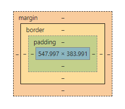

# 3/23 (금)

## 1. Today I learend

### 1-1. CSS

+ 마크업 언어가 실제로 표시되는 방법을 기술한다.
+ 사용자 에이전트 스타일을 변경한다.
+ 다양한 마크업 언어에 사용 할 수 있다(HTML, XHTML, XML...)
+ W3C의 표준
+ 어떻게하면 공통된 것들에 가이드를 정하고 같은 스타일을 지정할 것인가. 어떻게 모듈화할 것인가.

✏️ **스타일 이야기**  
아래아 한글은 도스용으로 시작했던 워드 프로세스 프로그램이다. 이러한 워드프로세스 등에 글꼴과 문단 모양을 저장해 사용하는 스타일 기능이 있어 공통된 역할에 일관된 스타일을 지정해 줄 수 있었다.  
많은 페이지를 수정할 때 편리했다.

> **사용자 에이전트 스타일시트(User Agent Style Sheets)**  
케스케이드의 초석인 스타일, 웹 브라우저에서 스타일 정보가 첨부되지 않은 HTML 문서를 제공할 때 최소한의 서식을 사용하여 제공한다.
> + [User Agent Style Sheets: Basics and Samples](https://meiert.com/en/blog/user-agent-style-sheets/)

#### 1-1-1. CSS History

+ CSS Level 1   - 1996년W3C 주도하 발표
+ CSS Level 2   - 1998년
+ CSS Level 2.1 - 2006년 발표, Level 2의 버그 수정. 현재까지 표준으로 사용
+ CSS Level 3 - HTML5와 같이 등장했다. 스펙이 이전보다 훨씬 방대하게 늘어나서 모든 명세가 포함된 버전이 아니라 모듈단위로 개발되고, 표준화가 진행되고 있다. (Working Draft 단계에 머물러 있는 모듈도 있다.)

새로운 기술을 쓸 때 브라우저에서 지원하는지, 이슈가 없는지, 미지원 브라우저를 위한 폴리필이 있는지, 폴리필을 따로 만들어 쓸지 고려해서 써야한다.

프레임워크는 춘추전국 시대 어떤 것이 살아남을지 알 수 없다. 중요한 것은 그것의 기본이 되는 자바스크립트를 탄탄히 공부해 두는 것

#### 1-1-2. 웹표준 개발 단계

1. **Draft(초안)** 
2. **Working Draft(WD, 작업 초안)** 
3. **Candidate Recommendation(CR, 권고 후보)**: 권고안이 될 가능성이 아주 많지만 드랍 될 수도 있다. (예를들어 `<time>`이 Draft되었다가 드랍되고 `<date>`가 올라갔다가 다시 내려가고 `<time>`이 올라갔다.)
4. **Proposed Recommendation(PR, 최종 권고안)**: 스펙으로서의 표준(메이저 브라우저가 지원하는 현실적 표준과는 약간 차이가 있을 수 있다)
5. **Recommendation(REC, 권고안)**: 강제성이 없기 때문에 브라우저가 권고안을 수용하지 않으면 사용할 수 없다.(IE)

> **LC(Last Call Working Draft)** - Working Draft의 마지막 단계

✏️ **비표준 이야기**  
과거 넷스케이프 네비게이터와 인터넷 익스플로러가 서로 경쟁하면서 독자적인 기술을 자랑하느라 비표준의 독자적 기술들을 막 뽑아냈다.(렌더링 형식이 엄청 다르다.)  
개발자들은 이런 브라우저 간의 차이를 맞추기 위해 조건문으로 분기해서 처리해야 해서 고통스러워졌다.  
넷스케이프가 익스와의 경쟁에서 결국 패했지만 자사 기술을 오픈소스로 공개하도록 정책을 변경하면서 웹 발전에 많은 기여를 했다. 모질라 파이어폭스의 전신이다.  

익스는 렌더링 방식을 호환성 보기 모드라해서 비표준, 표준의 다양한 렌더링 방식을 제공했다. 웹표준을 준수한 사이트도 호환성 보기 렌더링에서 오히려 깨지는 문제도 발생했다.

+ [Specifying legacy document modes](https://goo.gl/kgKr4U)
+ [Understanding the need for document compatibility modes](https://goo.gl/t7TiWM)

아이폰이 우리나라에 들어왔을때 비표준인 우리나라의 많은 사이트들이 깨지거나 아무것도 보이지 않는 경우도 발생했다.  
플래시나 비표준 태그들을 지원하지 않아서 웹표준을 준수하는 것이 중요해졌다.

##### 🔖 CSS 스펙관련 링크

+ [w3c /css](https://www.w3.org/Style/CSS/)
+ 모듈 중 흥미로운 기술: 마스킹기법 [CSS Masking Module Level 1](https://www.w3.org/TR/css-masking-1/)
+ 브라우저가 CSS3를 지원하는지 직관적으로 확인가능한 사이트 : [css3test](http://css3test.com/)

#### 1-1-3. css사용 의의

+ 구조와 무관한 표현적 요소를 CSS로 분리한다.
+ 웹 문서가 기계적으로 해석될 수 있는 가능성이 높아진다.
+ HTML이 간결해지고 더욱 구조화 될 수 있다.

🔖 [css zen garden](http://csszengarden.com/) : 다양한 디자인을 적용해볼 수 있는 사이트. 전세계의 개발자들이 HTML 구조를 내려받아 자신만의 css 스타일링을 올린다. 에릭마이어 작품도 있다.  
구조와 표현이 완벽하게 분리된다면 위와 같은 사이트가 가능하다.

✏️ 크로스브라우징이라는 것은 디자인의 1px까지 똑같도록 만드는 게 아니라 접근할 수 있는 환경을 만들어주는 것이다. 환경에 대한 특성을 이해하고, 접근할 수 있는 UI를 제공하는 것이 중요하다.


#### 1-1-4. 웹 브라우저별 접두사(vendor prefix)

CSS3 표준안이 확정되지 않은 상태에서 최신 웹 브라우저들이 실험적으로 제공하고 있는 속성을 사용하기 위해 속성이나 속성 값 앞에 접두사를 제공한다.
같은 웹킷이더라도 버전별로 플랫폼 별로 렌더링이 다를 수 있다. 특히 모바일은 모듈 파편화가 심각함

`border-radius`가 실험적인 단계였을때 아래와 같이 사용했다.
```css
div {
  -moz-border-radius: 10px; /* 파이어폭스 */
  -ms-border-radius: 10px; /* 인터넷 익스플로러 */
  -o-border-radius: 10px; 
  -webkit-border-radius: 10px;
  border-radius: 10px;
}
```

Sass에서 compass같은 프레임워크의 자동기능을 사용하면 이러한 벤더프리픽스를 자동으로 붙여줬다. **[prefix free](https://leaverou.github.io/prefixfree/)**라는 완벽히 안정적이지는 않지만 폴리필을 제공하는 스크립트도 있다.

#### 1-1-5. 단위

+ 상대 단위 : em, ex, ch, rem, vw, vh, vmin
+ 절대 단위 : cm, mm, in, px, pt, pc
+ 기타 단위 타입 : deg, grad, rad, turn, s, ms, Hz, kHz

#### 1-1-6. 색상

CSS3에서 색상 단위는 좀 더 확대. 투명값이나 색상, 채도, 명도 지정 가능, HSL 방식, current color 키워드가 추가되었다.

+ RGBA : `color: rgba(255, 127, 45, 0.5)`
+ HSLA : `color: hsla(0, 0%, 100%, 0.5)`

※ HSL(Hue, Saturation, Lightness)

#### 1-1-7. CSS 적용하는 방법

+ external : HTML파일 head에`<link>`, CSS파일 내에`@import`
+ embeded : HTML파일 내에`<style>`
+ inline : 태그 내에 `style=""`

```html
<link rel="stylesheet" href="style.css">
<link type="text/css" rel="stylesheet" href="style.css">
```

```css
@charset 'utf-8';
@import url('style.css');
```

```html
  <style>
    a { color: inherit}
  </style>
</head>
<body>
```

```html
  <div class="dummy" style="color: red">red</div>
```

external 방식이 성능상 이점이 있다. 이미 불러들인 css 파일은 캐시해두어 다음 요청시에는 캐시된 것을 불러오기 때문이다.  
임베드 형식은 파일 내부에 들어있기 때문에 캐시를 사용할 수 없다.

인라인은 CSS 우선순위가 가장 높아 스타일의 재정의가 어렵거나 불가능하다.  
단, CSS 우선순위를 무력화 시키는 `!important`를 사용할 경우는 스타일을 재정의 할 수 있다. 

#### 1-1-8.선택자

스크립트를 사용해 동적으로 요소를 추가할 때, 특정 순서의 요소를 찾아내야할 때 등 유용하다.

+ **전체선택자**: `* {}`
+ **요소선택자**: E - `h1 {}`, `p {}`, `div {}`
+ **클래스 선택자**: E.class-name, E.class-name.class - `.header {}`, `.header.navigation {}`
+ **아이디 선택자**: E#idName - `#main {}`
+ **속성선택자**:  E[attr], E[attr="val"], E[attr~="val"], E[attr^="val"], E[attr$="val"], E[attr*="val"], E[attr|="en"] - `a[title] {}`
+ **가상클래스 선택자**: : 
  - **동적 가상 클래스**: `:link`, `:visited`, `:active`, `:hover`, `:focus`
  - **타깃 가상 클래스**: `:target`
  - **언어 가상 클래스**: `:lang`
  - **UI 요소 상태 가상 클래스**: `:enabled`, `:disabled`, `:checked` 
  - **구조 가상 클래스**: `:root`, `:nth-chlid()`, `:nth-last-child()`, `:nth-of-type()`, `:nth-last-of-type()`, `:first-child()`, `:last-child()`, `:first-of-type()`, `:last-of-type()`, `:only-child()`, `:only-of-type()`, `:empty`
  - **부정 가상 클래스**: `:not()`
+ **가상 요소 선택자**: `:first-line`, `:first-letter`, `:before`, `:after`, `:selection`
+ **하위 선택자(문맥선택자)**: [선택자] [선택자] - `#main div {}`
+ **자식 선택자**:  [선택자] > [선택자] - `#main > div {}`
+ **형제 선택자**: [선택자] + [선택자], [선택자] ~ [선택자] - `.header ~ .main {}`
+ **선택자 그룹화**: [선택자], [선택자] - `.header, .conatiner {}`

문맥선택자는 찾아내는 범위를 좁혀준다. 

#### 1-1-9. 선택자 우선 순위

+ [CSS specificity - MDN](https://developer.mozilla.org/ko/docs/Web/CSS/Specificity)

css 캐스케이딩의 약자이며 스타일이 쌓인다는 의미이다. 스타일의 우선순위를 정한다.  
캐스케이드가 많이 될 경우 성능 이슈가 있을 수 있으므로 설계를 잘하자!
(모던 브라우저의 성능이 좋아져서 별 차이가 없다 하더라도 불필요한 코드를 줄이자.)

구체성(specificity)이 높을수록 우선순위 점수가 높아진다.

```css
.main section {} /* id 0, class 1, element 1 : 11 */
.favorite-site {} /* id 0, class 1, element 0 : 10 */
section.favorite-site {} /* id 0, class 1, element 1 : 11(나중에 선언되었으므로 .main section {} 보다 더 우선함)*/
.main .favorite-site {} /* id 0, class 2, element 0 : 20 */
```

성능관점에서는 연달아 길게 구체성을 잡는 것은 좋지않다.  
(브라우저 엔진 성능이 좋아져서(렌더링 속도가 좋아져서) 요즘은 잘 고려하지 않는 추세이긴 함)

+ 태그의 `style` 속성으로 지정하는 인라인 스타일의 경우 구체성 점수 1000으로 위의 우선순위를 뛰어넘는다.
+ `!important`: 구체성을 무력화 시킨다. `!important`를 무력화시키려면 또 `!important`를 사용해야한다. 자주 쓰지 말고 오타가 없었는지 우선순위가 밀린건지 확인하는 용도정도나 혹은 정말 필요한 경우에 사용하자. 
부트스트랩같은 경우 동적으로 클래스가 삽입되는 경우가 있기 때문에 정해진 결과를 불러오기 위해 `!important`를 많이 사용한다.
+ 전체 선택자(*)와 연결자(>, +, ~ ,'')는 구체성에 영향을 주지 않는다.
+ 부정선택자(:not())는 괄호안의 요소는 구체성에 영향을 주지만 그 자체로는 구체성에 영향을 주지 않는다.

```css
.favorite-site {
  background-color: silver!important; /* 붙여써도 띄어써도 상관없음 */
  background-color: silver !important;
}
```

#### 1-1-10. Basic box model



문서에서 각 요소는 사각형 박스로 나타낸다. 요소에 의해 차지되는 공간의 내용(content)을 설명한다.

+ margin : border를 기준으로 다른 요소와의 바깥쪽 여백 지정
+ border : 요소 박스 테두리 지정(마진과 패딩 사이)
+ padding : content 영역과 border 사이의 안쪽 여백 지정
+ content : 요소의 콘텐츠가 표시되는 영역

✏️ `margin: 0 auto`의 본래 의미는 가운데 정렬이 아니라 뷰포트의 나머지 영역을 투명한 영역이 다 차지하고 있는 것이다. 그 다음 요소가 옆으로 올 수 없어 요소가 가운데로 정렬된 것처럼 보이기 때문에 쓰이고 있다.

+ [CSS 박스 모델 입문 - MDN](https://goo.gl/7orK89)

##### box-sizing 

요소의 너비와 높이를 계산하는 데 사용되는 기본적인 CSS Box Model을 대체하기 위해 사용된다. 요소 박스의 크기를 결정하는 방식을 지정 

+ content-box : CSS 표준에 정의된 기본 스타일 (w + p + b + m)
+ border-box : w(p + b 포함)
+ ~~padding-box~~ : 아직 실험적인 단계, 파이어폭스 외의 브라우저에서 지원하지 않는다.

box-sizing을 베이직 박스 모델인 `content-box`가 아니라 `border-box`로 설정하면 기존에 div 2개로 랩핑해야 가능했던 여백(padding) 디자인이 하나의 div로도 가능하게 되었다.

box-sizing은 익스8마저도 지원하는데 이는 옛날 익스(<=IE6)의  'quirks mode'에서 상자 모델을 다르게 처리했던 것에서 나왔기 때문이다.

[box-sizing 관련 히스토리가 CSS Trick에 나와있다.](https://css-tricks.com/box-sizing/)  


#### 1-1-11. 레이아웃 CSS

+ display: inline-block, float, grid (display 속성의 값이다.)
+ float: left, right

마크업이 일반적인 흐름과 다르다면 inline-block은 배치 기법으로 적합하지 않다.

#### 1-1-12. Flexible box model

스타일링 전 기본 배치는 위에서 아래로 선형화되어 있다. 배치를 가로방향으로 하고 싶다면 flexible기술이 유용할 수 있다.

##### flex container

+ `display: flex`: 가로방향 배치가 기본이다(`flex-driection: row`). 높이는 부모영역만큼 차지한다. flex-item을 포함하는 flex-container가 되며 손자 영역을 제외하고 자식영역에게만 영향을 준다.
+ `flex-diection: row | row-reverse | column | column-reverse` : 
배치 방향 **메인축, 교차축이 row, column, reverse에 따라 변경**된다.
+ `flex-wrap: nowrap | wrap | wrap-reverse` : 기본적으로 자식 요소 박스가 한 줄에 맞춰 정렬되는 데 wrap으로 지정하면 멀티라인으로 배치된다.
+ `flex-flow: <flex-derection> || <flex-wrap>` : flex-direction과 flex-wrap의 속기법
+ `justify-content: flex-start | flex-end | center | space-beteen | space-around | space-evenly`: 메인축(주축) 정렬
+ `align-items: flex-start | flex-end | center | baseline | stretch` : 라인박스의 높이에 따라 배치되는 요소 박스에 배치에 영향을 주는 교차 축을 지정하는 속성, 교차축 정렬
+ `align-content: flex-start | flex-end | center | baseline | stretch`: 여러개의 행이나 열로 구성된 요소 박스의 정렬을 지정

🌟 메인축 정렬과 마진의 조합으로 생기는 일
```css
.main {
  display: flex;
  flex-direction: row;
  justify-content: center; /* (메인축 가로정렬) */
}
.favorite-site {
  order: 1;
  margin: auto; /* 메인축 기준으로 왼쪽으로 밀린고 나머지 영역을 margin으로 차지한다.*/
}
```

##### flex items

+ `order: <integer>` : 아이템 순서. 초기값을 0이다. 숫자가 클 수로 뒤로 밀린다.
+ `align self: align-self: auto | flex-start | flex-end | center | baseline | stretch` : 개별 요소에 적용할 수 있는 속성. align-items가 지정된 값들을 인자로 받아 지정한 flex-items 요소에만 적용된다. 
+ `flex: none | [ <'flex-grow'> <'flex-shrink'>? || <'flex-basis'> ]` : flex-grow, flex-shrink, flex-basis의 속기법. flex-shrink, flex-basic는 선택적이다.
  - `flex-grow: <number>` : 자식요소에 확대 비율을 지정해 부모 요소의 크기에 맞게 자동으로 크기를 조정
  - `flex-shrink: <number>` : 자식요소에 축소 비율을 지정해 부모 요소의 크기에 맞게 자동으로 크기 조정
  - `flex-basis: <'width'>` : 유연하게 조절되는 박스의 기준 크기를 지정
 
```css
.main {
  display: flex;
}
.favorite-site {
  order: 1;
}
.twitter {
  /* default - order: 0; */
}
/* .favorite-site가 .twitter보다 먼저 마크업 되었어도 트위터 다음으로 온다. */
```

✏️ `justify-content: space-between(양 옆 거터 없음) || space-around(양 옆 거터있음);`를 쓸 때 플랙스 아이템의 넓이가 비율에 맞지 않게 크다면 비율대로 맞춰 축소해준다.( 확대 축소 알고리즘이 내장되어있다.)

+ [flex froggy 예제](http://flexboxfroggy.com/#ko)

### 1-2. HTML 구조 설계

구조와 디자인 사이의 간극이 있을때 고민해서 최적의 결과를 도출하자.

#### 실습 헤더 작업

모바일 퍼스트로 고려하라는 말은 논리적인 흐름을 해치지 않을때이다.  
서비스의 성격에 따라 논리 흐름은 다를 수 있다. (가입을 먼저 유도해야 한다든가, 검색을 우선한다든가.) 서비스에 대한 고민을 해야한다.

##### 로고 작업 

이미지로 마크업할 지, 텍스트로 할 지 고민해야한다. 텍스트로 해서 백그라운드로 이미지를 제공하고 텍스트는 숨길건지 개발방향을 정한다.

ir기법, 또는 wai-aria 기법을 이용해 대체 텍스트 혹은 정보를 제공해준다.

🔖 [responsive logo](http://responsivelogos.co.uk/) - 텍스트없이 백그라운드만 넣은 로고는 웹접근성 관점에서는 0점

모바일은 디스플레이 성능이 굉장히 좋아졌다. 레티나 디스플레이의 경우 일반 해상도의 2배이다. 데스크탑에 맞춰 제공한 이미지가 레티나 에서는 흐릿해보이는데 이는 그 이미지를 2배 늘려서 보여주기 때문이다.  
아이폰과 최근 갤럭시는 3, 4배까지 늘어났다. 그만큼 큰 이미지를 제공하거나 벡터 이미지(svg)를 사용하는 방법이 있다.

만약 텍스트로 제공한다면 SEO 관점에서 검색 노출에도 좋다.

```html
<h1 class="logo">
  <a href="">
    
  </a>
</h1>
```

img의 alt에 이미지와 동등한 내용을 넣어준다.  
예) Web Cafe (o), 로고 (x)
웹접근성 관점에서 WebCafe보단 Web Cafe라고 띄어쓰기를 지켜줘야 스크린리더가 적절히 읽을 수 있다.

※ 웹 접근성 평가 : 
정성적인 평가(사람이 일일이 체크), 정량적인 평가(기계적으로 평가)
QA테스트할때 다양한 레포팅 툴 중에 openWAX도 사용된다.

```html
<h1 class="logo"><!-- 브랜딩이 가장 중요한 대제목이라고 생각한다면 -->
  <a href=""><!-- 홈으로의 연결이 필요하다면 -->
    
  </a>
</h1>
<ul class="member"><!-- 순서가 중요하지 않은 리스트라 ul을 쓴다 -->
  <li><a href="">로그인</a></li> <!-- 독립된 링크라고 생각해서 li로 감싸줬다. -->
  <li><a href="">로그인</a></li>
  <li><a href="">로그인</a></li>
</ul>
<form action=""><!-- action이 필수적인 속성임 인풋 값들이 action으로 넘겨짐-->
  <fieldset><!-- 연관성 있는 컨트롤들을 묶어준다 -->
  <!-- 필수 정보, 선택적 정보의 그룹핑을 나누고 싶을때라거나 -->
    <legend>검색</legend>
    <label for="search">검색어</label>
    <input type="search" placeholder="" id="search">
    <button class="btn-search">검색</button>
  </fieldset>
</form>
```

##### 검색영역 작업 

XHTML은 form안에 fieldset, legend를 생략할 수 없다. HTML은 생략해도 되지만 써주는 것이 좋다. 

form관련 태그들이 더라도 button[type=button] 같이 submit 기능이 없다면 form으로 감쌀 필요가 없다.

어떤 값이 들어오는 지 이름을 정해줘야한다. 반드시 1:1로 대응되는 label(레이블)을 제공해야한다. (label과 input이 반드시 위치가 인접해 있을 필요는 없다.)
```html
  <label for="search">검색어</label>
  <input type="search" placeholder="" id="search">
```
label은 input으로의 접근까지 가능해서 사용성을 좋게한다.  
for 속성 값으로 '#'(hash)를 넣지 않는 것은 이동이 아니라 같은 짝이라는 것을 명시하는 레이블링의 역할을 하기 때문이다.

암묵적인 레이블 방법: 라벨안에 인풋을 넣는다(이것도 허용)
```html
<label>
  검색어
  <input type="search">
</lable>
```

사용성을 좋게하려는 기능 중에 (예를들어 주민등록 입력같은) 완료된 인풋은 다음 포커스로 이동하게 만든 것은 오히려 접근성이 나쁠 수도 있다. 예를들어 키보드 접근시에 오타가 나서 `shift` + `tab`으로 이동했는데 이미 입력된 인풋박스라 다시 다음으로 포커스 이동해버려 수정이 불가능할 수도 있다.

`input[type=""]` HTML5부터 새로운 타입이 많이 생겼다.  
text, password, number, search...
만약 구형버전에서 지원하지 않는 타입이라면 알아서 text로 인식한다.

`button[type=""]` : summit, reset  
예전에는 입력값이 안 맞는게 있을경우 button 다 reset 시켜버렸는데 사용성 관점에서 좋지 않아서 최근에는 맞는 입력은 캐싱해놨다가 넣어주는 식으로 사용성을 개선하고 있다.

`require` 속성  
원래 인풋 값이 없을 경우의 밸리데이션은 스크립트로 처리했는데 HTML5에서는 require속성으로 해당 기능을 구현한다.

`placeholder= ""` 속성  
과거에 value 값에 미리 넣고 포커스를 받으면 없어지도록 인풋에 대한 미리보기 설명 텍스트를 넣었는데 그역할을 이제 `placeholder`가 한다.

## 2. Today I fonund out

CSS3 애니메이션이나 트랜스폼등 처리하면서 그래도 다양하게 사용하고 있다고 생각했는데 표준화 된 방대한 모듈과 아직 개발되고 있는 많은 모듈들을 보니 배울게 굉장히 많은 것 같다.  

marign: 0 auto는 가운데 정렬을 위한 기술 정도로 생각하고 있었다 auto란 것이 요소를 가운데로 보내준다고 생각했지 나머지 영역을 차지하고 있기 때문이라고는 생각하지 않고 있었다.  
HTML5의 기술도 모르거나 사용하지 않았던게 굉장히 많다. 일할때 좀 더 부지런히 공부하고 사용해 볼 걸 생각도 들고 IE8혹은 IE7까지는 대응해야하는 프로젝트라 써보지 못했던 기술들을 보면 협업 환경(웹에이전시)과 웹 개발의 발전 간의 차이가 많이 아쉽다.  

flex 같은 경우는 폴리필과 같이 사용했는데도 깨져서 다 걷어냈던 적도 있었다. 그 프로젝트 같은 경우는 해외에서 먼저 디자인이 나온 사이트였고 해외 사이트의 디자인 가이드에 맞춰 국내 사이트를 만들어야 했는데 해외 사이트에서는 쓰고 있는 방식을 국내 환경에 맞추려니 쓰지 못한 게 많았다. flex가 제일 대표적이다.  
그런 환경이 아쉽기도 하고 그 환경에 순응하면서 다른 대안을 찾아보지 않았던 나도 많이 반성한다.

## 3. 오늘 읽은 자료 (혹은 참고할 링크)

+ [box sizing](https://css-tricks.com/box-sizing/) : bos-sizing에 대한 CSS Tricks 문서
+ [visual formatting model](https://goo.gl/VEQyxY) : 문서를 처리하거나 시각 매체에서 나타내는데 사용되는 알고리즘인 비주얼 서식 모델에 대한 MDN 문서