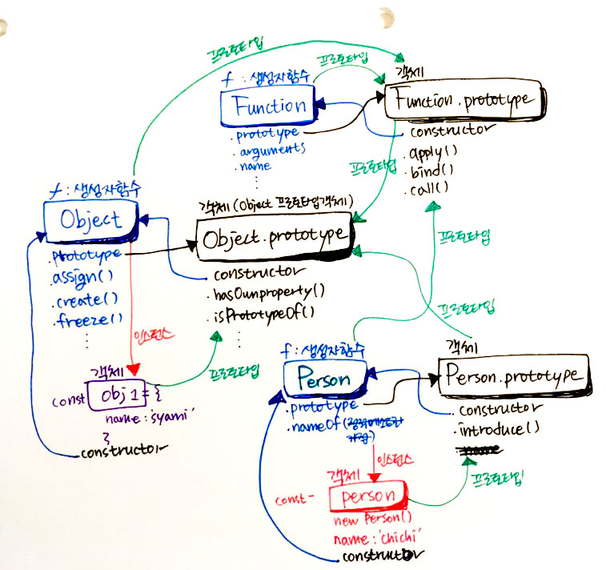
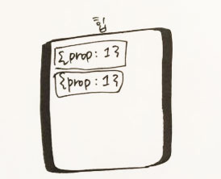
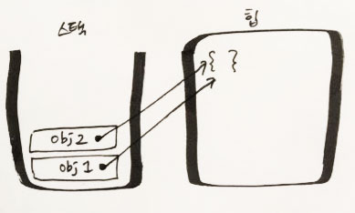
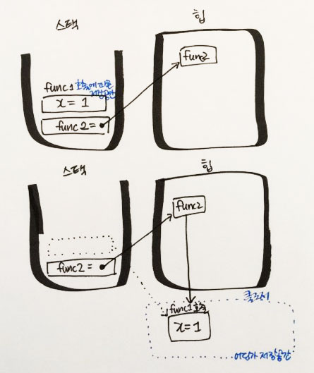

# 4/21 (토)

## 1. Today I learend

### 1.1. 프로토타입

```js
// 객체 생성 리터럴
const obj1 = {
  name: 'syami'
}

// 생성자 함수
function Person(name) {
  this.name = name;
}

Person.prototype.introduce = function() {
  return `안녕하세요, 제 이름은 ${this.name}입니다.`
}

// 인스턴스 객체 생성
const person = new Person('chichi')
person.introduce()

// Person의 정적 메소드
Person.nameOf = function(name) {
  // ...
}
```
<!--  -->

### 1.2. 객체와 참조

```js
{prop: 1} !== {prop: 1} // true
```


```js
const obj1 = {};
const obj2 = obj1;

obj2.name = 'chichi';
obj1; // {name: 'chichi'}
```


### 1.3. 클로저

```js
function func1(x) {
  // 여기서 반환되는 함수는 바깥 스코프에 있는 변수 `x`를 사용
  return function () {
    x += 1;
    return x;
  }
}

const func2 = func1(1);

// `func1`의 실행은 끝났지만, `func2`를 통해서 변수 `x`를 사용할 수 있다.
console.log(func2()); // 2
```



## 2. Today I fonund out

[함수형 프로그래밍](../JavaScript/02_Functional_programming.md) 정리하려고 했는데 역시나 순수함수에서부터 이게 뭐지...하고 탁 막혔다. (사실 람다니 대수니 하는 것에서 지레 겁먹었다. 수학...) 제대로 정리하기엔 아직 잘 모르겠고 일단 쭉 읽어보고 어떤것이 함수형 프로그래밍인지 많이 봐둬야겠다. 

그림은 프로토타입이나 스택, 힙같은 개념을 이해해보려고 그린건데 틀린부분이 있을수도...

오늘 여러모로 많이 집중 못한 것 같다. 뭔가 집중이 안되면 바로 공부하는 환경을 바꿔야겠다. 그리고 한가지를 너무 깊게 들어가는 것도 지금처럼 배우는 시점에서는 조금 적당히 해야할 것 같다. 깊게 들어가면 갈수록 모르면 괜히 집중력만 흐트러지고 의미자체를 모르게 되는 것 같다. 이런게 있구나하고 어떻게 쓰이는 지 위주로 봐야할 것 같다.

## 3. 오늘 읽은 자료 (혹은 참고할 링크)

- [람다, 익명 함수, 클로저](https://goo.gl/sNq8uU)
- [번역 - 함수형 프로그래밍이란 무엇인가?](https://sungjk.github.io/2017/07/17/fp.html)
- [Master the JavaScript Interview: What is a Pure Function?](https://goo.gl/jRpE8o)
- [함수형 프로그래머가 되고 싶다고?](https://goo.gl/we5ZEj)