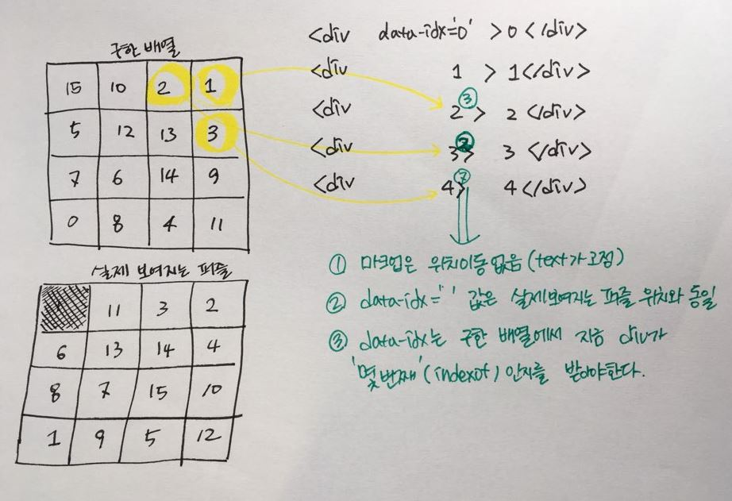

# 5/11 (금)

## 1. Today I learend

## 2. Today I fonund out

제일 생각하기 어려웠던 부분인데 막상 그림으로 그려보니 이해가 쉬웠다.  
하지만 이 그림을 생각해내는 것도 나한테 너무 어려운 일이었다...  
물론 그림의 다차원 배열은 한줄로 풀어내야한다. 이때 `spread`연산자를 참 유용하게 사용했다.

(처음에는 이 그림을 그리지 않고 머리로만 생각했더니 그냥 풀어낸 일차원 배열을 순차적으로 `[data-idx]`에 넣으면 될 거라는 말도 안되는 생각을 했다.  
결국 구해놓은 배열과 전혀 일치하지 않게 정렬된 퍼즐이 보여졌었다.)

해커톤을 무사히 끝냈다. 무언가 하나를 만들고자하니 공부도 많이 해야했고, 모르는 것도 많이 찾아봐야했다.  
또 내가 아는 것을 상대방에게 알려주거나 내 코드를 리뷰해주는 것 역시 많은 공부가 되었다.  

해커톤 우승보다 더 기쁜것은 아직까지 내가 발견한 오류는 없다는 것. 어제 밤을 샌 보람을 느꼈다.  
영원히 풀리지 않는 퍼즐을 생성하지 않도록 하는 것은 가장 큰 과제였다.  
5시 해커톤 마감 바로 전에 완료시 모달에 시간이 분:초 형식으로 출력되지 않아서 식겁했다.
다행히 빠르게 해당 부분을 타이머처럼 변환해서 문자열로 출력해주는 코드 뭉치를 함수로 만들어 그곳에서도 재사용하도록 수정하니 오류가 없어졌다.  
그 뒤에 알파값을 0.8정도 넣은 배경뒤로 살짝 비치는 레이어 뒤로 게임기의 타이머가 계속 돌아가는 문제가 있었는데,  
그 경우는 textContent로 마지막으로 구한 타이머를 다시 넣어주는 것으로 해결했다. 

조금 아쉬운 것은 1조에서 만든 것처럼 시간을 제한을 두는 방식으로 가거나 아니면 시간을 올려서 찍는 것은 고려하지 않았기 때문에 60분이 지나가면 어떻게 할 것인지에 대한 고려가 더 필요하다는 것이다.  

협업 경험은 생각한 것보다 힘들지 않았고(힘들다기 보다는 굉장히 재미있었다.)   
오히려 이렇게 서로 대화하고 의견을 제시하면서 더 나은 방향으로 프로젝트를 이끌 수 있었다.

아직 많이 부족한 코드지만 내가 혼자 짰다면 더욱 조잡했을 코드가 같이 리팩토링해가면 수정한 덕분에 잘 정리되었다.

주말동안은 다른 팀이 만들었던 숫자야구 게임이나 오목도 한번 만들어봐야겠다.  
다들 굉장히 다양한 접근으로 다양한 애니메이션이나 기획으로 만들어내서 보는 재미가 있었다.  
일단 먼저 만들어 볼 생각이라 아직 로직을 보지는 않았지만 다른 사람이 짠 코드를 읽어보는 것도 재미있을 것 같다.