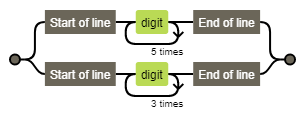

# 문자열 다루기 기본

> #정규표현식, #isNaN()

date: 18.04.19

* [관련링크](/https://programmers.co.kr/learn/challenge_codes/99)

> alpha_string46함수는 문자열 s를 매개변수로 입력받습니다.
s의 길이가 4혹은 6이고, 숫자로만 구성되있는지 확인해주는 함수를 완성하세요.
예를들어 s가 a234이면 False를 리턴하고 1234라면 True를 리턴하면 됩니다

## 1. 풀이

```js
function alpha_string46(s){
  return (s.length == 4 || s.length == 6 ) && !(/[A-Z]/i.test(s));
}

console.log(alpha_string46('1234'));    // true
console.log(alpha_string46('a12d34'));  // false
console.log(alpha_string46('1234bb'));  // false
console.log(alpha_string46('12345'));   // false
```
문자열 길이가 4 또는 6이여야 하며 문자열이 아니면 true를 리턴하도록 정규표현식으로 풀었다.

## 2. 다른 사람 풀이

### 2-1. 정규표현식

작성자: Seoung Ho Jeoung

```js
// 원래는 이거
function alpha_string46(s){
  var regex = /^\d{6}$|^\d{4}$/;
  return regex.test(s);
}

// 이렇게도 줄일 수 있음
function alpha_string46(s){
  return /^\d{6}$|^\d{4}$/.test(s);
}

console.log(alpha_string46('1234'));    // true
console.log(alpha_string46('a12d34'));  // false
console.log(alpha_string46('1234bb'));  // false
console.log(alpha_string46('12345'));   // false
```

더 깔끔한 정규표현식을 사용한 풀이다. 내가 문자열 길이 구한 부분까지도 정규표현식으로 깔끔하게 구했다.

#### 2-2-1. 풀이에 쓰인 정규표현식 표현방법

+ `^x`: 문자열이 x로 시작한다.
+ `x$`: 문자열이 x로 끝난다.
+ `x{n}`: x를 n번 반복한 문자를 찾는다.
+ `\d`: 숫자를 찾는다. (`\D`는 숫자가 아닌 값을 찾는다.)



###  2-2. isNaN()

작성자: 박현준

```js
function alpha_string46(s) {
   return s.length == 4 || s.length == 6 ? !isNaN(s) : false 
}

console.log(alpha_string46('1234'));    // true
console.log(alpha_string46('a12d34'));  // false
console.log(alpha_string46('1234bb'));  // false
console.log(alpha_string46('12345'));   // false
```

Number 객체의 isNaN() 정적 메소드를 이용해 숫자가 아닌 값이 있는지 확인하는 방법  
isNaN() 메소드가 있다는 건 아는데 막상 문제 풀 때는 생각이 잘 안나니 적어봤다.