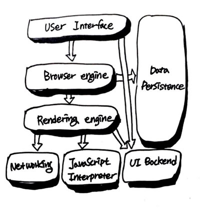
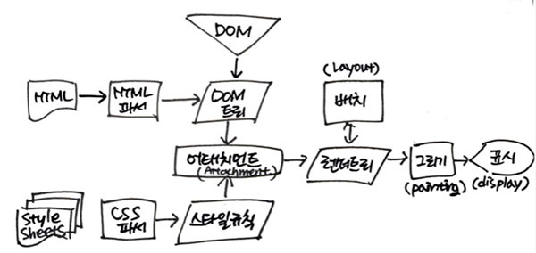
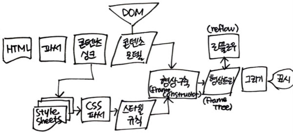

# reflow, repaint와 최적화

왜 position보다 float을 쓰는게 좋다고 하는지  
왜 애니메이션을 줄 때 left, top보단 tranform으로 처리하라고 하는지  
flex는 성능 관점에서 좋은건지  
자바스크립트보단 CSS로 애니메이션 처리하는게 성능관점에서 좋다고 하는 이유가 무엇인지

1. 리플로우, 리페인트
2. 리플로우과 리페인트를 유발하는 속성들과 마크업 최적화
3. CSS의 GPU가속
4. 자바스크립트에서 최적화

## 1. 리플로우, 리페인트

### 1.1. 브라우저 렌더링 프로세스

#### 1.1.1. 브라우저의 기본구조

1. **사용자 인터페이스**  
  주소창, 뒤로가기/앞으로 가기 버튼, 즐겨찾기 등의 기능 포함. 요청한 페이지를 보여주는 창(document)을 제외한 거의 모든 부분
2. **브라우저 엔진**  
  사용자 인터페이스와 렌더링 엔진 사이 동작 제어
3. **렌더링 엔진**  
  요청한 콘텐츠 표시. (전송된 HTML, CSS등을 파싱하여 디스플레이)
4. **통신(Networking)**  
  HTTP 요청같은 네트워크 통신기능 수행. 플랫폼 독립적인 인터페이스이며 각 플랫폼 하부에서 실행됨
5. **UI 백엔드**  
  브라우저 창의 형태, 콤보박스등 기본적인 장치를 표현. OS의 UI 메소드에 의존함.
6. **자바스크립트 인터프리터**  
  자바스크립트 코드의 파싱과 실행에 사용(ex. Chrome의 V8 엔진)
7. **자료 저장소(Data persistance)**  
  쿠키등 자원을 위한 저장공간. 지속적인 계층. HTML5명세에는 브라우저가 지원하는 '웹DB'정의

#### 1.1.2. 렌더링 엔진 동작 과정

1. HTML문서를 파싱하고 '콘텐츠 트리' 내부에서 태그를 DOM 노드로 변환. 외부 CSS파일과 함께 포함된 스타일 요소도 파싱
2. 스타일 정보와 HTML 표시 규칙이 렌더트리를 생성
3. 각 노드가 화면내에 위치되어야 할 좌표값을 계산(position, size)후 배치
4. UI백엔드에서 렌더트리의 각 노드를 가로지르며 형상을 만들어 내는 그리기 과정

##### webkit 동작 과정

##### gecko 동작 과정

---

정리하고 싶은데 읽을 게 너무 많고 이해가 잘 안되어서 아래 글들 찬찬히 두세번은 읽어보고 정리해야할 듯

+ reflow, repaint가 대체 뭔지, 브라우저 동작원리와 함께 보는 글
  - [브라우저 reflow 최소화](https://developers.google.com/speed/docs/insights/browser-reflow)
  - [Reflow와 Repaint](https://github.com/nhnent/fe.javascript/wiki/Reflow%EC%99%80-Repaint)
  - [Reflow 원인과 마크업 최적화](http://lists.w3.org/Archives/Public/public-html-ig-ko/2011Sep/att-0031/Reflow_____________________________Tip.pdf)
+ 자바스크립트와 reflow 관련
  - [[자바스크립트]브라우저 렌더링](http://12bme.tistory.com/140)
  - [When does reflow happen in a DOM environment?](https://stackoverflow.com/questions/510213/when-does-reflow-happen-in-a-dom-environment)
  - [Efficient JavaScript](https://dev.opera.com/articles/efficient-javascript/?page=3): 오페라 개발자 사이트 아티클
  - [css와 자바스크립트 애니메이션](https://developers.google.com/web/fundamentals/design-and-ux/animations/css-vs-javascript?hl=ko): 구글 개발자 사이트
  - [Performance best practices for Firefox front-end engineers](https://developer.mozilla.org/en-US/Firefox/Performance_best_practices_for_Firefox_fe_engineers): 모질라 개발자 사이트
+ 왜 transform을 애니메이션 처리하는게 성능면에 좋다고 하는지 GPU 가속에 대해서(그리고 will-change라는게 뭔지)
  - [(번역) CSS GPU 애니메이션 제대로 하기](http://wit.nts-corp.com/2017/08/31/4861)
  - [하드웨어 가속에 대한 이해와 적용](http://d2.naver.com/helloworld/2061385)
  - [웹 애니메이션 GPU가속](http://iropke.com/archive/animation-gpu.html)
  - [CSS will-change 프로퍼티에 관해 알아둬야 할 것](https://dev.opera.com/articles/ko/css-will-change-property/)
  - [CSS 애니메이션 어떻게 사용하고 계신가요?](https://brunch.co.kr/@99-life/2)
  - [WebKit의 GPU 렌더링](https://www.slideshare.net/deview/a5deview-2012-pt-hds-webkitgpu)
+ flex랑 grid로 레이아웃을 그리는 거는 성능면에서 어떤 영향이 있을지 궁금해서
  - [Does Flexbox Have a Performance Problem?](https://css-tricks.com/does-flexbox-have-a-performance-problem/)
  - [크고 복잡한 레이아웃 및 레이아웃 스래싱 피하기](https://developers.google.com/web/fundamentals/performance/rendering/avoid-large-complex-layouts-and-layout-thrashing?hl=ko)
+ CSS Trigger라고 엔진별 해당 속성이 layout, paint, composite 중 어느것을 필요로 하는지 보여주는 사이트(이걸 내가 의미도 모르면서 북마크 해둔지 한참 되었다는 걸 알고 충격을 먹었다..공부해야지...)
  - [CSS Triggers](https://csstriggers.com/)
+ 관련된 건 아니고 svg도 아니고 pure css로 만든게 신기해서
  - [Alex the CSS Husky](https://codepen.io/davidkpiano/pen/wMqXea)