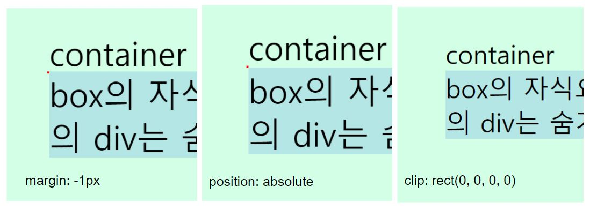
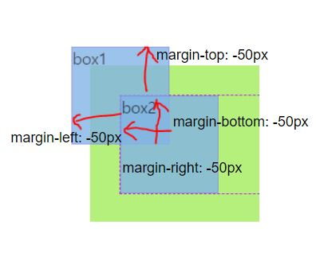

# 3/26 (월)

## 1. Today I learend

### 1-1. CSS Resect

브라우저마다 제공하는 사용자 에이전트 스타일이 있다.
CSS를 작성하면 이 스타일을 덮어쓰게 된다.

예) ul에 정의한 크롬 사용자 에이전트 스타일들

```css
ul, menu, dir {
    display: block;
    list-style-type: disc;
    -webkit-margin-before: 1em;
    -webkit-margin-after: 1em;
    -webkit-margin-start: 0px;
    -webkit-margin-end: 0px;
    -webkit-padding-start: 40px;
}
```
※ 벤더 프리픽스가 붙은 속성들은 표준이 아니라 크롬에서 자체적으로 넣은 스타일 속성이다.

이러한 사용자 에이전트 스타일은 디자인에 맞추기 위해 초기화를 해줘야하는데, 브라우저들이 모두 일관된 스타일을 제공하는 게 아니라서 어려울 수 있다.

#### 1-1-1. Normalize.css

+ [normalize.css 링크](https://necolas.github.io/normalize.css/)

> **A modern, HTML5-ready alternative to CSS resets**  
> Normalize.css makes browsers render all elements more consistently and in line with modern standards. It precisely targets only the styles that need normalizing.

브라우저간의 에이전트 스타일 오차를 줄이거나 가지고 있는 버그를 최소화해주는 스타일들을 필요하다면 재지정하거나 기본값을 통일하는 식으로 많은 사람들의 협력으로 작성되고 있는 오픈소스 프로젝트  
사용은 선택사항이지만 트위터, 부트스트랩, 깃헙등 많은 프로젝트, 사이트에서 사용하고 있다.

##### ✏️ iOS를 위한 normalize 초기화

아래는 이전에 다른 브라우저에서도 있는 이슈였다고 한다. 지금은 iOS에서만 발생하는 이슈여서 주석에 명시되어 있다.

iOS는 portrait(세로방향)모드와 landscape(가로방향)모드에서 동일한 사용자 경험을 제공하기 위해 가로방향일 경우 폰트를 확대시키도록 한다.

```css
/* nomalize.css*/

/*
  2. Prevent adjustments of font size after orientation changes in iOS.
*/
html {
  -webkit-text-size-adjust: 100%; /* 2 */
}
```
> **[text-size-adjust: auto | none | <percentage>](https://developer.mozilla.org/en-US/docs/Web/CSS/text-size-adjust)**  
> 일부 모바일 기기에서 사용되는 텍스트 자동 확장 알고리즘을 제어한다.
일부 모바일(ios)에서 기본값은 auto이며 자동 확대를 지원한다. 비표준이라 데스크탑에서는 동작하지 않으나 none으로 설정할 시 오래된 웹킷 기반 브라우저에서는 웹페이지의 줌 기능을 방해한다.
> [관련 포스팅](https://blog.55minutes.com/2012/04/iphone-text-resizing/)

#### 1-1-2. Reset.css

[Eric Meyer의 Reset.css](https://meyerweb.com/eric/tools/css/reset/)

Normalize 보다 먼저 등장한 초기화 스타일이다.  
에릭마이어의 Reset.css나 야후의 YUI 등 디자이너, 마크업 엔지니어들이 만든 여러 Reset CSS가 존재한다. 
프로젝트 들어가기 전에 최대한 기본값을 설정해버리는 방법. 이 역시 쓰는 것은 선택사항이며, 최근에서 성능상 초기화가 필요할때만 그때 그때 초기화해주는 편이다.

### 1-2. 글꼴

브라우저간 글꼴을 비교해보면 Safari의 기본 글꼴 군은 Serif 계열로, Sans-serif인 다른 브라우저들과 차이가 있다.

그런 글꼴군을 통일하기위해 아래와 같이 `font-family`를 지정할 수 있다.

```css
body {
              /* <family-name> | <generic-name> */
  font-family: Arial, Helvetica, sans-serif
}
```

family-name은 이름에 공백이 있을경우 따옴표로 묶어야한다.

```css
body {
  font-family: Times, "Times New Roman", Georgia, serif;
}
```

#### 1-2-1. 글꼴군(generic name)

일반 글꼴 모음(generic font families)은 대체 글꼴 매커니즘으로, 지정된 글꼴을 사용할 수 없을때 스타일 시트 작성자의 의도를 그대로 유지하는 수단이다.

일반 글꼴 모음은 키워드이므로 따옴표로 묶어서는 안된다.

+ Serif: Times, Times Nes Roman...
+ Sans-serif: Arial, Helvetica...
+ Monospace: Andale Mono, Courier....
+ Cursive: Comic Sans, Zapf Chancery
+ Fantasy: Impact, Arnoldboeklin...

[MDN - CSS generic name](https://developer.mozilla.org/ko/docs/Web/CSS/font-family#%EA%B0%92)

##### ✏️ 글꼴군 관련 이야기

옛날에는 serif 계열이 가독성이 높아서 선호했다. 모바일 디바이스가 등장하면서 serif계열의 삐침은 모바일에서 잘못 읽힐 가능성이 높았고 가독성을 떨어뜨렸다.  
이러한 모바일 사용자를 고려한 이유로 Sans-serif가 많이 쓰이게 되었다.  
(이러한 추세는 구글 로고의 변천사를 보면 알 수 있다.)

#### 1-2-2. 웹폰트

운영체제마다 지원하는 글꼴군의 글꼴이 다르고 사용자 환경(글꼴이 설치되어 있지 않을 수도 있으므로)이 다를 수 있다.

이러한 문제를 해결하고자 과거에는 모든 텍스트를 이미지로 잘라 넣었다.  
그러나 고해상도 디스플레이를 고려해야하는 지금은 이 방식은 문제가 있다.

그래서 '웹폰트'라는 것이 등장했다.  
만약 로컬에 해당 폰트가 설치되어 있지 않다면 폰트를 서버에서 다운받아 렌더링 하는 것이 가능하다.

단점은 깜빡임 문제가 있다.  
(웹폰트를 서버에서 내려받기 전까지는 웹 페이지를 로드하지 않고 웹폰트가 다 로드 되면 웹페이지를 로드하기 때문에 깜빡이는 것처럼 보이는 현상 등)  
그리고 모바일에서는 웹폰트를 내려받는 용량이 부담스러울 수 있다.(폰트 경량화, 최적화를 고려하자.)

※ 웹폰트 깜빡임 현상과 그외 폰트 관련해서 정리된 포스트 : [FOUT / FOIT / FOFT ](http://wit.nts-corp.com/2017/02/13/4258)

##### 1-2-2-1. `@font-face`를 사용한 웹폰트 사용 방법

```css
@font-face {
  font-family: 'Noto Sans Regular';
  /* 쓰고 싶은 이름은 마음대로 지정해도 된다. 앞으로 쓸 이름을 정하는 것*/
  font-style: normal;
  /* 기울임 같은 글꼴 스타일 */
  font-weight: 400;
  /* 글꼴 단계를 어떻게 나눌지에따라 정할 수 있다. */
  src: local('Noto Sans Regular'), local('NotoSans-Regular'), url('font/eot/NotoSansKR-Regular-Hestia.eot'), url('font/eot/NotoSansKR-Regular-Hestia.eot?#iefix') format('embedded-opentype'), url('font/woff/NotoSansKR-Regular-Hestia.woff') format('woff'), url('font/otf/NotoSansKR-Regular-Hestia.otf') format('opentype');
  /* local() 함수는 로컬에 있다면 보여달라고 요청하는 것 */
  /* ?#iefix : ie9 버그를 해결하기 위함 */
}

/* 위에서 폰트를 설정하고 아래와 같이 사용한다. */
body {
  font-family: 'Noto Sans Regular', sans-serif;
}
```

[브라우저마다 지원하는 폰트 포맷](https://developer.mozilla.org/en-US/docs/Web/CSS/@font-face)이 다르기 때문에 웹폰트를 사용한다면 다양한 포맷의 폰트를 준비해야한다. 

+ [웹 폰트를 로컬 스토리지에 저장하는 기법 - 캐시 안정성 증가, 글꼴 깜빡임 현상 제거](https://mytory.net/2016/06/15/webfont-best-practice.html)
+ [웹 글꼴 최적화 | Web | Google Developers - 로드 및 렌더링 최적화](https://goo.gl/LdzWFq)

##### 1-2-2-1. CDN을 이용한 웹폰트

[Google Fonts](https://fonts.google.com/)

다음과 같이 `<link>`태그나 `@import url()`로 사용할 수 있다.

```html
<link href="https://fonts.googleapis.com/css?family=Noto+Sans:400,700" rel="stylesheet">
```
```css
@import url('https://fonts.googleapis.com/css?family=Noto+Sans:400,700');

body {
  font-family: 'Noto Serif', serif;
}
```

### 1-3. 상속

+ Casecade: 스타일이 겹침
+ Inheritance: 부모요소로부터 상속받는 것

부모 요소의 일부 스타일(또는 부모가 상속받은 스타일)을 상속받는다.  
상속받을만한 스타일만 상속 받도록 되어 있는데 그 예는 아래와 같다.

+ `font-famil`, `color`를 상속받는다. 
+ `margin`, `padding`, `border`, `background`같은 컨테이너 관련 속성은 상속되지 않는다. (이런 컨테이터 속성이 상속된다면 각 개별 요소마다 일일이 상속을 해제해야 할 것이다;;) 

배경색은 상속되는 것처럼 보이지만 별도로 지정하지 않은 요소의 배경색은 transeparent이기 때문에 아래의 부모요소의 배경색이 보이는 것이다.

a태그에 2개의 컬러 스타일이 캐스캐이드 된 상태의 예시이다.  
사용자 에이전트 스타일과 body로부터 상속받은 스타일이 겹치는데 이러한 경우 상속이 무시되고 원래 가진 값이 우선한다.

```css
/* style.css */
a {
    text-decoration: none;
}
```
```css
/* user agent stylesheet */
a:-webkit-any-link {
    color: -webkit-link; /* 웹킷에서 사용하는 변수이름 */
    cursor: pointer;
    /* text-decoration: underline; */
}
```
```css
/* inhrited from body*/
body {
    background-color: #fff;
    color: green;
    font-family: 'Noto Sans Regular', sans-serif;
}
```

a를 찾아 일일이 컬러 스타일을 재설정해 줄 필요없이 부모의 컬러 스타일을 상속받게 하기 위해서 상속을 제어하기 위한`inherit`값을 사용한다.

```css
/* style.css */
a {
  color: inherit
}
```

상속을 제어하기 위한 속성 값으로 4가지가 있다.
+ inherit
+ initial
+ unset
+ revert

`inherit`키워드가 장점만 있는 것은 아니다. 상속 받는 컬러가 아니라 다른 컬러를 주고 싶을 경우 재지정을 하는 수밖에 없다. ( 해당 내용은 나중에 다시 추가;; 😓)

### 1-4. 숨김 콘텐츠

폼관련 요소들의 스타일링은 CSS로 완벽히 핸들링 되지 않는 케이스가 많다.  
특히 `<legend>`는 브라우저마다 렌더링이 달라 CSS로 스타일링 하기 어렵다.

이런 구조상 존재할 필요가 있지만 스타일링하기 어려운 콘텐츠를 웹접근성을 고려하여 숨김 컨텐츠로 만드는 방법을 생각해보자

#### 1-4-1. 숨김 콘텐츠 처리(비권장)

다음의 방법들은 화면상에서 숨겨지지만 웹접근성 관점에서 좋지 않은 방법들이다.

+ `display: none`: 화면에서만 감춰지는 것이 아니라 보조장치가 접근할 수 없게한다.(읽을 수 없다)  
국내 사용자가 많은 스크린리더인 센스리더의 경우 이같은 처리도 읽어주는데 국내 사이트들이 웹접근성을 고려하지 않고 `display:none`을 남용하여 콘텐츠를 이해하는데 어려움이 생기기때문에 이런 국내사정을 고려해 넣은 기능으로 보인다.
+ `visibility: hidden`: 자신의 영역을 가지면서 화면에서만 숨겨지는데, 이 역시 보조장치에서 읽지 못할 수 있기 때문에 권장하지 않는다.
+ `width: 0; height: 0; overflow: hidden`: 스크린리더는 가상커서라고 해서 눈에 보이지 않는 것들(구조상에는 존재하는)을 탐색하는데 width, height값이 0이라면 없는 콘텐츠라고 인식할 수 있다.

#### 1-4-2. 숨김 콘텐츠 처리(권장)

+ 콘텐츠 상자 크기 조절: `width: 1px, height: 1px` (위의 비권장사항에 있는 이유로 값을 1px 넣어준다.)
  - 텍스트 노드가 있어 overflow 현상이 생긴다. -> `overflow: hidden`을 추가한다.
  - 글자가 일부 노출되는 데 이러한 이슈를 해결하기 위해 다른 방법을 사용한다.
+ `margin: -1px` : 해당요소의 콘텐츠를 모든 방향에 -1px만큼 주어 부모요소의 왼쪽으로 밀어낸 것처럼 보이게 한다.
+ `position: absolute`
+ `clip: rect(0, 0, 0, 0)`: `position : absolute` 또는 `position : fixed` 요소를 가진 절대 위치 요소에만 적용되는 속성으로 요소의 어느 부분이 보일지 지정한다. 모든 값이 0이여서 요소는 보이지 않게 된다.
+ 위에까지 썼는데 안 없어진다 하면(브라우저에 따라 작은 점같이 남아보일 수 있다.)
  - `font-size: 0; line-height: 0`를 추가한다.

```css
legend {
  width: 1px;
  height: 1px;
  overflow: hidden;
  margin: -1px;
  position: absolute;
  clip: rect(0, 0, 0, 0);
  /* font-size: 0;
  line-height: 0; */
}
```

위와 같이 재사용 가능한 속성들은 모듈화하는 방법을 생각하자.

```css
/* w3c.org */
.offscreen {
  width: 1px;
  height: 1px;
  overflow: hidden;
  margin: -1px;
  position: absolute;
  clip: rect(0, 0, 0, 0);
}
/*
  .a11y-hidden, .readable-hidden식의 이름이 많이 쓰인다.
*/
``` 



### 1-5. 마진

#### 1-5-2. 음수 마진(Negative margin)

패딩과 보더는 음수값을 쓸 수 없지만 마진은 음수를 값으로 가질 수 있다.

  
float된 box1에 마진값을 각 -50px로 줬을 경우다.

[음수 마진](https://codepen.io/chiabi88/pen/ZxXqZo)

#### 1-5-3. 마진병합 현상(Collapsing-margins)

일반적 흐름의 콘텐츠는 세로방향일때 특정 인접 마진(top 또는 bottom)이 병합(상쇄)되어 가장 큰 단일 마진을 형성한다.

[마진 병합](https://codepen.io/chiabi88/pen/eMGaJR)

+ 블럭 레벨 박스의 마진만 병합될 수 있다. (`inline-block`의 마진도 병합하지 않는다. )
+ `float`된 박스의 마진은 다른 마진과 병합되지 않는다.
+ `visible` 이외의 `overflow`값이 있는 박스의 마진은 자식요소의 마진과 병합되지 않는다.
+ `position: absolute`로 배치된 박스의 마진은 다른 마진과 병합하지 않는다.
+ 루트 요소 박스의 마진은 병합하지 않는다.
+ 음수 마진이 포함되는 경우, 상쇄된 마진의 크기는 제일 큰 양수 마진과 제일 작은(절대값이 가장 큰) 음수 마진의 합이다.
+ 첫번째 블록 자식요소의 margin-top과 부모 블록 요소의 margin-top을 분리하는 보더, 패딩, 인라인 콘텐츠 또는 clear가 없거나 마지막 블록 자식 요소의(last child) margin-bottom과 부모 블록 요소의 margin-bottom을 분리하는 보더, 패딩, 인라인 콘텐츠, height, min-height 또는 max-height이 없는 경우 그 마진은 상쇄한다. 상쇄된 마진은 결국 부모 바깥이 된다.
+ 마진이 0이더라도 적용된다. 부모요소의 마진이 0이든 아니든 맏이/막내 자식요소의 마진은 부모의 바깥이 된다.

※ 등간격 배치를 하고 싶을 경우 마진을 선택하는 것이 좋다.

+ [w3c.org- collapsing-margins](https://www.w3.org/TR/css3-box/#collapsing-margins)
+ [MDN - 마진 상쇄정복](https://developer.mozilla.org/ko/docs/Web/CSS/CSS_Box_Model/Mastering_margin_collapsing)

### 1-6. float 배치

띄우다. 부유하다.

[float과 float clear](https://codepen.io/chiabi88/pen/yKzdpR)

일반적인 흐름(normal flow)을 벗어나 띄워져 부모요소를 기준으로 좌(left), 우(right)로 배치되는 기법.

float시킨 요소는 넓이를 따로 지정하지 않는 한 콘텐츠 영역만큼 줄어들어 보이지만 블록 요소이다. (flex등 일부 특수한 경우를 제외라고) 모든 요소의 성격을 블록으로 변경한다.

일반적은 흐름을 벗어난 요소는 부모 요소가 높이를 인식하지 못한다.  
float으로 띄운 요소는 다음에 오는 요소(normal flow의 요소)와 겹쳐지지만(위에 겹쳐진 것처럼 보인다.) 그 다음 요소 내부의 콘텐츠(텍스트등)는 float된 요소에 밀린다.
다음요소의 콘텐츠가 아래로 밀리면 부모요소가 높이를 인식하는 것처럼 보이지만 사실 다음 요소의 시작점은 부모요소의 시작점이다.

요소들이 모두 float되면 부모는 높이를 잃게 되는데, 부모가 높이를 잃어버렸을때 부모 요소의 형제 요소의 콘텐츠가 float된 자식요소 옆으로 붙어보이는 것은 콘텐츠는 float 요소 옆으로 흐르고, 부모의 형제요소의 시작점이 부모요소의 시작점이다.

부모 요소가 float 된 자식요소의 높이를 인식하게 하는 방법은 다음과 같은 방법들이 있다.

#### 1-6-1. overflow

`overflow: hidden`은 내부적으로 hidden을 시키기 위해 넘치는 요소가 있는지 없는지 자식 요소의 높이를 체크하게 된다 이때 알아낸 자식요소의 높이를 반영하는데, 잃어버리는 높이를 읽어내는 듯한 효과를 얻을 수 있다.

단점은 부모영역 밖으로 넘어가는 요소들이 숨김처리되기 때문에 디자인 변화가 있을경우 대응할 수 없을 수도 있다.

`overflow: auto`나 `overflow: scroll`은 스크롤이 생기게 하기(할 수 있기) 때문에 이 역시 적절한 방법은 아니다.

```css
.main {
  overflow: hidden;
}
.main section {
  float: left;
}
```

#### 1-6-2. 빈 엘리먼트를 추가해 clear하는 방법

부모 요소의 마지막 요소로 빈 엘리먼트(의미없는 div)를 추가해 clear하는 방법이다.  
clear 속성은 모든 부동체(float된 요소)의 마진 경계 아래로 요소의 마진 경계를 옮긴다.(내부적으로 강제 마진 알고리즘이 있다.)

```html
      <section class="favorite-site">인기사이트</section>
      <section class="twitter">트위터</section>
      <div class="clear"></div>
    </main>
```

```css
.main .section {
  float: left;
}
.clear {
  clear: both;
}
```

clear가 필요없어질 경우 의미없는 소스가 남아 지저분해 질 수도 있다.

#### 1-6-3. 부모요소의 다음에 올 형제 요소에 clear하는 방법

```html
      <section class="favorite-site">인기사이트</section>
      <section class="twitter">트위터</section>
    </main>
    <article class="slogan"></article>
```

```css
.main .section {
  float: left;
}
.slogan {
  clear: both;
}
```

float의 영향에서는 벗어나지만 부모요소는 여전히 자식요소의 높이를 인식하지 못하고 있다. 

이 방법의 경우 clear가 float된 요소만큼 마진을 내부적으로 마진을 주는 것이므로 마진이 float된 요소의 높이만큼이라 `margin-top`을 부모의 형제 요소에 지정할 경우 마진이 겹쳐 먹지 않은 것처럼 보인다.

#### 1-6-4. 부모요소에 float을 넣는 경우

이 방법은 float을 float으로 해결하는 방법으로 float된 요소를 그룹핑해 또 좌, 우측으로 float을 이용해야할 경우 사용한다.

이경우 float된 부모요소는 그 부모요소가 높이를 인식하지 못하므로 clear하는 방법을 필요로한다. (다음 형제요소에 clear:both를 준다든지) 또한 부모요소가 자식요소의 너비만큼 줄어든다.

#### 1-6-5. 가상선택자 ::after에 clear를 주는 방법

**::before, ::after**
+ CSS2: :before, :after (ie9까지 대응)
+ CSS3: ::before, ::after

인라인 상자가 가짜로 만들어진다. `content`로 값을 추가시킬 수도 있다. `content`가 반드시 있어야 가짜 요소가 만들어진다.

```css
.main::after {
  content: ''; /*  null, 가끔 여기에 공백을 넣는 사람도 있음 */
  clear: both;
  /* 인라인 요소는 마진값을 줄 수 없으므로 */
  display: block;
}
```
`clear: both`로 강제 마진을 주려면 디스플레이가 블록이어야 한다.

공통으로 사용되는 이 css를 모듈화 시켜서 재사용 가능하도록 하는 게 좋다.
```css
.clearfix:after {
  content: '';
  clear: both;
  display: block;  
}
```

```html
<main class="main clearfix">
  <section class="recommend-book">추천 서적</section>
```

### 1-7. 기타

#### 1-7-1. wai-aria의 role(역할 모델)

전맹시각자들이 콘텐츠를 탐색할 때 div로만 되어 있으면 시행착오를 많이 거쳐야 그 콘텐츠를 이해할 수 있다.

랜드마크라해서 기계가 이해할 수 있는 표시를 해주는것  
스크린리더는 랜드마크 단위로 탐색가능  
role : banner, navigation, main, article, content info

이러한 방법은 시각자들의 사용성을 높게한다.

가능한 HTML5 시멘틱 태그를 쓰는 네이티브 방식이 더 낫다.  
그러나 이미 현업에서 div로 짜여진 소스를 유지보수해야한다면 태그 수정에따른 위험을 고려해서 웹접근성을 위해 aria 역할모델인 `role=""`을 추가해주자

#### 1-7-2. HTML5 콘텐츠 모델을 고려하자

현업에서 개발자들이 실수하는 것 중에 ul 아래에 빈 div를 넣는 경우가 있다.

> Error: Element div not allowed as child of element ul in this context. (Suppressing further errors from this subtree.)

```html
<ul class="member">
  <div class="box"></div>
  <li></li>
</ul>
```

HTML5는 블록, 인라인 모델로의 구분은 없어졌지만 콘텐츠 모델 단위로 해석한다. 
`ul` 요소는 자식요소로 `li`요소 외에는 받을 수 없다.  
우선 마크업을 validation을 돌리고 에러가 난다면, 
콘텐츠 모델의 허용하는 자식요소에 대한 규칙 같은 것을 확인하자.

`a` 해당 텍스트가 하이퍼링크임을 의미, 인터렉티브 모델인데 `href` 속성이 없다면 인터렉티브 모델이 아니다.

```html
<a name="skip">skip</a>
```
위는 옛날방식이라 요즘은 보기힘든데, 책갈피라고 해서 페이지를 이동하는 게 아니라 `name` 식별자를 정해서 해당 위치로 이동하게 하는 거  
요즘은 `id`를 그런 역할로 사용한다. ※ `id`는 전역 속성이므로 `href`가 없는 인터렉티브가 아닌 `a`태그에서도 쓸 수 있다.

#### 1-7-3. aria-label 

'<카드번호> [   ]-[   ]-[   ]-[   ]'

`label`과 `input`은 1:1대응해야하는데 카드번호 입력란 처럼 그렇게 하기 힘들어 보일 경우.

```html
<input aria-label="카드첫번째 4자리"></input>
```
`aria-label`을 사용해 label을 각각 넣어 숨김처리 하는 대신 input요소에 라벨링할 수 있다.

그러나 과연 저 카드 입력란을 하나가 아닌 4개로 나눠 입력 받는 것이 좋을지. 사용성 관점에서 고민할 것.

#### 1-7-4. 성능

파일을 여러개로 쪼개넣는 것은 성능관점에서는 좋지 않지만 유지보수관점에서 좋다. 그렇기 때문에 개발단계에서는 파일을 나누고 추후에 Sass같은 것을 사용해서 파일은 쪼개고 빌드해서 배포한다. 

해외는 템플릿엔진을 많이 쓴다. 
+ Pug(구 Jade) -> HTML
+ Sass -> CSS
+ Typescript -> JS

개발단계에서는 주석을 잘 작성하고 배포버전은 압축한다. (uglify)
Typescript : 슈퍼셋언어. 최신의 모던 코드를 지원하지 않는 브라우저를 위해 옛날 코드로 변경해주는 빌드작업이 필요한데, typescript로도 그것이 가능해서 많은 개발자가 선호한다. 자바스크립트는 강제 형변환 되는 등 동적인 언어인데 이러한 부분을 정적으로 쓰도록 강제해서 스크립트를 더 사용하기 쉽도록 해준다.

## 2. Today I fonund out

현업에서 쓸 수 없었던 flex보단 float이 내게는 더 익숙한 배치 방법이다. 당연히 프로젝트하면서 이런 저런 버그아닌 버그같은 상황에 직면했고 그런 것들을 풀어내는 다양한 방법을 경험과 stackoveflow같은 사이트의 도움을 빌어 체득했다. 그래서 어느정도는 알고 있다고 생각했는데, 막상 수업을 듣고나니 내가 float과 margin에 대해 잘 모르고 있었다는 걸 알게되었다. 
여지껏 소 뒷걸음 치다 쥐 잡은 격으로 알게 되었던 clearfix나 숨김컨텐츠를 처리하는 것같은 팁들이 왜 그 속성이 필요하고, 왜 어떤 방법은 또 다른 버그같은 상황을 만들어내는 지 알게되었다.

어떤 요행같은 상황이 만들어지면 그 내부에서 어떤 원리에 의해 만들어진 건지 더 궁금해하고 알아보려는 노력을 해야겠다.

## 3. 오늘 읽은 자료 (혹은 참고할 링크)

+ [웹폰트 사용하기 (웹폰트 101)](http://wit.nts-corp.com/2017/02/13/4258)
+ [웹 폰트를 로컬 스토리지에 저장하는 기법 - 캐시 안정성 증가, 글꼴 깜빡임 현상 제거](https://mytory.net/2016/06/15/webfont-best-practice.html)
+ [웹 글꼴 최적화 | Web | Google Developers - 로드 및 렌더링 최적화](https://goo.gl/LdzWFq)
+ [MDN - Casecade and Inheritance](https://goo.gl/F3hCAC)