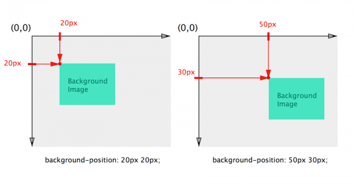
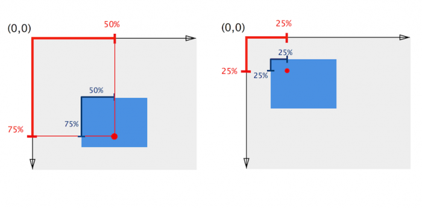

# 3/29 (목)

## 1. Today I learned

### 1.1. 아웃라인 알고리즘

HTML5에선 특정 내용을 의미론적으로 구분 짓는 새로운 엘리먼트들이 등장했을 뿐만 아니라 웹 브라우저가 문서를 읽고 DOM tree를 해석하는 아웃라인 알고리즘에도 변화가 생겼다.

+ 암묵적 아웃라인 
+ 명시적 아웃라인

#### 1.1.1. 암묵적 아웃라인

HTML4에서는 HTML 구획요소(`div`)와 HTML 제목요소(`<h1>`~`<h6>`)로 섹션을 정의한다.

헤딩 레벨(`<h1>`~`<h6>`간 계급)에 따라 암묵적으로 섹션이 구분지어짐.  
단, HTML 구획요소로 그룹핑하는 것이 꼭 필요한 것은 아니다.

```html
<div class="section1">
  <h1>섹션 1</h1>
  <p>섹션 1의 문장 문장 문장</p>
  <div class="section2">
    <h2>섹션 1.1</h2>
    <p>섹션 1.1의 문장 문장 문장</p>
```
```html
  <h1>섹션 1</h1>
  <p>섹션 1의 문장 문장 문장</p>
  <h2>섹션 1.1</h2>
  <p>섹션 1.1의 문장 문장 문장</p>
```
위 두개는 암묵적으로 다음의 구조를 가진다.
```
1. 섹션 1
  1.1 섹션 1.1
```
#### 1.1.2. 명시적인 아웃라인

HTML5에서 새로 소개된 섹션을 구분 짓는 요소들(`<article>`, `<section>`, `<nav>`, `<aside>`)은, 내부에 포함된 제목 요소와 관계없이, 항상 그들이 속한 가장 가까운 상위 섹션의 바로 밑 하위 섹션으로 자리 잡게된다.

이 섹션 요소들은 외부의 헤딩 레벨에 영향을 받지 않고 헤딩 레벨을 맞추는 것은 섹션 요소 내부에서만 필요하다.   
(섹션 요소 안에서 상위 섹션의 헤딩 레벨과 관계없이 쓸 수 있다.)

단, W3C에서는 모든 브라우저(에이전트)와 보조 기술 장치에서 구현되지는 않으므로 헤딩레벨을 지켜서 쓰라고 한다. 

```html
<section>
  <h1>섹션1</h1>
  <p>섹션 1의 문장 문장 문장</p>
  <section>
    <h2>섹션1.1</h2><!-- h1 ~ h6 어느것을 써도 상관없다.-->
    <p>섹션 1.1의 문장 문장 문장</p>
  </section>
```
```
1. 섹션 1
  1.1 섹션 1.1
```

+ [HTML5 문서의 섹션과 아웃라인 - MDN](https://goo.gl/CKgubS)
+ [HTML5 개요(outline) 알고리즘 이해](http://naradesign.net/wp/2017/04/18/2382/)
+ [HTML5 아웃라인 예제](https://naradesign.github.io/html5/sections.html)

### 1.2. 네비게이션 작업

```html
    <nav class="navigation">
      <h2 class="a11y-hidden">메인메뉴</h2>
      <ul class="menu">
        <li>
          <span class="icon">HTML에 대해</span>
          <ul class="sub-menu">
            <li><a href="">HTML5 소개</a></li>
```

1. 네비게이션의 텍스트들을 텍스트로 제공할지 이미지로 제공할지 선택한다.  
2. 링크를 걸지 않을 텍스트('HTML에 대해')에 따로 스타일링 하고 싶을 때 의미는 없는 중립적 요소로 감싸준다.
  - div(block)
  - span(inline)
3. 'HTML5에 대해', 'HTML5 소개' 그룹이 달라 'HTML5 소개' 아래의 링크들은 다시 그룹핑한다. 리스트 아이템으로 보아 UL 혹은 OL , LI로 그룹핑한다. 그 상위 역시 리스트 아이템으로 보아 묶어준다.

어떤 기능을 줄 것인지 어떤 의미를 가지는지 어떤 부모로 감싸주고 어떻게 하면 시맨틱하게 묶어줄 것인지 고민해서 콘텐츠를 마크업 하자.

##### ✏️ 엘리먼트 선택자에 스타일 정의시 주의할 점
+ 의도하지 않았던 하위에 있는 모든 해당 엘리먼트를 선택하여 스타일링 하게 된다.  
혹은 유지보수 하면서 하위에 해당 엘리먼트가 추가된다면 다시 스타일을 재정의 해줘야한다.
+ 다른 개발자와 협업할 때 같은 의도나 기능을 가지고 있지만 다른 태그를 사용할 수도 있다.

#### 1.2.1. 키보드 포커싱 작업

+ 목표 : 오버(`:hover`)시에 `span`안의 텍스트 효과 준것을 키보드로 탐색했을때도 발생하게 하려함

키보드 포커스를 받지 못하는 요소에 `tabindex="0"`을 줘서 논리적인 흐름을 벗어나지 않으면서 `li`를 키보드 포커싱을 받을 수 있는 요소로 만든다.
```html
    <nav class="navigation">
      <h2 class="a11y-hidden">메인메뉴</h2>
      <ul class="menu">
        <li tabindex="0"><!-- 키보드 포커스를 받을 수 있게 한다 -->
          <span class="icon">HTML에 대해</span>
          <ul class="sub-menu">
            <li><a href="">HTML5 소개</a></li>
```
```css 
.menu span:hover,
.menu li:focus span {
  color: #ff0;
}
```

##### 1.2.1.1. 키보드 포커싱이 가능한 요소

+ `<a href="">`
+ form 요소 : input, select, button...
+ `<area>`
+ `<object>`

##### 1.2.1.2. tabindex

+ 0 : 포커스를 받을 수 있으며 순차적인 키보드 탐색으로도 접근 가능함
+ 음의 정수값 : 포커스를 받을 수는 있지만 순차적인 키보드 탐색으로는 접근 불가능
+ 양의 정수값
  - 포커스를 받을 수 있으며 동시에 순차적인 키보드 탐색으로도 접근 가능함
  - 요소의 상대적인 순서는 속성값에 의해 결정(값이 낮은 것부터 차례대로 순차 탐색)

※ 접근순서를 논리적이지 않도록 구조를 만들고 tabindex로 해결하려고 하면 유지보수가 힘들어질 수 있고 오히려 접근성을 해칠 수도 있다.

스타일링이 어렵다 해도 접근순서가 논리적이도록 콘텐츠 구조를 고민해 만들자.

+ [키보드 접근성을 고려한 tabindex의 사용](http://nuli.navercorp.com/sharing/blog/post/1132726)
+ [tabindex 속성이 오히려 접근성을 해친다.](http://naradesign.net/wp/2009/04/07/744/)
+ [using tabindex - 구글 developers](https://developers.google.com/web/fundamentals/accessibility/focus/using-tabindex?hl=ko)

#### 1.2.2. 커서 스타일링

※ 웹 카페 반응형 네비게이션 참고

`<span class="icon">HTML에 대해</span>`부분이 클릭할 수 있는 영역이라는 것을 보여주기 위해 마우스 포인터를 영역에 오버했을때 커서의 스타일을 정해준다.

```css
.menu span {
  /*...(생략)...*/
  cursor: pointer;
}
```

(아래 텍스트(속성값)위에 오버하면 스타일링 된 커서를 볼 수 있다.)
+ <span style="cursor: default">default</span>
+ <span style="cursor: pointer">pointer</span>
+ <span style="cursor: wait">wait</span>
+ <span style="cursor: text">text</span>

[더 많은 속성 값이 있으니 해당 문서 참고 : cursor - MDN](https://developer.mozilla.org/ko/docs/Web/CSS/cursor)

### 1.3. 배경

배경에 컬러를 넣을 수 있고, 이미지를 넣을 수 있다. 컬러와 배경 이미지를 같이 쓸 수도 있고 멀티 배경 이미지도 가능하며, 그래디언트 효과도 가능하다. 

#### 1.3.1. 배경 관련 속성

+ **background-image**: 배경 이미지 지정
  - `none(초기값) | url(<이미지 경로>)`
+ **background-position**: 배경 이미지 위치 지정
  - `0% 0%(초기값) | <키워드 값**: top, left...> | <길이 값(px, ch, cm...)> | <퍼센트 값>`
+ **background-size**: 배경 이미지 크기 지정
  - `auto auto(초기값) | <length> <percentage> | cover | contain`
  - cover: 이미지의 비율이 요소와 다른 경우 빈 공간이 남지 않도록 세로 또는 가로로 자른다.
  - contain: 가능한 한 이미지가 잘리진 않는 정도에서 큰 이미지를 보여준다.
+ **background-repeat**: 배경 이미지를 반복할지 정의
  - `repeat(초기값) | repeat-x | repeat-y | space | round | no-repeat`
+ **background-origin**: 배경 이미지 시작점 기준을 정의
  - `padding-box(초기값) | border-box | content-box`
+ **background-clip** : 배경 이미지나 컬러를 어디까지 칠할지 지정
  - `border-box(초기값) | padding-box | content-box`
+ **background-attachment**: 배경 이미지의 위치가 뷰포트 내에서 고정되어 있는지, 포함 된 블록과 함께 스크롤되는지를 결정
  - `scroll(초기값) | fixed | local`
  - scroll: 요소의 내용을 기준으로 고정, 요소 내 스크롤시 요소 내 컨텐츠와 함께 이동하지 않음
  - fixed: 뷰포트를 기준으로 고정, 스크롤 시 요소와 함께 이동하지 않음 
  - local: 요소의 내용을 기준으로 고정, 요소 내 스크롤시 요소 내 컨텐츠와 함께 이동함
+ **background-color**: 배경 컬러 정의
  - transparent(초기값) | 컬러관련 값(hsl, rgb, rgba, Hex, 컬러키워드) | currentcolor

##### 1.3.1.1 background-position

픽셀값과 퍼센트값은 이미지 위치의 동작 방식이 다르다.

+ 픽셀값으로 넣었을 때의 동작 방식(상대적인 포지션 값)

+ 퍼센트값으로 넣었을 때의 동작 방식


**관련 자료**  
+ [이미지 출처 : a primer to background positioning in css(blogs.adobe.com)](https://blogs.adobe.com/creativecloud/a-primer-to-background-positioning-in-css/)
+ [애니메이션으로 보여주는 백그라운드 동작방식 차이](https://css-tricks.com/i-like-how-percentage-background-position-works/)


#### 1.3.2. 배경 관련 속성 사용방법

##### 1.3.2.1. 개별 속성으로 정의
```css
{
  background-color: #988574;
  background-image: url("../images/normal.jpg");
  /* 아래는 배경 이미지와 관련된 속성들이다 */
  background-size: 100px 100px;
  background-repeat: no-repeat;
  background-position: 0 0;
  background-attachment: fixed
}
```
※ 이미지와 배경색을 같이 쓸 경우 배경색은 이미지 아래에 깔린다.  

##### 1.3.2.2. 속기법

```css
{
  /* 'color' 'image' 'position' / 'size' 'repeat' 'attachment' */
  background: #988574 url("../images/normal.jpg") 100% 0% / 200px no-repeat fixed
}
```
※ 다른 선언 순서는 달라도 상관없지만 포지션과 사이즈의 선언 순서는 지켜줘야한다.(`/`로 구분함)

##### 1.3.2.3. 멀티 백그라운드 방식

+ `background: background1, background 2, ..., backgroundN;`
+ 콤마(,)로 구분해 사용한다. 각 속성 별로 정의시 해당 속성값이 중복된다면 하나로 써도 무방하다.

```css
{
  background-color: #988574;
  background-image: url("../images/normal.jpg"), url("../images/small.jpg");
  background-repeat: no-repeat; /* 둘 다 같은 값을 줄 거라면 생략해도 된다.  repeat, repeat */
  background-position: 0 0, 100% 0; /* 0은 단위를 생략하는 편이다. */
  background-size: 200px, 300px;
  background-attachment: scroll; /* scroll, scroll*/
}
```
속기법
```css
{
  background: url("../images/normal.jpg") no-repeat 0% 0% / 200px scroll, 
              url("../images/small.jpg") no-repeat 100% 0% / 200px scroll;
  background-color: #988574;
}
```
※ 멀티 백그라운드 방법에서는 컬러는 속기법으로 같이 쓸 수 없다.(따로 `background-color`로 정의)  
이때 백그라운드 컬러는 맨 밑에 깔린다.
※ 속기법과 개별 속성 정의의 순서에 주의  
(캐스케이드에 의해 개별 속성 정의 뒤를 따르는 백그라운드 속기법은 해당 속성 값을 속기법 내 지정 속성값(없다면 초기값)으로 덮어쓴다.)

#### 1.3.3. 그래디언트 

+ linear-gradient: 선형 그래디언트
+ radial-gradient: 원형 방사형 그래디언트
+ repeating-linear-gradient: 선형 그래디언트 반복

※ `background-image`임에 주의

##### 1.3.3.1 선형 그래디언트

```css
{
  background-image: linear-gradient(red, blue);
  background-image: linear-gradient(to right, red, blue);
  background-image: linear-gradient(45deg, red, blue);
  background-image: linear-gradient(-45deg, red, blue);
  /* 여러 그래디언트 컬러를 정의할 수 있다. */
  background-image: linear-gradient(180deg, red, orange, yellow, green, blue, purple);
  /* 컬러 패턴을 만들 수 있다. */
  background-image: linear-gradient(180deg, red,red 50%, orange 50%, orange 100%);
  /* 배경이미지와 함께 사용 가능하다. 순서는 먼저 선언한 순서가 위로 온다. */
  background-image: linear-gradient(180deg, 
  rgba(255, 0, 0, .2),
  rgba(255, 0, 0, .2) 50%, 
  rgba(0, 0, 255, .2) 50%,
  rgba(0, 0, 255, .2) 100% 
  ), url('../images/normal.jpg');
  background-repeat: no-repeat, repeat;
  background-position: 0 0;
  background-size: 100%; 
}
``` 
##### 1.3.3.2 방사형 그래디언트

```css
{
  /* 원형(방사형) 그래디언트 */
  background-image: radial-gradient(green, red);
  /* 원형 그래디언트의 형태 지정 (정원, 타원)*/
  background-image: radial-gradient(circle, green, red);
  /* 원형 그래디언트 위치값 일반 적인 도형패턴처럼 사용가능 */
  background-image: radial-gradient(circle, green 50%, red 50%);
  /* at 어느쪽 기준으로 시작할지 */
  background-image: radial-gradient(circle at right top, green 50%, red 50%);
  background-image: radial-gradient(circle at 100% 0, green 50%, red 50%);
  background-image: radial-gradient(circle at 70% 20%, green 50%, red 50%);
}
```

##### 1.3.3.3. 반복 선형 그래디언트

백그라운드를 패턴처럼 사용하기 좋다.
```css
{
  background-image: repeating-linear-gradient(90deg, red, red 10%, blue 10%, blue 20%);
  background-image: repeating-linear-gradient(90deg, red, red 20%, blue 20%, blue calc(20% + 20px));
  background-image: repeating-radial-gradient(green 50px, yellow 100px);
  background-image: repeating-radial-gradient(green, green 50px, yellow 50px, yellow 100px);
}
```

+ [이쁜 그래디언트가 미리 만들어진 사이트 ](https://webgradients.com/)
+ [그래디언트로 패턴 만들어진 사이트](http://lea.verou.me/css3patterns/)

### 1.4. em vs rem

+ em
  - 부모요소의 폰트 사이즈를 기준으로 계산한다. 
  - em = 구하고자 하는 요소 px 값 / 부모 요소 폰트 사이즈 px 값
+ rem
  - 루트요소(`html`, `:root`)에 지정한 사이즈 px 값 기준으로 계산한다.
  - rem = 구하고자 하는 요소 px 값 / 루트 요소 폰트 사이즈 px 값
  - 대부분의 브라우저에서 지정하기 전의 기본 폰트 사이즈는 16px이다.

```html
<body>
  <div class="box1">폰트 사이즈</div>
  <div class="box2">폰트 사이즈</div>
</body>
```
```css
html {
  font-size: 16px;
}
body {
  font-size: 1.5em;
}
.box1 {
  font-size: 1.5em; /* 36px */
}
.box2 {
  font-size: 1.5rem; /* 24px */
}
/*
 * box1 : (16(px) * 1.5(em)) * 1.5(em) = 36px
 * box2 : 16(px) * 1.5(rem) =  24px
 /
```
+ [폰트 사이즈 계산기](https://websemantics.uk/tools/convert-pixel-point-em-rem-percent/)
+ [종합 안내: Rem 그리고 Em, 언제 써야 할까](https://goo.gl/hRGpZn)

### 1.5. line-height

텍스트와 같이 줄에 사용되는 공간의 양을 설정. 
블럭 레벨 요소에서 요소 내의 라인 박스의 최소 높이를 지정

+ `normal`: 사용자 에이전트 기본값 font-family에 따라 다르다.(보통 1.2)
+ `<number>`: 자체 글꼴 크기를 곱한 값 ( 1이라면 폰트 사이즈 만큼이다.)
+ `<length>`: 지정된 값
+ `<percentage>`: 폰트 사이즈에 백분율을 곱한 값으로 계산된 결과값

※ 퍼센트값으로 계산된 결과 값과 길이값은 자식요소의 폰트 사이즈에 상관없이 상속된다.  

leading(행간)은 line-height - font-size로 폰트 위 아래로 half leading이라고 한다.  
소수점을 렌더링하지 못하는 브라우저에서는 정확히 반으로 떨어지지 못하고 브라우저마다 1px을 위 또는 아래에 더할지 렌더링 결과가 달라 다르게 보일 수 있다.

+ [CSS line-height](https://www.slideshare.net/headvoy/css-lineheight)
+ [줄간격 상속](http://webclub.tistory.com/475)
+ [CSS에 대한 깊은 이해: 폰트 매트릭스, line-height와 vertical-align](http://wit.nts-corp.com/2017/09/25/4903)

✏️ 예전에는 폰트 사이즈를 10, 12px로 많이 썼는데 워낙 와이드 스크린이 되면서 해외의 경우 에이전트의 기본 폰트 사이즈인 16px을 그대로 쓰는 곳도 많아졌다. 부트스트랩은 16px 기준으로 타이포그래피 설계되어 있다.

### 1.6. text-shadow

`text-shadow: <x offset(이동)>, <y offset(이동)>, <blur(흐릿한 효과 값)>, <color>`

```css
.menu span {
  /* x offset(이동), y offset(이동), blur(흐릿한 효과), color */
  text-shadow: 1px 1px 1px #f00;
}
```

쉼표로 구분하여 멀티 로도 지정가능하다.  
다음은 그림자 효과를 이용해 윤곽체를 만드는 예이다.

```css
.menu span {
  text-shadow: 0 1px 0 #f00, 1px 0 0 #f00, 0 -1px 0 #0f0, -1px 0 0 #f0f;
}
```

text-shadow와 애니메이션을 결합한 예제
+ [text shadow pattern](https://codepen.io/carpenumidium/pen/hHjEJ)
+ [Fire Text-Shadow](https://codepen.io/atnyman/pen/cgGuL)
+ [Smoky Text](https://codepen.io/bennettfeely/pen/lgybC)


### 1.7 CSS3 애니메이션

+ transform: 변형
+ transition: 변환
+ keyframes를 쓰는 animation

### 1.7.1. transition

전이효과

+ `transition-property` : 변환할 css 프로퍼티, 모든 프로퍼티의 변환은 `all`로 선언
+ `transition-duration` : 실행시간, 밀리세컨트 내지는 세컨드로 지정 (1000ms = 1s)  
지정하지 않을경우 기본값이 0s로 설정되는데 아무런 효과가 나타나보이지 않아 transtion을 쓰는데 의미가 없다.(트랜지션을 쓴다면 필수 속성)
+ `transition-delay`: 변환 진행 전 지연시간
+ `transition-timing-function` : 진행 속도의 형태 지정
  - ease, linear, ease-in, ease-out, ease-in-out
  - steps([구간 수], [속성 값 변경 기준]): 진행 구간을 임의의 단계를 구분. 시작점 또는 종료점에서 속성 값 변경
  - cubiz-bezier: 베지어 곡선의 시작점과 끝점의 조절점 좌표를 직접 지정

```css
{
  transition-property:color;  
  transition-duration: 1s;  
  transition-timing-function: ease;  
  transition-delay: .5s;
  /* 속기법 */
  /* <property> <duration> <timing-function> <delay> */
  transition: color 1s ease .5s;
}
```

해당 속성들은 콤마로 구분하면 멀티로 지정 가능하다.
```css
{
  transition-property:color, transform;  
  transition-duration: 1s, 3s;  
  transition-timing-function: ease, ease-in-out;  
  transition-delay: .5s 0;
  /* 속기법 */
  transition: color 1s ease .5s, transform 3s ease-in-out 0;
}
```

+ [트랜지션 사용하기 - MDN](https://developer.mozilla.org/ko/docs/Web/CSS/CSS_Transitions/Using_CSS_transitions)
+ [easing 효과 차이를 풍선 애니메이션으로 비교](http://www.the-art-of-web.com/css/timing-function/)
+ [cubiz-bezir](http://cubic-bezier.com/#.17,.67,.83,.67)

### 1.7.2. transform(2차원)

요소 박스를 변형하는 속성
+ `translate(X,Y)`, `translateX()`, `translateY()`: 요소 박스의 이동, 다른 요소의 배치에 영향을 주지 않는다.
+ `scale(<number>[, <number>])`: 요소 박스의 크기 변형
+ `rotate(<angle>)`: 요소박스를 평면상에서 회전
+ `skew(<angle>[,<angle>])`, `skewX(<angle>)`,`skewY(<angle>)`: 요소박스의 기울임 지정

```css
{
  transform: rotate(360deg);
  transform: translateX(50px);
  transform: skew(25deg);
  transform: scale(1.2);
  /* 복수의 선언 가능, 공란으로 구분, 적은 순서대로 순차적으로 일어남 */
  transform: rotate(360deg) translateX(50px) scale(1.2)
}
```

### 1.7.2. 애니메이션 

애니메이션은 장면으로 만들어진다. 
키프레임을 만들때는 애니메이션 시나리오를 적고 어떤 속성이 필요한지 생각하자.

+ `@keyframes <name> {}`: 애니메이션 속성에 적용할 키프레임 생성
  - 키프레임: 애니메이션을 구현할 때 기준이 되는 특정 시점
  - 시작점: from{}, 0%{}
  - 중간단계: 백분율로 지정
  - 종료지점: to{}, 100%{}
+ `animation-name`: 애니메이션 이름 정의
+ `animation-duration`: 애니메이션 실행 시간
+ `animation-fill-mode`: 애니메이션 실행 이전 또는 이후에 효과를 표시할 지 여부
  - none
  - forwards: 애니메이션 종료 후 마지막 키프레임에 선언된 속성 표시
  - backwards: 첫번째 키프레임에 선언된 속성 표시
  - both
+ `animation-iteration-count`: 애니메이션 반복 횟수 지정
  - number, 기본값 1
  - infinit: 애니메이션 무한반복
+ `animation-delay`: 애니메이션 실행 지연 시간
+ `animation-direction`: 애니메이션 진행 방향
  - normal: 정방향
  - reverse: 역방향
  - alternate: 정방향 -> 역방향 -> 정방향으로 반복됨
  - alternate-reverse: 역방향 -> 정방향 -> 역방향 반복됨
+ `animation-timing-function`: 애니메이션 진행 속도의 변화 형태 지정(트랜지션의 속성과 동일) 
+ `animation-play-state`: 애니메이션 진행 및 정지 상태 지정
  - running | paused

```css
@keyframes text-ani {
  from {
    font-size: 20px;
  }
  to {
    font-size: 40px;
  }
}
div {
  animation-name: text-ani;
  animation-duration: 3000ms;
  animation-fill-mode: forwards; 
  animation-delay: 3000ms;
  animation-iteration-count: infinite;
  animation-direction: alternate;
  animation-timing-function: ease-in-out;
  /* 속기법 */
  animation: text-ani 3000ms forwards 3000ms infinite alternate ease-in-out
}
div:hover {
  animation-play-state: paused;
}
```
트랜지션처럼 콤마로 구분해 멀티로도 속성을 정의할 수 있다.

+ [steps animation](https://codepen.io/simurai/pen/tukwj)
+ [Animate.css](https://daneden.github.io/animate.css/)

※ 텍스트 노드는 눈에 보이지 않는 익명의 상자이므로 display:flex를 사용하면 텍스트 정렬이 가능하다.

+ [text-shadow, transform, animation 으로 만들어본 예제](https://codepen.io/chiabi88/pen/eMVXvG)

## 2. Today I found out

### 2.1. Quiz에서 헷갈렸던 개념

#### 2.1.1. [속성선택자](https://developer.mozilla.org/ko/docs/Web/CSS/Attribute_selectors)

> [attr] : attr이라는 이름의 속성을 가진 요소를 선택합니다.

#### 2.1.2. [Block formatting context](https://developer.mozilla.org/en-US/docs/Web/Guide/CSS/Block_formatting_context)

> + absolutely positioned elements (elements where position is absolute or fixed) + sticky

#### 2.1.3. [selectors - Combinators](https://developer.mozilla.org/en-US/docs/Web/CSS/CSS_Selectors)

> + **Adjacent sibling combinator ( + )** : The adjacent sibling combinator (+) separates two selectors and **matches the second element only if it immediately follows the first element**, and both are children of the same parent element.
> + **General sibling combinator ( ~ )** : The general sibling combinator (~) separates two selectors and matches the second element only if it follows the first element **(though not necessarily immediately)**, and both are children of the same parent element.

### 2.2. 

마지막 프로젝트가 백그라운드에 그래디언트가 잔뜩 들어간 사이트인데, 하위 익스는 고려하지 않아도 된다고 하길래 CSS로 처리했었다. 그러면서 선형 그래디언트는 써봤는데, 단순히 그래디언트 효과만으로 끝나는게 아니라 이걸로 패턴까지 만들 수 있다는 걸 알게 되었다. 그런 점을 응용해서 굉장한 효과를 구현하는 사람들도 대단하고, (물론 부딪쳐보면 한계는 있겠지만) CSS만으로 할 수 있는 것들이 무궁무진하구나 생각했다. 비록 당장은 직접 구현할 자신이 없지만 이런 기능이 있다는 걸 아는 것만으로도 큰 수확인 것 같다.

## 3. 오늘 읽은 자료 (혹은 참고할 링크)

- 아웃라인
  + [HTML5 문서의 섹션과 아웃라인 - MDN](https://goo.gl/CKgubS)
  + [HTML5 개요(outline) 알고리즘 이해](http://naradesign.net/wp/2017/04/18/2382/)
  + [HTML5 아웃라인 예제](https://naradesign.github.io/html5/sections.html)
- tabindex
  + [키보드 접근성을 고려한 tabindex의 사용](http://nuli.navercorp.com/sharing/blog/post/1132726)
  + [tabindex 속성이 오히려 접근성을 해친다.](http://naradesign.net/wp/2009/04/07/744/)
- background-position
  + [a primer to background positioning in css(blogs.adobe.com)](https://blogs.adobe.com/creativecloud/a-primer-to-background-positioning-in-css/)
  + [애니메이션으로 보여주는 백그라운드 동작방식 차이](https://css-tricks.com/i-like-how-percentage-background-position-works/)
- bakcground-gradient
  + [이쁜 그래디언트가 미리 만들어진 사이트 ](https://webgradients.com/)
  + [그래디언트로 패턴 만들어진 사이트](http://lea.verou.me/css3patterns/)
- em, rem
  + [폰트 사이즈 계산기](https://websemantics.uk/tools/convert-pixel-point-em-rem-percent/)
  + [종합 안내: Rem 그리고 Em, 언제 써야 할까](https://goo.gl/hRGpZn)
- line-height
  + [CSS line-height](https://www.slideshare.net/headvoy/css-lineheight)
  + [줄간격 상속](http://webclub.tistory.com/475)
  + [CSS에 대한 깊은 이해: 폰트 매트릭스, line-height와 vertical-align](http://wit.nts-corp.com/2017/09/25/4903)
- text shadow 예제
  + [text shadow pattern](https://codepen.io/carpenumidium/pen/hHjEJ)
  + [Fire Text-Shadow](https://codepen.io/atnyman/pen/cgGuL)
  + [Smoky Text](https://codepen.io/bennettfeely/pen/lgybC)
- 트랜지션
  + [트랜지션 사용하기 - MDN](https://developer.mozilla.org/ko/docs/Web/CSS/CSS_Transitions/Using_CSS_transitions)
  + [easing 효과 차이를 풍선 애니메이션으로 비교](http://www.the-art-of-web.com/css/timing-function/)
  + [cubiz-bezir](http://cubic-bezier.com/#.17,.67,.83,.67)
- animation
  + [Animate.css](https://daneden.github.io/animate.css/)
  + [steps animation](https://codepen.io/simurai/pen/tukwj)