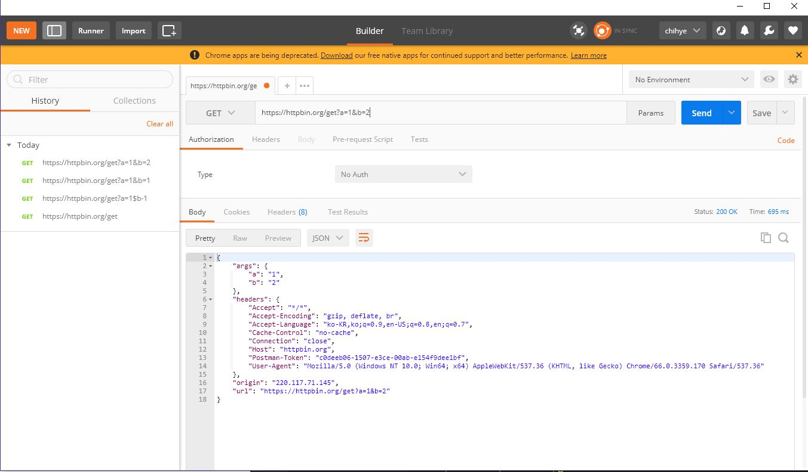

# 5/14 (월)

## 1. Today I learend

---

## 1. 큐, 스택, 트리

(비동기 등을 이해하기 위해 살펴볼 내용)

**ADT(Abstract Data Type)**
+ 어떤 데이터의 구체적인 구현방식은 생략
+ 데이터의 추상적 형태와 그 데이터를 다루는 방법을 정함
+ 개념적, 추상적으로 데이터의 형태가 있다고 생각하고 그것의 조작방법을 나열한 개념적인 약속

큐, 스택, 트리는 추상자료형 중에서도 널리 쓰이는 개념

### 1.1. 큐(Queue)

+ 파이프인데 들어가는 곳, 나오는 곳이 따로 있음  
+ 데이터를 집어넣을 수 있는 선형(linear) 자료형  
+ **FIFO(선입선출). 먼저 집어넣은 데이터가 먼저 나온다.**
+ enqueue(데이터를 집어넣는 작업), dequeue(데이터를 추출하는 작업)

프로그래밍 언어에 관계없이 위와 같이 쓸 수 있고 위와 같이 동작하는 것은 전부 큐라고 한다.  
눈에 보이지 않는 컴퓨터의 부분, 프로그래밍, 프로그래밍 해석기 내부에 많이 사용된다.
```js
// javascript로 구현한 큐
class Queue {
  constructor() {
    this._arr = [];
  }
  enqueue(item) {
    this._arr.push(item);
  }
  dequeue() {
    // ※ `.shift()`는 배열에서 제거된 요소를 반환한다.
    return this._arr.shift();
  }
}

const queue = new Queue();
``` 

**순서대로 처리해야 하는 작업을 임시로 저장해두는 버퍼(buffer)로 많이 사용된다.**  
(※ 버퍼링의 버퍼가 이 버퍼임, 받아놓은 동영상을 순서대로 보여주려고 임시로 저장하는 공간, 행위를 버퍼라고 함)

브라우저에서도 많이 사용되고, 비동기 프로그래밍에서 배울 아주 중요한 큐가 있음

### 1.2. 스택

+ 파이프인데 끝이 막혀있다. 선형(linear) 자료형
+ **LIFO(후입선출). 나중에 집어넣은 데이터가 먼저 나온다.**
+ push(데이터를 집어넣는 작업), pop(데이터를 추출하는 작업), peek(맨 나중에 집어넣은 데이터를 확인하는 작업)

서로 관계가 있는 여러 작업을 연달아 수행하면서 **이전의 작업 내용을 저장해 둘 필요가 있을 때**

직전에 무슨 작업을 했는지 궁금하다면, peek을 하면 되고 3번째에 무슨 작업을 했는지 궁금하다면, pop(), pop(), pop() 이런식
(`CTRL + Z`를 눌렀을 때같이 이전에 실행되어 저장된 작업을 되돌리게 되는 기능에 스택이 구현되어 있음)

```js
// javascript로 구현한 스택
class Stack {
  constructor() {
    this._arr = [];
  }
  push(item) {
    this._arr.push(item);
  }
  pop(item) {
    // .pop() 역시 삭제된 요소를 반환한다.
    return this._arr.pop(item);
  }
}
```
(※ `push`, `unshift`는 추가된 배열의 길이가 반환되고, `pop`, `shift`는 삭제된 요소가 반환된다.)

이것은 추상적인 개념이고, 브라우저에서 자바스크립트 참조형, 원시형이 저장되는 스택, 힙등은 실제 메모리 안에 들어있는 저장소이다.

### 1.3. 트리(Tree)

여러 데이터가 계층 구조 안에서 서로 연결된 형태를 나타낼 때 사용  
또한 계층 구조를 통해 알고리즘의 효율을 높이고자 할 때 널리 사용된다.

--- 

## 2. 비동기 프로그래밍

프로그래머들 사이에서 핫한 주제.  
자바스크립트에 이 기능이 추가된지는 얼마 되지 않음  
(ES2015 - `Promise`, ES2017 - `async`, `await`)  
잘 사용하면 성능을 좋게 만들 수 있다.

비동기 프로그래밍이란 기술을 의미하거나 프로그래밍 양식을 의미하기도 한다.

### 2.1. Motivation - 타이머 API

웹 브라우저에 함수를 특정시간이 지난 뒤에 실행시키거나,   
함수를 주기적으로 실행시키는 작업을 할 수 있게 해주는 함수가 내장되어 있다.

```js
setTimeout(() => {
  // 여기는 2초 뒤에 실행된다.
  console.log('setTimeout이 실행된 지 2초가 지났습니다.');
}, 2000);

// 첫번째 인자는 하고 싶은 작업, 두번째 인자는 얼마 뒤에 실행시키고 싶은지 시간
```
```js
setInterval(() => {
  console.log('3초마다 출력됩니다.');
}, 3000);
```
`setTimeout`과 `setInterval`은 각각 타이머 식별자를 반환한다.   
이 식별자를 가지고 실행 중인 타이머를 취소할 수 있다.

반환되는 식별자를 변수에 저장시켜, `clearTimeout`, `clearInterval`에 인자로 넘겨 타이머를 취소시킨다.
```js
const timeoutId = setTimeout(() => {
  console.log('setTimeout이 실행된 지 2초가 지났습니다.');
}, 2000);

const intervalId = setInterval(() => {
  console.log('3초마다 출력됩니다.');
}, 3000);

clearTimeout(timeoutId);
clearInterval(intervalId);
```

#### 2.1.1. [WindowOrWorkerGlobalScope.setTimeout()](https://developer.mozilla.org/ko/docs/Web/API/WindowTimers/setTimeout)

> `WindowOrWorkerGlobalScope` 믹스인은 `Window`와 `WorkerGlobalScope`인터페이스의 몇가지 공통된 기능을 설명함

타이머가 만료된 뒤 함수나 지정된 코드를 실행하는 타이머를 설정한다.  
첫번째 인자로 타이머가 만료된 뒤 실행될 함수나 문자열을 전달할 수 있는데, **문자열은 `eval()`을 사용하는 것과 같은 보안 위험성을 가지고 있다**

두번째 인자로 delay(지연시간)을 ms단위의 시간으로 받는다. 이 인자를 생략하면, 0이 값으로 사용되지만 HTML5 스펙에 명시된 최소 지연시간은 4ms로 실제로는 `setTimeout()` 호출은 최소 지연을 사용하도록 강제된다.

`setTimeout()`과 `setInterval()`의 반환값은 호출하여 만들어진 타이머를 식별할 수 있는 0이 아닌 숫자이다.(timeoutID)  
이 값은 타이머를 취소시키기 위해 `clearTimeout()`과 `clearInterval()`에 전달할 수 있다.  
이 둘은 같은 ID공간을 공유하기 때문에 `clearTimeout()`과 `clearInterval()` 둘 중 어느 것을 사용해도 기술적으로 동일하게 동작한다.(단, 명확성을 위해 일치시켜주자.)

#### 2.1.2. [WindowOrWorkerGlobalScope.setInterval()](https://developer.mozilla.org/en-US/docs/Web/API/WindowOrWorkerGlobalScope/setInterval)

`setInterval()` 메소드는 **반복적으로** 호출되는 함수나 실행되는 code 스니펫을 정해진 지연시간 사이마다 실행한다.  
(code 스니펫의 보안 위험성등 `setTimeout()`과 비슷하다.) 

#### 2.1.3. 타이머 사용 시 주의할 점

※ **setTimeout과 setInterval은 정확한 지연시간을 보장해 주지 않는다.**

```js
const start = new Date();

setTimeout(() => {
  // 새로운 date객체(이 시점의 시각)에 저장된 date객체를 빼면 밀리세컨드가 나온다.
  console.log(new Date() - start);
}, 100); // 최대한 100 밀리세컨드에 실행시키려는 노력을 하지만, 정확하지는 않다.
```
알아챌 수 없는 정도로 시간이 틀어진다.

※ **지연시간을 0으로 주었을때는 코드가 기대한 대로 동작하지 않는다.**

```js
setTimeout(() => {
  console.log('hello');
}, 0);

console.log('world');

// 출력 결과:
// world
// hello
// 코드의 순서가 뒤바꼈다.
```

### 2.2. 브라우저의 JavaScript 코드 실행 과정

다음의 내용을 알면 브라우저 안에서 자바스크립트 코드를 실행 할 때, 내부가 어떻게 돌아가는지 코드가 어떤 순서로 동작하는 지 파악할 수 있다.

#### 2.2.1. 호출 스택(Call Stack)

자바스크립트 엔진이 관리하는 스택 형태의 저장소.  
함수 호출과 관련된 정보를 관리한다.

**실행맥락(EC, execution context)**: 호출 스택에 저장되는 각 항목(한 칸)  
(다른 프로그래밍 언어에서는 스택 프레임(stack frame)이라고 하기도 한다.)


**실행맥락에 저장되는 정보들**
+ 함수 내부에서 사용되는 변수
+ 스코프 체인
+ `this`가 가리키는 객체

이것외에도 다양한 정보가 저장되어 있다.

함수 정의시 함수가 저장되는 것이 아니라 함수 호출시 함수 호출과 관련된 정보가 저장되는 것
```js
function add(x, y) {
  return x + y;
}

function add2(x) {
  return add(x, 2); // `add`를 호출
}

function add2AndPrint(x) {
  const result = add2(x); // `add2`를 호출
  console.log(result); // `console.log`를 호출
}

add2AndPrint(3); // `add2AndPrint`를 호출
```

함수를 정의할 때가 아니라 함수를 호출을 할 때, 실행 흐름이 그 함수 안으로 이동한다.  
인수, 스코프체인 등의 정보를 어딘가에 저장해야 실행시 참고할 수 있으므로 이런 정보를 저장하는 곳이 바로 호출 스택이다. - 스크립트가 함수를 호출하면 인터프리터는 해당 호출에 대한 실행 맥락을 생성해 호출 스택에 추가한다.(**push**)

함수의 호출이 끝나면 그 호출의 정보는 날라가고 실행 흐름이 다시 되돌아온다. - 결과값을 반환하고, 호출 스택 가장 위에 있는 실행 맥락을 제거한다.(**pop**)

※ 스크립트를 불러올 때, **전역 실행 맥락(global execution context)**을 호출 스택에 추가한다.  
스크립트의 실행이 모두 끝나면, 전역 실행 맥락을 호출 스택에서 제거한다.(**pop**)

변수에 값을 대입하거나, 함수가 여러번 중첩되어 호출되는 등의 **복잡한 코드의 동작을 단순한 자료구조로 표현할 수 있게 된다.**

(※ 브라우저에서 호출 스택을 직접 확인할 수 있는 방법이 있다.)

웹 브라우저는 **호출 스택에 실행 맥락이 존재하는 동안, 즉 실행 중인 함수가 존재하는 동안에는 먹통이 되어 버린다.**  
(정확히는, microtask queue가 비워질때까지 브라우저의 렌더링이 멈춘다)

```js
// 특정 시간동안 계속 루프를 도는 코드
function sleep(milliseconds) {
              // Date.now() 유닉스 시간을 반환함
  const start = Date.now();

  // 인수로 들어온 밀리세컨드보다 작으면 계속 실행
  while ((Date.now() - start) < milliseconds);
}

sleep(5000);
// 5초 동안 while 루프가 실행되므로, 호출 스택이 비워지지 않고 브라우저는 먹통이 됩니다.
```
이런 식으로 5초간 호출스택이 비워지지 않게 하면 브라우저가 5초간 먹통이 된다.

브라우저는 대개 60fps(1초에 60번 화면을 그린다)로 동작하기 때문에, 대략 16ms안에 코드의 실행을 완료하지 못하면 브라우저의 애니메이션이 뚝뚝 끊기는 현상이 나타난다.

사용자와의 상호작용을 위한 코드를 작성할 때 16ms 내에 실행되는 코드를 작성해야한다.

(※ 참고로 스택이 할당된 공간보다 많은 공간을 차지하면 "**stack overflow**" 에러가 발생한다.)

#### 2.2.2. 작업 큐(Task Queue)

그러나 모든 작업을 16ms안에 작업할 수 없다. 무언가를 다운로드 한다든가... 복잡한 계산을 한다든가. 사용자 입력을 기다린다든가...

프로그래밍에서는 어떤 사건(event)이 일어날 때까지 기다리거나 혹은 큰 데이터에 대한 계산이 완료될 때까지(혹은 통신때문에) 기다리는 데에 시간이 오래 걸린다.

브라우저에서 호출스택에 남겨두지 않고도 처리할 수 있도록 여러가지 기능을 제공한다.

+ **기다려야하는 일을 자바스크립트 단에서 처리하지 않고, API를 통해 브라우저에 위임한다.**(혹은 Web Worker에 위임할 수 도 있다. 이 때에는 `message`이벤트에 이벤트 리스너를 등록하는 방식으로 결과를 받는다.)  
이 때, **일이 끝나면 실행시킬 콜백을 같이 등록한다.**
+ 위임된 일이 끝나면, 그 결과와 콜백을 작업 큐(태스크 큐, 콜백 큐)에 추가한다.
+ 브라우저는 호출 스택이 비워질 때마다(비워져 있지 않다면 기다렸다가) 작업 큐에서 가장 오래된 작업을 꺼내와서 해당 작업에 대한 콜백을 실행시킨다.(호출 스택에 밀어넣는다.) 이 과정을 끊임없이 반복하는 형태를 **이벤트 루프**라 한다.

기다림이 완료되는 일의 예: 1. 이미지를 다운로드 받았다. 2. setTimeout에 인수로 넣은 지연 시간이 지났다.  

기다림이 완료되어도 호출 스택이 비워져 있지 않으면 바로 실행 시키기 어려울 수 있다.  
이를 작업 큐에 먼저 저장하고, 호출 스택이 비워지면 밀어넣어 실행시킨다.

※ **자바스크립트는 단일 쓰레드이다.** - 브라우저, 대개의 자바스크립트 엔진이 콜 스택이 하나 밖에 존재하지 않는다.  
(자바나 파이썬 같은 프로그래밍 언어에서는 콜 스택을 여러개 두고 함수를 동시에 실행 시킬 수 있다.)  
참고로 함수를 실행 시키는 것은 CPU의 코어이다. 코어가 여러개 있는 컴퓨터는 함수를 동시에 여러개 실행시킬 수 있다.  
브라우저나 Node.js는 콜스택이 하나 밖에 없어서 함수를 하나밖에 실행시킬 수 없다.

**호출스택과 작업 큐의 성질**
+ 각 작업은 작업 큐에 쌓인 순서대로 실행
+ 이미 작업 큐에 작업이 쌓여있다면 뒤늦게 추가된 작업은 앞서 추가된 작업이 모두 실행된 다음(호출 스택이 비워진 다음)에야 실행된다.
+ 호출 스택이 비워지지 않는다면, 작업 큐에 쌓여있는 작업을 처리할 수 없다.
+ 각 작업 사이에 브라우저는 화면을 새로 그릴 수 있다.(호출 스택에 비워지지 않으면 브라우저는 화면을 새로 그릴 수 없음)

지연시간 0을 넘겨준 `setTimeout`은 바로 실행되는 것이 아니라  
넘겨진 콜백을 웹 API를 통해 콜백을 작업 큐에 등록한다.  
호출 스택이 비워지면 그제야 작업큐에 들어있는 콜백을 가져와 실행하기 때문에  
해당 콜백 부분이 나중에 실행된다.  
(4보다 작은 지연시간을 주면, 4ms 지연시간이 대신 사용된다.)
```js
setTimeout(() => {
  console.log('hello');
}, 0); // 작업 큐에 콜백이 추가됨

console.log('world'); // 이 부분이 실행되어 호출 스택이 비워져야 
// setTimeout에서 작업큐로 넘겨준 콜백이 실행된다.
```

※ [Web Worker는 자바스크립트를 멀티 쓰레드처럼 사용하기 위해 추가되었다.](https://developer.mozilla.org/ko/docs/Web/API/Web_Workers_API)

브라우저 API는 C++로 만들어져 있는데 파이어폭스는 크롬보다 느리다는 말이 있었다.  
파이어폭스에서 C++는 브라우저에 적합하지 않다고 판단해 브라우저를 새로 만들기 위해 프로그래밍 언어를 새로 만들었다.([Rust](https://www.rust-lang.org/ko-KR/)) - 파이어폭스 퀀텀

### 2.3. 비동기 프로그래밍(Asyncronous Programming)

기다려야하는 일인데, 기다리지 않고 바로 다음 코드를 실행해 나가는 프로그래밍 방식
```js
console.log('hello');
setTimeout(() => {
  console.log('world');
}, 5000)
console.log('helloooo');
// hello
// helloooo

// 5초 뒤
// world
```

반대로 어떤 일이 완료될 때까지 코드의 실행을 멈추고 기다리는 프로그래밍 방식을 **동기식 프로그래밍**(synchronous programming)이라고 부른다.
```js
function sleep(milliseconds) {
  const start = Date.now();
  while ((Date.now() - start) < milliseconds);
}
console.log('hello');
sleep(5000);
console.log('world');
```

브라우저에서의 비동기 프로그래밍은 주로 **통신, 계산**과 같이 오래 걸리는 작업들을 브라우저에 위임할 때 이루어진다.

(C#이라는 프로그래밍 언어에서 처음으로 비동기 프로그래밍을 문법으로 도입했다.  
이러한 문법이 다른 프로그래밍언어에도 퍼져나갔다. 자바스크립트도 이 문법을 차용한 지는 얼마 되지 않았다.)

비동기 프로그래밍 방식은 대개 프로그램의 성능과 응답성을 높이는 데 도움을 준다.

과거에는 비동기 프로그래밍을 하는 것이 그저 콜백을 추가하는 방법 뿐이라 코드가 실제 실행되는 순서가 뒤죽박죽이 되어 문법이 복잡하고, 번거롭다는 인식이 있었으나 비동기 프로그래밍을 할 수 있도록 해주는 도구가 최근에 추가되었다.(`Promise`, `async`, `await`)

+ [Github REST API](https://developer.github.com/v3/) 
  - Github에 이런 정보를 가져오려면 이렇게 해라~라는 정보의 문서
  - REST API: 통신방식
  - (예. 나는 github의 저장소의 commit과 관련된 정보를 알고 싶다.)

#### 2.3.1. 콜백(Callback)

다른 함수의 인수로 넘기는 함수. 이 콜백으로도 비동기 프로그래밍을 할 수 있다. 

[Github의 create-react-app 프로젝트에 등록되어 있는 이슈 목록](https://github.com/facebook/create-react-app/issues)을 가져와서 출력하는 코드
```js
// jQuery를 써서 통신하고 있다.
const $ = require('jquery'); // jQuery를 불러옴
const API_URL = 'https://api.github.com/repos/facebookincubator/create-react-app/issues?per_page=10';


// 통신 방법을 설정하는 방법
$.ajaxSetup({
  dataType: 'json'
});

// jQuery에 get 메소드를 사용
// 주소로 접속해 정보를 받아올 수 있음
// 어떤 정보든간에 받아올 때는 기다려야함
// 다 다운받아지면 처리를 함
              // 두번째 인수로 콜백을 넘긴다. 이슈 목록이 매개변수로 들어온다.
$.get(API_URL, issues => {
  console.log('최근 10개의 이슈:');
  // (이슈목록은 배열이다.)
  issues
    .map(issue => issue.title)
    .forEach(title => console.log(title));
  console.log('출력이 끝났습니다.');
});

console.log('받아오는 중...');

// 받아오는 중...               // 이부분이 먼저 실행되었다.
// => undefined
// 최근 10개의 이슈:
// Webpack Dev Server Utils - Allow changing of the set-cookie header
// [Q] How to speed up Jest?
// ...
// Cannot build app - Javascript heap out of memory
// 출력이 끝났습니다.
```
+ `$.get` 메소드는 비동기식으로 동작하며, Github API 서버와 통신하는 일을 브라우저에 위임한 후 바로 종료된다.  
+ 통신이 끝나면, 그 결과를 첫번째 인수로 해 콜백을 호출한다.

jQuery로 이런방식으로 통신을 많이 했었다. 

※ 콜백을 인수로 받는 함수가 항상 비동기식으로 동작하는 것은 아니다(배열의 메소드 - `map`, `forEach`등의 메소드는 콜백이 동기식으로 호출된다. 즉, 콜백의 실행이 끝날때까지 코드의 실행 흐름이 다음으로 넘어가지 않는다.)

콜백은 고차함수를 잘 지원한다는 특징 때문에 가장 많이 사용되는 비동기 프로그래밍 양식이지만 복잡한 비동기 데이터 흐름을 표현하기 어려웠다.

다음은 모두 별개의 작업, 별개의 비동기 통신이다.
+ Github에 공개되어있는 저장소 중, 언어가 JavaScript이고 별표를 가장 많이 받은 저장소를 불러온다.
+ 위 저장소에 가장 많이 기여한 기여자 5명의 정보를 불러온다.
+ 해당 기여자들이 최근에 Github에서 별표를 한 저장소를 각각 10개씩 불러온다.
+ 불러온 저장소를 모두 모아, 개수를 센 후 저장소의 이름을 개수와 함께 출력한다.

```js
const $ = require('jquery');
const API_URL = 'https://api.github.com';
const starCount = {};

$.ajaxSetup({
  dataType: 'json'
});

// 1. Github에 공개되어있는 저장소 중, 언어가 JavaScript이고 별표를 가장 많이 받은 저장소를 불러온다.
$.get(`${API_URL}/search/repositories?q=language:javascript&sort=stars&per_page=1`, result => {
  // 2. 위 저장소에 가장 많이 기여한 기여자 5명의 정보를 불러온다.
  $.get(`${API_URL}/repos/${result.items[0].full_name}/contributors?per_page=5`, users => {
    let repoArrs = [];
    for (let user of users) {
      // 3. 해당 기여자들이 최근에 Github에서 별표를 한 저장소를 각 기여자마다 10개씩 불러온다.
      $.get(`${API_URL}/users/${user.login}/starred?per_page=10`, repos => {
        repoArrs.push(repos);
        // 4. 불러온 저장소를 모두 모아, 개수를 센 후 저장소의 이름을 개수와 함께 출력한다.
        // 5명의 정보를 다 불러왔는지 일일이 확인하는 작업
        // `repoArrs` 배열의 길이를 체크하고 있다.
        if (repoArrs.length === 5) {
          for (let repoArr of repoArrs) {
            for (let repo of repoArr) {
              if (repo.full_name in starCount) {
                starCount[repo.full_name]++;
              } else {
                starCount[repo.full_name] = 1;
              }
            }
          }
          console.log(starCount);
        }
      });
    }
  });
});

console.log('fetching...');
```

콜백으로 이런 복잡한 비동기 데이터 흐름을 표현하려면 어마어마하게 코드가 복잡해진다. 콜백 안의 콜백 들여쓰기.. **콜백지옥(callback hell)**

#### 2.3.2. Promise

콜백 문제를 해결하기 위해 여러 라이브러리들이 등장했다.  
그 라이브러리들 중 Promise라는 패턴/양식을 사용한 라이브러리들이 있었고, 대부분의 개발자들이 사용했고 결국 [ES2015에 자바스크립트 내장 기능으로 채택되었다.](https://promisesaplus.com/)

> **Promise라는 패턴/양식을 사용한 라이브러리** 
+ [jQuery Deffered](https://api.jquery.com/category/deferred-object/)
+ [Q](http://documentup.com/kriskowal/q/)
+ [Bluebird](http://bluebirdjs.com/docs/getting-started.html)

Promise는 결론적으로는 객체이다. 단, **언젠가 끝나는 작업의 결과값을 담는 통**이다.  
값이 담겨있을 수도 있고 안 담겨 있을 수도 있는데, 언젠가는 들어올거라는 기대를 할 수 있다. 그리고 `then`메소드를 통해 값이 들어오는 순간 실행할 콜백을 같이 등록할 수 있다.

Promise 객체 생성방법 중 가장 쉬운 방법 - `Promise.resolve` 정적 메소드를 사용해 생성한다.
```js
const p = Promise.resolve(1);
// 통이 하나 만들어지고 값이 1 채워져있다.(Promise 객체 생성)

p.then(num => {
  console.log(num);
}); // 1
```
Promise에 위처럼 값을 미리 채워놓을 수 있지만. 비동기 작업을 하기 위해선 위와 같이 미리 값을 채워놓지 않는다.

비동기 작업을 하는 Promise 객체는 `Promise` 생성자를 통해 만들 수 있다. 
```js
// 이 순간에는 값이 채워져있지 않지만 2초 후 채워짐
const p = new Promise((resolve, reject) => {
  setTimeout(() => {
    console.log('2초가 지났습니다.');
    resolve('hello'); 
    // 2초뒤 resolve에 'hello'를 넘겨 'hello'라는 값이 채워지게 한다. 
  }, 2000);
});

p.then(str => {
  console.log(str);
}); 

// 2초가 지났습니다.
// hello
```
Promise 생성자는 콜백을 인수로 받는다.  
이 콜백의 첫번째 인수로 `resolve` 함수가 들어오는데, 콜백 안에서 `resolve`를 호출하면 **`resolve`에 인수로 준 값이 곧 Promise 객체의 궁극적인 결과값이 된다.**

두번째 인수인 `reject` 함수는 비동기 작업에서 에러가 발생했을 때 호출하는 함수이다.

Promise 객체의 결과값을 사용해 추가 작업을 하려면 `then` 메소드를 호출해야 한다.

+ **`then` 메소드 자체도 Promise 객체를 반환한다.** 이 때, 콜백에서 반환한 값이 곧 Promise의 결과값이 된다.
  ```js
  const p = new Promise((resolve, reject) => {
    setTimeout(() => {
      console.log('2초가 지났습니다.');
      resolve('hello'); 
    }, 2000);
  });

  const p2 = p.then(msg => {
    return msg + ' world';
  });

  const p3 = p2.then(msg => {
    return msg + ' hello';
  });

  // 계속 값을 받아 작업을 실행할 수 있다.
  p3.then(msg => {
    console.log(msg)
  }); // hello world hello
  ```
  아래처럼 줄여 쓸 수도 있다.(`then` 메소드가 Promise를 반환하기 때문에 chaining이 가능하다. - composition이라고도 한다.)
  ```js
  const p = new Promise((resolve, reject) => {
    setTimeout(() => {
      console.log('2초가 지났습니다.');
      resolve('hello'); 
    }, 2000);
  });

  p.then(msg => msg + ' world')
   .then(msg => msg + ' hello')
   .then(console.log);
  console.log('기다리지 않고 실행');

  // 기다리지 않고 실행
  // 2초가 지났습니다.
  // hello world hello
  ```
+ `then` 메소드에 넘겨준 콜백에서 Promise 객체를 반환하면, then 메소드가 반환한 Promise 객체는 앞의 Promise 객체의 결과를 따르게 된다.
  ```js
  const p = Promise.resolve(1);

  const p2 = p.then(msg => {
    console.log(num);
    return Promise.resolve(num + 1); // 마치 p3처럼 된다.
  });

  const p3 = p2.then(msg => {
    console.log(num);
    return num + 1;
  });
  ```
  ```js
  // Promise 객체를 반환하는 함수
  function delay(ms) {
    return new Promise(resolve => {
      setTimeout(() => {
        console.log(`${ms} 밀리초가 지났습니다.`);
        resolve(); // undefined를 채워넣는다.
      }, ms);
    });
  }
 // delay(1000)은 Promise가 튀어나온다.
 // 첫번째 then에서 Promise
  delay(1000)
          // 1초 뒤 실행될 부분, 2초 뒤 Promise 객체를 반환
    .then(() => delay(2000))
          // '끝이라는 값이 있는 프로미스를 반환
    .then(() => Promise.resolve('끝'))
    .then(console.log);
    // .then(str => {
    //   return console.log(str); 이거와 같음
    // });

  console.log('시작');
  // 1000 밀리초가 지났습니다.
  // 2000 밀리초가 지났습니다.
  // 끝
  ```
  만약 위 코드를 `setTimeout`으로 짰다면
  ```js
  setTimeout(() => {
    setTimeout(() => {
      setTimeout(() => {
        console.log('끝');
      }, 0)
    }, 2000)
  }, 1000)
  ```

여러 비동기 작업을 하려 할 때 Promise가 유용하게 사용된다.

HTTP 통신을 할 때 Promise가 사용된다.  
최신 브라우저에는 HTTP 통신을 위한 [`fetch`](https://developer.mozilla.org/ko/docs/Web/API/Fetch_API) 함수가 내장되어 있는데, 이 함수는 Promise 객체를 반환한다.
```js
const API_URL = 'https://api.github.com';

// 다운로드가 다 완료되면 Promise를 채워준다.
fetch(`${API_URL}/repos/facebookincubator/create-react-app/issues?per_page=10`)
    // 응답에 포함된 JSON문자열을 자바스크립트 객체로 변환한다. 
    // `.json()`도 Promise를 반환한다.
  .then(res => res.json())
  .then(issues => {
    console.log('최근 10개의 이슈:');
    issues
      .map(issue => issue.title)
      .forEach(title => console.log(title));
    console.log('출력이 끝났습니다.');
  });
```
`fetch`를 호출해서 반환된 Promise 객체의 결과값은 `Response`(라는 생성자로 부터 생성된) 객체로, HTTP 응답에 대한 내용을 담고 있다.   
이 객체의 `json` 메소드는, HTTP 응답에 포함된 JSON 문자열을 JavaScript 객체로 바꾸어주는 역할을 한다.  
`json` 메소드 역시 Promise 객체를 반환한다. 
(HTTP 응답 헤더의 전송이 끝난 즉시 Response 객체가 만들어진다. 즉, 이 시점에는 응답 바디를 전송받았다는 보장이 없기 때문에 이와 관련된 `json`메소드가 Promise 객체를 반환하는 것이다. - `json`는 Body 믹스인의 `Response` 스트림을 취해 이를 완료할 때까지 읽는다. 본문 텍스트를 JSON으로 구문 분석 한 결과으로 resolve 되는 Promise 객체를 반환한다.)


**Promise를 통한 비동기 프로그래밍의 이점**
+ `then` 메소드는 Promise 객체를 반환하므로, **콜백을 중첩하지 않고도 비동기 작업을 연이어 할 수 있다.**
+ **비동기 작업이라는 동작 자체를 값으로 (추상화 해) 다룰 수 있게 된다.**  
즉, 이제까지 값을 다루면서 해왔던 모든 작업을 Promise 객체에 대해서도 할 수 있다.

`Promise.all`: Promise의 정적 메소드. '인수로 들어온 iterable에 들어있는 모든 Promise 객체가 완료되었을 때' 그 자신도 완료되는 새 Promise 객체를 반환한다.  

기존에 콜백을 사용한 비동기 프로그래밍에서 if를 써서 다 완료되었는지 배열의 길이를 체크면서 일일이 확인해야 했던 작업을 `Promise.all`을 사용하면 굉장히 쉬워진다. 
```js
const API_URL = 'https://api.github.com';
const starCount = {};

// 1. Github에 공개되어있는 저장소 중, 언어가 JavaScript이고 별표를 가장 많이 받은 저장소를 불러온다.
fetch(`${API_URL}/search/repositories?q=language:javascript&sort=stars&per_page=1`)
  .then(res => res.json())
  // 2. 위 저장소에 가장 많이 기여한 기여자 5명의 정보를 불러온다.
  .then(result => fetch(`${API_URL}/repos/${result.items[0].full_name}/contributors?per_page=5`))
  .then(res => res.json())
  // 3. 해당 기여자들이 최근에 Github에서 별표를 한 저장소를 각각 10개씩 불러온다.
  .then(users => {
    // 이 ps에 담긴 배열은 프로미스 객체의 배열
    const ps = users.map(user => fetch(`${API_URL}/users/${user.login}/starred?per_page=10`));
    return Promise.all(ps);
  })
  .then(responses => Promise.all(responses.map(r => r.json())))
  // 4. 불러온 저장소를 모두 모아, 개수를 센 후 저장소의 이름을 개수와 함께 출력한다.
  .then(repoArrs => {
    for (let repoArr of repoArrs) {
      for (let repo of repoArr) {
        if (repo.full_name in starCount) {
          starCount[repo.full_name]++;
        } else {
          starCount[repo.full_name] = 1;
        }
      }
    }
    console.log(starCount);
  })

console.log('fetching...');
```
※ `then` 메소드의 기능 `Promise.all()`의 기능(중요)

[`Promise.race(itrerabl)`](https://developer.mozilla.org/en-US/docs/Web/JavaScript/Reference/Global_Objects/Promise/race) : itarable 안에 있는 Promise 중에 가장 먼저 resolve 또는 reject된 Promise의 결과값이 이 Promise 객체의 결과값이 된다.

#### 2.3.3. 비동기 함수(Async Function)

Promise는 이전의 방식에 비하면 여러 장점을 가지고 있지만, 여전히 콜백을 사용한다는 점 때문에 불편하며, 가독성이 좋지 않다는 비판이 있다. 

ES2017에서 도입된 **비동기 함수**를 사용하면, 동기식 코드와 거의 같은 구조를 가지는 비동기식 코드를 짤 수 있다.

**함수 앞에 `asyn` 키워드를 붙이면 이 함수는 비동기 함수가 된다.**
```js
// 비동기 함수
async function func1() {
  // ...
}

// 비동기 화살표 함수
const func2 = async() => {
  // ...
}

// 비동기 메소드
class MyClass() {
  async myMethod() {
    // ...
  }
}
```

비동기 함수는 **항상 Promise 객체를 반환한다**는 특징을 가진다.  
이 Promise의 결과값은 비동기 함수 내에서 무엇을 반환하느냐에 따라 결정되며,  
**then 메소드와 똑같은 방식으로 동작한다.**
```js
async function func1() {
  return 1; // 1이라는 값을 담은 Promise 객체를 반환한다.
} 

async function func2() {
  return Promise.resolve(2); // 2라는 값을 담은 Promise 객체를 반환한다.
}

func1().then(console.log); // 1
func2().then(console.log); // 2
``` 

`await` 키워드는 Promise의 `then`메소드와 유사한 기능을 하는데, **`await` 키워드 뒤에 오는 Promise가 결과값을 가질 때까지 비동기 함수의 실행을 중단시킨다.** 
```js
// Promise 객체를 반환하는 함수.
function delay(ms) {
  return new Promise(resolve => {
    setTimeout(() => {
      console.log(`${ms} 밀리초가 지났습니다.`);
      resolve()
    }, ms);
  });
}

async function main() {
  // 비동기 함수 내에서 쓸 수 있다.
  await delay(1000);
  await delay(2000);
  const result = await Promise.resolve('끝');
  console.log(result);
}

main();
console.log('main이 실행되었다');
```
비동기식으로 기다린다. 다른 함수의 실행을 막지는 않는다.

`await` 키워드는 연산자이기도 하며, `await`연산의 결과값은 뒤에 오는 Promise 객체의 결과갑이 된다.  

`await` 키워드는 `for`, `if`와 같은 제어 구문 안에서도 쓰일 수 있기 때문에, `then` 메소드를 사용할 때보다 복잡한 비동기 데이터 흐름을 아주 쉽게 표현할 수 있다는 장점이 있다. 

비동기 함수의 가장 큰 장점은 동기식으로 작업하듯이 비동기식 코드를 짤 수 있다는 것이다.

비동기 함수라 다시 작성한 Github 데이터를 불러오는 예제
```js
const API_URL = 'https://api.github.com';

// 비동기 함수내에서 동기식으로 코드를 짠다.
async function fetchStarCount() {
  const starCount = {};

  // 1. Github에 공개되어있는 저장소 중, 언어가 JavaScript이고 별표를 가장 많이 받은 저장소를 불러온다.
  const topRepoRes = await fetch(`${API_URL}/search/repositories?q=language:javascript&sort=stars&per_page=1`);
  const topRepoData = await topRepoRes.json();

  // 2. 위 저장소에 가장 많이 기여한 기여자 5명의 정보를 불러온다.
  const topMemberRes = await fetch(`${API_URL}/repos/${topRepoData.items[0].full_name}/contributors?per_page=5`);
  const topMemeberData = await topMemberRes.json();

  // 3. 해당 기여자들이 최근에 Github에서 별표를 한 저장소를 각각 10개씩 불러온다.
  const ps = topMemeberData.map(user => fetch(`${API_URL}/users/${user.login}/starred?per_page=10`));
  const starredReposRes = await Promise.all(ps);
  const starredReposData = await Promise.all(starredReposRes.map(r => r.json()));

  // 4. 불러온 저장소를 모두 모아, 개수를 센 후 저장소의 이름을 개수와 함께 출력한다.
  for (let repoArr of starredReposData) {
    for (let repo of repoArr) {
      if (repo.full_name in starCount) {
        starCount[repo.full_name]++;
      } else {
        starCount[repo.full_name] = 1;
      }
    }
  }
  return starCount;
}

fetchStarCount().then(console.log);
```
비동기 작업을 위해 콜백을 사용하는 부분이 모두 사라졌다.

※ 비동기 함수는 복잡한 비동기 데이터 흐름을 아주 쉽게 표현할 수 있지만, 이 역시 Promise를 사용하기 때문에, 비동기 함수를 잘 쓰기 위해서는 Promise에 대한 이해가 중요하다.

--- 

## 3. Node.js + HTTP

※ [강의자료](https://fds9.github.io/fds-nodejs-http/)

### 3.1. REST API 실습


+ [Postman](https://chrome.google.com/webstore/detail/postman/fhbjgbiflinjbdggehcddcbncdddomop): fetch 같은 함수를 GUI로 할 수 있게 해주는 크롬 확장프로그램
  - REST API를 시험해볼 수 있는 도구
  - 개발한 API를 테스트하고 테스트 결과를 공유해 API개발의 생산성을 높여주는 플랫폼
  - 다양한 편의 기능 제공
  - 브라우저는 HTML 문서를 보여주는 프로그램. JSON형태의 데이터를 제공받거나 브라우저가 기본으로 지원하지 않는 통신 방식을 테스트해보고 싶을 때 사용한다.
+ [Github REST API v3](https://developer.github.com/v3/)
+ https://httpbin.org/: HTTP Request & Response Service

### 3.2. Node.js

+ nvm
+ nvm-windows 

```sh
$ nvm install 8.11.1
$ nvm use 8.11.1
$ nvm alias default 8.11.1 # nvm-windows는 필요없음
```

Ndoe.js REPL
```sh
$ node

> 'hello node'
'hello node'

> const factorial = n => n < 1 ? 1 : n * factrial(n - 1)
undefined

> factorial(3)
6

> .exit # 혹은 `Ctrl+C`를 두번 입력해서 나가기
```

프론트엔드 빌드도구(parcle, webpack)들이 node.js로 만들어져있다.  
(조금이라도 사용할 줄 알아야함)

브라우저랑은 전혀 다른 환경이다. Node.js는 통신서버를 만들기 위한 환경이기 때문에 보여지는 부분에 관한 API가 많은 브라우저와 달리, 통신관련 함수가 내장되어 있다.

`require()`: Node.js 모듈을 불러올 때 사용

Ndoe.js로 파일 실행시키기
```sh
$ node (파일 경로)
```

자바스크립트를 실행시키는 부분만 크롬과 같은 V8 자바스크립트 엔진을 사용한다  
Node 패키지 생태계는 제일 큰 오픈소스 생태계이다.

JavasScript 런타임: JS를 구동하기 위해 필요한 실행 환경.  
프로그래머는 런타임이 제공하는 도구(fetch, require)를 응용해 프로그램을 개발한다.  
웹 브라우저나 Node.js도 JavasScript 런타임의 일종

JavaScript Runtime
+ Chrome이 제공하는 웹 브라우저용 런타임
+ Node.js가 제공하는 서버용 런타임
+ MongoDB가 제공하는 데이터 처리용 런타임
+ Photoshop이 제공하는 전용 런타임

#### 3.2.1. V8 Javascript Engine 

자바스크립트 생태계를 바꾼 역사적인 엔진...굉장히 자바스크립트 실행이 빨라졌다.

크롬이 나오기 이전까지의 브라우저에서 자바스크립트를 많이 쓰는 웹 사이트는 없었다.(자바스크립트를 많이 쓰면 느렸기 때문에)

- **JIT(Just-In-Time) compilation**: 기계어가 아닌 자바스크립트를 훨씬 빠르게 동작하는 기계어로 변환시켜 실행시키는 기능
- Code Optimization: 코드 최적화(훨씬 빠르게 동작하는 코드로 최적화한다.)
- 크롬, Node.js, MongoDB와 그 밖의 프로그램에서 사용한다.

[How the V8 engine works?](http://thibaultlaurens.github.io/javascript/2013/04/29/how-the-v8-engine-works/)

#### 3.2.2. Event-driven Programming

프로그램의 흐름이 외부 요인에 의해 일어나는 사건에 의해 결정되는 프로그래밍 양식

addEventListener를 쓰는 것과 크게 다르지 않게 통신을 할 때, 약속된 방식으로 이벤트 핸들러를 작성함으로써 외부 이벤트가 일어났을 때 코드를 실행한다.

+ 마우스 입력
+ 키보드 입력
+ 다른 프로그램/컴퓨터로부터의 통신
```js
// DOM 이벤트 핸들러 등록 (웹 브라우저)
domElement.addEventListener('click', function(e) {
  e.stopPropagation()
  alert('hello')
})

// 서버도 똑같이 한다.
// (단, 프레임워크를 쓸 때는 직접 이벤트를 다룰 일이 별로 없음)
// HTTP 응답 이벤트 핸들러 등록 (Node.js)
httpResponse.on('data', data => {
  console.log(data)
})
```

#### 3.2.3. Node.js Module

Node.js는 별개의 실행환경 브라우저에서는 `window`가 전역 객체였지만 Node.js에서는 `global`이라는 전역객체가 있음

`alert`이 `window`전역객체의 메소드였듯이 `require`는 `global`전역객체의 메소드임
```js
// `module.exports`에 저장한 값은 다른 모듈에서 불러올 수 있음
module.exports = {
  familyName: '김',
  givenName: '승하',
  fullName: function() {
    return this.familyName + this.givenName
  }
}
```
```js
// Node.js에 내장된 모듈을 불러 올때는 그냥 이름만
const os = require('os');
// 내가 만든 모듈을 불러올 때는 `./`경로
const m = require('./module');
```

※ `import`문법은 아직 Node.js에서 지원하지 않는다.

#### 3.2.4. NPM

Node.js 패키지 관리도구 / 클라우드 패키지 저장소(npmjs.com)
+ 의존 패키지 관리
+ 스크립트 실행 (예. `npm build`, `npm start`)
+ 패키지 설정
+ NPM에 패키지 배포
+ Node.js 종합 작업도구

```sh
$ npm init -y
```
**package.json**: 패키지 정보를 담고 있는 파일.  
여러가지 설정을 할 수 있는 설정파일, NPM이라는 클라우드 저장소에 내가 만든 라이브러리를 올릴 수 있는데 그 때 필요한 정보들.  
- dependencies: `npm install --save`명령으로 설치한 패키지가 기록됨
- scripts: 원래 목적은 패키지 생명 주기마다 자동으로 실행되는 명령을 등록하기 위함이나 개발자 편의를 위해 자주 사용되는 명령을 등록하는 용도로 더 많이 사용됨

**package-lock.json**: NPM이 관리하는 파일(지우면 안됨)

※ `npm install --save`에서 `--save`를 쓰지 않아도 dependencies에 등록 되도록 Node.js가 버전업되었다.

node modules에 수많은 파일이 들어있는데 내가 만든 파일과 관련은 없지만 내가 관리할 파일은 아니다. git 저장소 같은데 다 올려버린다면 관리하기 어렵다.

`npm install`을 실행시키면 `package.json`파일에 기록된 의존성에 따라 다시 node modules에 필요한 파일들을 설치해 준다.

`.gitignore`는 `git add`로 스테이징 영역에 올릴때 무시하는 파일을 설정한다. (내가 만든 파일만 git에 올려 관리할 수 있다.)

### 3.3. HTTP

[Chrome DevTools를 이용한 리소스 로드 시간 측정](https://developers.google.com/web/tools/chrome-devtools/network-performance/resource-loading?hl=ko)

+ 웹 브라우저와 웹 서버간의 통신을 위해 개발된 통신규약  
+ 최근에 **REST API의 부상**과 함께 다른 용도로도 널리 사용됨
  - 모바일 앱 - 서버간 통신
  - 서버 - 서버간 통신
+ 80번 포트를 기본으로 사용
  - `localhost:` - 컴퓨터에 대한 주소 : 포트번호(통신 통로) - `8080`, `5500`
  - `http://~` 는 뒤에 `:80`이 생략된 것이다. 
+ 클라이언트의 요청(request)과 서버의 응답(response)으로 이루어진다.
  - (채팅같은 통신 방식은 좀 다르다)

## 2. Today I fonund out

점점 수업이 어려워진다. 통신 쪽은 혼자서 읽을 때 이해가 안되었는데 지금도... 아직 진도가 많이 나간 것은 아니지만.  
비동기 프로그래밍에서 Promise는 혼자 볼 때는 하나도 이해를 못했는데 그래도 설명을 들으니 어떤 건지 대충 알 것 같다.  
아직은 다 감이 안잡히고 뭔가 예제를 따라해본다거나 뭔가를 만들어야 이해를 할 수 있을 것 같다.


## 3. 오늘 읽은 자료 (혹은 참고할 링크, 생략해도 됨)

+ [FDS Node.js + HTTP](https://fds9.github.io/fds-nodejs-http/): 강의자료
+ [fds-json-server](https://www.npmjs.com/package/fds-json-server): 중간 프로젝트 때 사용할 백엔드 대체품
+ [자바스크립트 Promise 쉽게 이해하기](https://joshua1988.github.io/web-development/javascript/promise-for-beginners/)
+ [JavaScript Promise](http://www.hanbit.co.kr/store/books/look.php?p_code=E5027975256): 한빛미디어 무료 전자책
+ [Google vision API](https://goo.gl/5hiFoz)
+ [gitignore](https://www.gitignore.io/)
+ [해커톤 예제 - 강사님 코드](https://github.com/fds9/fds-hackathon-example)
+ [신입개발자 생확백서](https://www.slideshare.net/jayjin0427/ss-71896768)
+ [Postman 개요 / 설치 / 사용법 / 활용 방법](http://meetup.toast.com/posts/107)